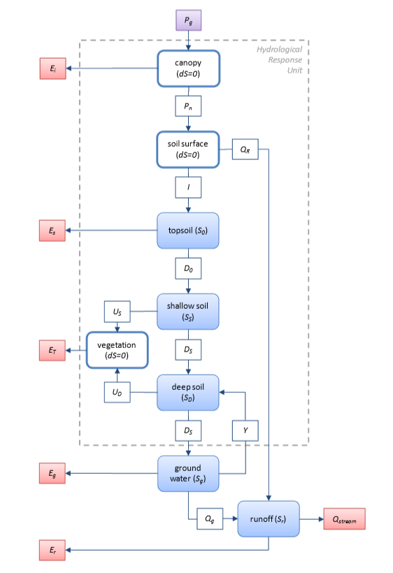

The wflow_W3RA and wflow_w3 Models
==================================

.. warning::

    The documentation of this model is incomplete

Introduction
------------
The wflow_w3ra and wflow_w3 models are adaptations of the Australian Water Resources Assessment Landscape model (AWRA-L). The AWRA-L model is developped through the Water Information Research and Development Alliance, 
the Bureau of Meteorology and CSIRO. It an hydrologic model that produces water balance component estimates for surface runoff, root water uptake, soil water drainage, groundwater discharge, capillary rise and streamflow.
Radiation and energy balance, Vapour fluxes and vegetation phenology are also included.

The following Figure describes the water stores and fluxes considered in AWRA-L:

For more information, please refer to the dedicated model documentation: Van Dijk, A. I. J. M. 2010. The Australian Water Resources Assessment System. Technical Report 3. Landscape Model (version 0.5) Technical Description. 
CSIRO: Water for a Healthy Country National Research Flagship.

Dependencies
------------

Configuration
-------------

It needs a number of settings in the ini file. The default name for the file
is wflow\_w3ra.ini or wflow\_w3.ini.

Examples are available in \\wflow\\examples\\wflow_w3ra\\ and \\wflow\\examples\\wflow_rhine_w3\\.

wflow_w3ra module documentation
-------------------------------

.. automodule:: wflow_w3ra
    :members:
    :undoc-members:
    :show-inheritance:
