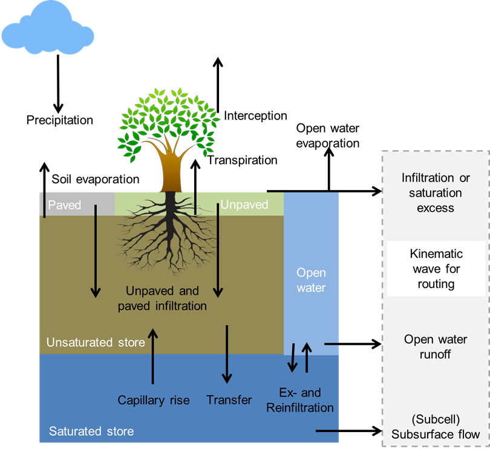
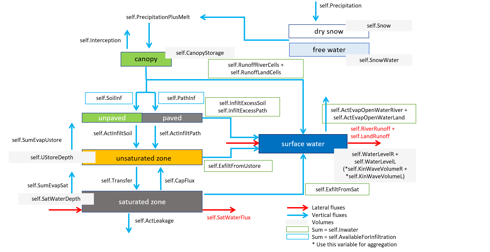
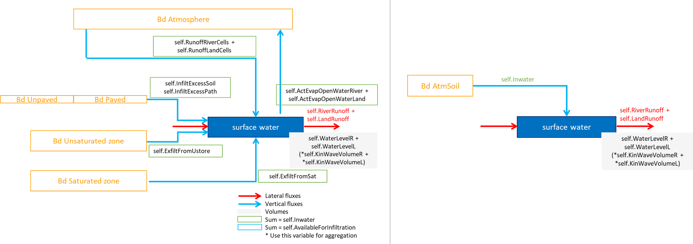
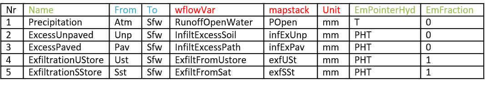
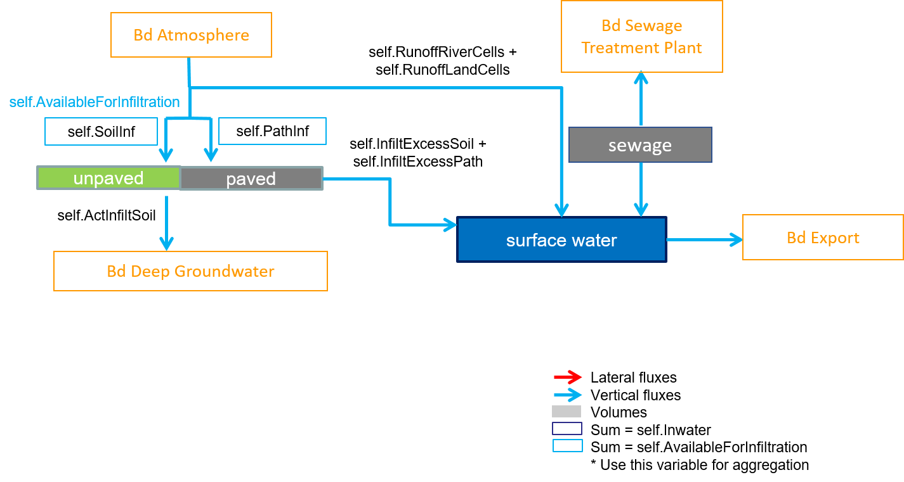
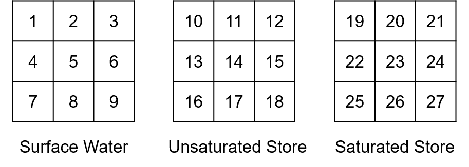
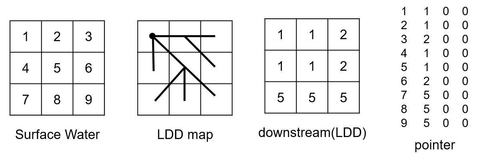
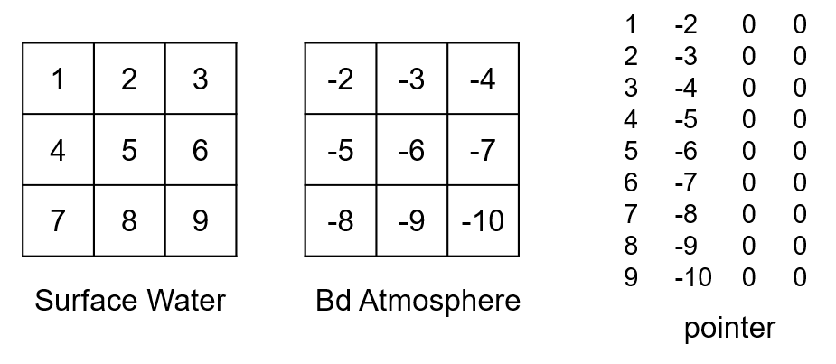
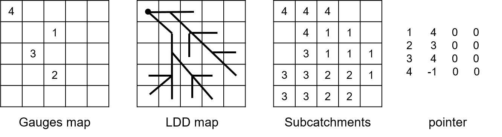

wflow_emwaq Module
==================

The wflow\_emwaq module provides a set of functions to create and link a Delft3Delwaq or D-Emission model to a wflow model. The module allows to both converts static and dynamic data from wflow\_sbm to readable structure, flow and emission 
data used to set up an emission or a water quality model (later referred to as D-Emission and Delwaq).

It is an extension of the wflow\_delwaq module that only handles the surface water for a Delwaq model. In addition, the script can aggregate results from wflow cells to build an emission/water quality model at the sub-catchment 
scale instead. The module has yet only been tested for wflow\_sbm but could as well be applied to other wflow models.

Basic concepts on the structure of wflow and D-Emission/Delwaq
-----------------------------------------------------------
The wflow\_sbm model is a fully distributed hydrologic model working on a regular grid of cells. Each cell is composed of several layers (or water buckets) such as open water, the unsaturated store or saturated store 
of the soil… (figure below) The link between each cell (or direction of the lateral water flow) is then defined according to the local drain direction map (ldd) which indicates which of the cell neighbours has the lowest elevation.

D-Emission or Delwaq are unstructured models. They are composed of unordered segments. Contrary to a wflow cell which contains several layers a D-Emission/WAQ segment only represent one layer, called a compartment. 
This means that one wflow cell is represented by several segments in D-Emission/WAQ: one for the open water, one for the unsaturated store, one for the saturated store… The direction of the flows in D-Emission/WAQ between 
each segment is defined in the pointer file. Contrary to wflow ldd which only needs to define the direction of lateral flows, the pointer file therefore also needs to indicate the direction of vertical flows (flows between 
the different layers/compartments of a same wflow cell). This also means that external flows coming to/out of a wflow cell (for example precipitation from the atmosphere) are defined in the pointer as flows between a segment 
and a boundary (for precipitation the boundary is the atmosphere).

The wflow_emwaq module main goal is then to convert wflow cells and ldd map into D-Emission/WAQ segments, compartments and pointer and to write the output flows from wflow into new flow files respecting the created cells/pointer 
framework.

As the cells grid from wflow\_sbm can lead to a very large model (especially the 1km resolution of the global wflow_sbm model), it is possible with the coupling to aggregate the results from wflow cells to subcatchments. 
With this option, a D-Emission/WAQ segment represents then a specific compartment of a wflow subcatchment instead of a specific compartment for a wflow cell.



    Overview of the different processes and fluxes in the wflow\_sbm model.


How to use the coupling module
------------------------------

Generalities
~~~~~~~~~~~~
The wflow\_emwaq module is a python script which has a similar structure as other wflow modules. First, a wflow\_sbm model is set up and run normally via the ini file and input data (tbl, staticmaps, inmaps…). Then 
wflow\_emwaq module is run to convert the outputs of wflow\_sbm into several files that serves as inputs to D-Emission/WAQ models (see scheme below). The set-up of the wflow\_emwaq run is also done via an ini file similar to 
wflow\_sbm and via three csv tables that selects the compartments, fluxes and boundaries that the user wants to include in the D-Emission/WAQ models. Finally, the links to the different files created by the wflow\_emwaq 
module are written in D-Emission/WAQ main input file and the emission and water quality model can be run.

.. figure:: _images/emwaq_scheme.jpg
    :width: 400px
    :align: center

    Scheme of the coupling between wflow and D-Emission-Delwaq.


Setting up the coupling
~~~~~~~~~~~~~~~~~~~~~~~

Defining the structure of the emission / water quality model
````````````````````````````````````````````````````````````
In order to set up an emission/water quality model, the user needs to choose which compartments, and which fluxes he wants to model. To aid that choice, the following figure sums up the different fluxes and the different 
layers/compartments of a wflow cell with their corresponding volumes.



    Complete wflow scheme.

For example, for a simple Delwaq run for the surface water with fraction calculation, only the surface water compartment is needed and all the fluxes coming in/out of it as shown in the left part of the following figure. 
In that case, the other compartments are turned into boundaries. In addition, as there is already a wflow variable that sums up all the in/outflows from the surface water (self.Inwater), the scheme can be simplified with 
just one boundary and flow (right part of the following figure).



    Compartments and fluxes needed for a Delwaq fraction model (left: with all the fluxes, right: simplified).

Once the needed compartments and fluxes have been defined, they have to be translated into inputs for the wflow\_emwaq module. This is done by editing the csv tables compartments.csv, fluxes.csv and boundaries.csv. 

The compartments.csv file is a table composed of eight columns (Table 1, columns in red need to be filled with precise keywords used in the coupling script, columns in blue only need to be consistent between the csv files):

-  Nr: number of the compartment. This field is not used by the python script of the module but is defined for user information.
-  ID: simplified identifier for the compartment, usually a few letters. The user can choose any name but IDs must be consistent with the ones in the fluxes.csv and boundaries.csv files.
-  Name: name of the compartment. This field is not used by the python script of the module but is defined for user information.
-  wflowVar: wflow\_sbm variable representing the volume of the compartment (as in the complete scheme above). If the compartment isn’t defined or doesn’t have a volume defined in wflow\_sbm, for example Sewage or Paved, the keyword ZeroMap can be used. Several wflow variables can be summed up to create one WAQ flux using '+' symbol between variables.
-  mapstack: name of the PCRaster or NetCDF mapstack (storage of the output variables). Mapstack are defined in the wflow_sbm ini file by the user. Note that the maximum allowed number of characters is eight. If the compartment doesn’t have a volume defined in wflow_sbm, for example Paved or Unpaved, the keyword ZeroMap can be used. Several wflow mapstacks can be summed up to create one WAQ flux using '+' symbol between mapstacks.
-  Unit: unit of the compartment volume, usually either mm or m3 for wflow volumes. If the volume is in mm, the script will convert it into m3 which is the standard for Delwaq.
-  At1, At2: D-Emission/WAQ attributes of the compartments. Usually attribute 1 specifies if the compartments is active or passive and attribute 2 specifies the type of the compartment (0 for surface water in 1D/2D models… see D-Emission/WAQ documentation). Here it is important that At2 is set to 0 for the Surface Water compartment and other numbers for the others.

Table 1: Example of the compartmemts.csv file for a Delwaq fraction model


The boundaries.csv file, which is not used by the script but for user information, is a table composed of three columns (Table 2, columns in blue only need to be consistent between the csv files):

-  Nr: number of the boundary. This field is not used by the python script of the module but is defined for user information.
-  ID: simplified identifier for the boundary, usually a few letters. The user can choose any names but IDs must be consistent with the ones in the fluxes.csv and compartments.csv files.
-  Name: name of the boundary. This field is not used by the python script of the module but is defined for user information.

Table 2: Example of the boundaries.csv file for a Delwaq fraction model


The fluxes.csv file is a table composed of nine columns (Table 3, columns in red need to be filled with precise keywords used in the coupling script, columns in blue only need to be consistent between the csv files, columns in green are required only for a coupling with an emission model):

-  Nr: number of the flux. This field is not used by the python script of the module but is defined for user information.
-  Name: name of the flux. This field is not used by the python script of the module but is defined for user information. For a coupling with D-Emission, this field is used to create the parameters name of the hydrology file. An “f” will be added at the beginning of the name if the flux unit is in fraction.
-  From: simplified identifier for the compartment or boundary where the flow comes from, usually a few letters. The user can choose any name but IDs must be consistent with the ones in the compartments.csv and boundaries.csv files.
-  To: simplified identifier for the compartment or boundary where the flow goes to, usually a few letters. The user can choose any name but IDs must be consistent with the ones in the compartments.csv and boundaries.csv files.
-  wflowVar: wflow_sbm variable representing the flux (as in Figure 3). If the flux is not defined in wflow_sbm, for example flux between the Sewage compartment and Surface Water in an emission model, the keyword ZeroMap can be used. Several wflow variables can be summed up to create one WAQ flux using '+' symbol between variables.
-  mapstack: name of the PCRaster or NetCDF mapstack (storage of the output variables). Mapstack are defined in the wflow_sbm ini file by the user. Note that the maximum allowed number of characters is eight. If the flux is not defined in wflow_sbm, for example flux between the Sewage compartment and Surface Water in an emission model, the keyword ZeroMap can be used. Several wflow mapstacks can be summed up to create one WAQ flux using '+' symbol between mapstacks.
-  Unit: unit of the flux, usually either mm or m3/s for wflow fluxes. If the flux is in mm, the script will convert it into m3/s which is the standard for Delwaq or D-Emission.
-  EmPointerHyd: specificity of the emission model. In the coupling between wflow and D-Emission, both the pointer file between each segment and actual fluxes data (hydrology.bin file) are saved. While the two files are consistent in Delwaq, this is not the case for D-Emission where some fluxes may only be present in the pointer but not the hydrology file and vice-versa. To take that into account the following keywords are used: P for a flux only present in the pointer file, H for a flux only present in the hydrology file and PH for a flux present in both. Note: D-Emission also needs an additional flow recorded in the hydrology file which is the “TotalFlow” that sums up some of wflow\_sbm fluxes to the surface water. If a wflow flux is needed for the calculation of the “TotalFlow”, the keywords T, PT, HT or PHT are used depending if the flow is also needed for the pointer and/or hydrology file. 
-  EmFraction: for emission modelling some fluxes units have to be converted to fraction of the volume of the compartment from which they come from. For those fluxes the keyword 1 is used, else 0.

Table 3: Example of the fluxes.csv file for a Delwaq fraction model



**Specificities of the coupling with D-Emission**

Setting up an emission model from wflow\_sbm is less straightforward than for Delwaq and the coupling script has therefore further requirements needed.  For example, an emission model can contain compartments that are not present
in wflow\_sbm, for example the Sewage compartment (figure below). To add this compartment, a new compartment line in the compartments.csv is added and as for the Paved or Unpaved compartments that don’t have any volume, 
the corresponding wflowVar and mapstack column values are ZeroMap. Then additional fluxes linked to the Sewage compartments are also added. There are two of them: a flux from the Sewage to the Surface Water compartment 
and a second flux from the Sewage to a Waste Water Treatment Plant boundary. As these fluxes are not defined in wflow\_sbm, the corresponding wflowVar and mapstack values are again ZeroMap.



    Example of an emssion model including a Sewage compartment.

Then, contrary to Delwaq, wflow\_sbm fluxes are not saved in a flow.dat file that represents exactly the pointer structure but rather in a hydrology.bin file that only saves some of the fluxes. This means that some wflow\_sbm 
fluxes are needed just in the pointer or in the hydrology file. In addition, in the hydrology file, an additional flow recorded is the “TotalFlow” that sums up some of wflow_sbm fluxes to the surface water. These fluxes may 
already be needed for the pointer or the hydrology file or just for the “TotalFlow”. In order to tell the coupling code which flux is needed where, the column EmPointerHyd is added in the fluxes.csv file. This column is filled 
with specific keywords:

-  P: flux only needed for the pointer (for example the flux from the Sewage to the Waste Water Treatment Plant).
-  H: flux only needed in the hydrology file.
-  T: flux only needed for the calculation of the “TotalFlow” (for example the precipitation falling directly to the surface runoff compartment self.RunoffOpenWater).
-  PH: flux needed for the pointer and the hydrology file.
-  PT: flux needed for the pointer and “TotalFlow”.
-  HT: flux needed for the hydrology file and “TotalFlow”.
-  PHT: flux needed for the pointer, hydrology file and “TotalFlow”.

Finally, the last difference is that for D-Emission, some of the saved fluxes are not in m3/s but in fraction of the compartment’s volume. To identify such fluxes, the column EmFraction was added to the fluxes.csv table 
and is filled with 1 if the wflow_sbm flux needs to be converted in fraction of the volume or with 0 if the flux needs to be converted in m3/s.


**Specificities of the aggregation option**

If aggregation of wflow\_sbm results from the cell to the subcatchment scale is needed, then the variable representing the volume of the surface water in wflow_sbm must be self.KinWaveVolume. This is because the surface area 
of the surface water compartment is not always the cell area but can also be the river surface area for wflow river cells.

Adding emissions maps
`````````````````````
The coupling can also prepare .inc emission data for D-Emission/WAQ, that are adapted to the wflow schematisation. In order to enable this option, emissions data must be prepared as wflow PCRaster map files and the links to these maps 
written in an emissions.csv file. The emssions.csv file contains 5 columns (Table 4, columns in red need to be filled with precise keywords used in the coupling script, columns in blue only need to be consistent between the csv files):

-  Nr: number of the emission data.
-  Name: name of the emission
-  To: ID of the compartment where the emission are located.
-  Fileloc: the link to the .map emission file. Path is relative to the wflow model casename.
-  AggType: if data need to be aggregated to the subcatchment level, identify the aggregation operation (total, average, maximum, minimum).

Table 4: Example of the emissions.csv file


Setting up the wflow\_sbm run
`````````````````````````````

If the user wants to aggregate the results from wflow cells to subcatchments, then wflow outputs are not saved as classical map files (netCDF or PCRaster) but as CSV tables where all the different fluxes and volumes are 
already aggregated. To create the CSV tables, wflow\_sbm variables are not saved in the outputmaps section of the ini file but in the different outputcsv sections.  Complete settings of these sections are described in the 
wflow documentation. For a coupling with water quality and emission modelling, only two types of CSV files need to be saved: wflow variables that are sampled at the outlet of the subcatchments and wflow variables that 
are summed up over the entire subcatchment area. 

The corresponding settings for variables summed over the entire catchment area are:

-  Type of wflow variables concerned: all the vertical fluxes between compartments and or boundaries, plus the variables representing the compartments volume/storage.
-  samplemap: link to the map of the subcatchments where results should be summed up.
-  function: type of function to use for the sampling by subcathcments. For the coupling, the sum is needed and function is then total. (Other possible wflow_sbm functions are average, minimum, maximum…).
-  List of wflow variables to save with the “.csv” extension.

And corresponding settings for variables sampled at the outlet of the subcatchments are:

-  Type of wflow variables concerned: all the lateral fluxes between compartments ie SurfaceRunoff and/or SatWaterFlux. In addition, due to possible conversions of units, the compartments volume/storage are also needed. As two csv files cannot have the same name, the letter g is added to the mapstack name. For example, the csv tables of the Saturated Store water depth would be “SStore.csv” for the sum over subcatchments and “SStoreg.csv” for the sampling at the gauges/subcatchments outlets.

.. warning::

    If the aggregation of wflow_sbm results from cells to subcatchments is used, the wflow variable used for the surface water compartment is self.KinWaveVolume instead of self.WaterLevel


Setting up the wflow\_emwaq run
```````````````````````````````

As for wflow\_sbm, wflow\_emwaq also has its own ini file wflow\_emwaq.ini. The different sections are (see the template for examples):

-  inputcsv: similar to the inputmapstacks section in wflow_sbm.ini, it lists the links to the csv tables. By defaults, the csv are placed in a new csv folder in the model directory of the wflow case. Required arguments are:

   -  sepcsv: separator between each field of the csv file. Usually "," or ";"
   -  compartments: link to the compartments.csv file.
   -  boundaries: link to the boundaries.csv file.
   -  fluxes: link to the fluxes.csv file.
   -  emissions: link to the emissions.csv file. If no path is specified the coupling won't produce any emission data.

-  run: similar than in wflow_sbm.ini. Required fields are:

   -  starttime: beginning of the simulation.
   -  endtime: end of the simulation.
   -  timestepsecs: length of the time step in seconds.
   -  runlengthdetermination: either intervals or steps depending on the format of the timestep.

-  model: maps and options to use for the model run.
   
   Type of the results saved by wflow_sbm. Indicate which type of file the coupling should read from. Options are:
   
   -  input_type: type of wflow outputs to read. Can be netcdf or PCRaster map  files or csv tables. The csv tables option is the one to use if aggregation of results to subcatchments is chosen.
   -  netcdfinput: name of the possible NetCDF output file of wflow_sbm is required. Can be left empty if input_type is either map or csv.
   
   Options for wflow_emwaq run (0 to turn off or 1 to turn on):
   
   -  write_ascii: dynamic data for D-Emission/WAQ are saved in binary files. If this option is on, an ASCII copy will also be created. Default is 0.
   -  write_structure: if on, structure data for D-Emission/WAQ are produced. Default is 1.
   -  write_dynamic: if on, dynamic data for D-Emission/WAQ are produced. Default is 1.
   -  fraction: if on, produce additional structure files used for Delwaq fraction mode. Default is 0.
   -  emission: if on, a coupling for D-Emission will be prepared. If off, a coupling for Delwaq will be prepared. Default is 0.
   -  fews: if on, additional files to use for FEWS or deltashell GUI will be produced. Default is 0.
   -  aggregation: if on, results from wflow_sbm will be aggregated from the cell to the subcatchment scale.
   
   Input or output staticmaps of wflow_sbm to use. The maps needed are:

   -  wflow_subcatch: map of wflow subcatchments. Serves as basis to define the extent of the model grid. Map used for the aggregation of results option.
   -  wflow_ldd: wflow local drain direction map used for pointer creation.
   -  wflow_gauges: map with points of interest where D-Emission/WAQ results will be saved. Map used for the aggregation of results option.
   -  wflow_reallength: map with the cell size (corrected with real latitude).
   -  wflow_pathfrac: fraction of the land part of the cell that is paved.
   -  wflow_waterfrac: fraction of the open water part of the cell.

   Settings for D-Emission/WAQ monitoring points or areas. Indicates the segments or zones where the emission water quality models sum and save the results.
   
   -  mon_points: selection of segments where results will be saved. Option segments will save the results for every segment of the model. Option gauges will save it for the compartments belonging to the points selected in the wflow_gauge map.  The gauges option is not handled if aggregation option is on.
   -  mon_areas: selection of monitoring areas to aggregate results. Option subcatch will save results for the segments present in each subcatchment of the wflow_subcatch map.  Option compartments will save it for the segments belonging in the same compartment type (e.g. by surface water). The subcatch option is not handled if aggregation option is on.

   Settings for the numbering of the model boundaries. Indicates if the boundary ID is set by boundary type (ex: one ID for atmosphere) or if it is set by boundary type and for each segment.
   
   -  bd_id: the default numbering is one ID per boundary type. If bd_id is set to segments then one ID per boundary type and per segment will be created.

   Additional parameters from wflow_sbm needing for data processing. Now only one parameter is needed:
   
   -  UStoreLayerThickness: same as in wflow_sbm.ini. It is needed in order for the python script to be able to handle the instates files of all the layers of the unsaturated store.


Running the coupling
~~~~~~~~~~~~~~~~~~~~

Like wflow_sbm, the whole coupling process can be run either from the command line or batch file(s). First wflow\_sbm is run. The minimum command line requires:

-  The link to the wflow_sbm script.
-  -C option stating the name of the wflow case directory.
-  -R option stating the name of the directory of wflow_sbm outputs.

Then wflow\_emwaq is run. The minimum command line requires:

-  The link to the wflow_emwaq script.
-  -C option stating the name of the wflow case directory (idem sbm).
-  -R option stating the name of the directory containing wflow_sbm outputs (idem sbm).
-  -D option stating the name of the directory of wflow_emwaq outputs.
-  -c option stating the name of wflow_emwaq ini file.

Additional run options corresponding to the one set up in the model section of the ini file are:

-  -i for writing binary and ASCII files.
-  -u for writing structure files.
-  -y for writing dynamic files.
-  -f for writing additional fraction files.
-  -e for an emission or water quality coupling.
-  -F for writing additional files for FEWS or deltashell GUIs.
-  -a for aggregation of results from cells to subcatchments.

Finally, all the files produced by wflow\_emwaq needs to be included in the main input file from D-Emission/WAQ and the emission or water quality model can be run. An example of the command lines needed to run both wflow python 
scripts is:

::

    activate wflow
    python wflow\wflow_sbm.py -C Rhine -R SBM
    python wflow\wflow_emwaq.py -C Rhine -R SBM -D Rhine\WAQ -c wflow_emwaq.ini


Outputs of the wflow\_emwaq module
~~~~~~~~~~~~~~~~~~~~~~~~~~~~~~~~~~

The wflow\_emwaq module produces several folders in the defined run directory. These are the debug folder which contains additional maps or files produced during the coupling process, the includes\_deltashell folder which 
includes all the structure files listed in Table 4 and the includes\_deltashell folder which includes all the data files listed in Table 5. The type of files produced depend if the coupling is made for an emission model 
or a water quality model with or without fraction calculation.

Table 4: List of structure files produced by wflow\_emwaq

========================== ========== ======== ===============
 File name                  Emission   Delwaq   Fraction mode 
========================== ========== ======== ===============
 B1\_sublist.inc                                      X       
 B1\_timestamp.inc              X        X                    
 B2\_monareas.inc               X        X                    
 B2\_nrofmon.inc                X        X                    
 B2\_outputtimes.inc            X        X                    
 B2\_stations.inc               X        X                    
 B2\_stations-balance.inc       X        X                    
 B2\_timers.inc                 X        X                    
 B3\_attributes.inc             X        X                    
 B3\_nrofseg.inc                X        X                    
 B4\_nrofexch.inc               X        X                    
 B4\_pointer.inc                X        X                    
 B5\_bounddata.inc                                     X      
 B5\_boundlist.inc              X        X                    
 B8\_initials.inc                                      X      
geometry.inc                    X                             
hydrology.bin                   X                             
nrofsegl.inc                    X                             
========================== ========== ======== ===============

Table 5: List of data files produced by wflow\_emwaq

===================== ========== ========
 File name             Emission   Delwaq 
===================== ========== ========
area.dat                            X    
flow.dat                            X    
manning.dat                         X    
surface.dat                         X    
velocity.dat                        X    
volume.dat                          X    
hydrology.bin             X              
===================== ========== ========


How the coupling script works
-----------------------------

Creation of the pointer
~~~~~~~~~~~~~~~~~~~~~~~
To create the pointer file needed by the emission/water quality models, the wflow\_emwaq scripts first gives a unique ID number to each of the active cell of the wflow\_sbm grid (cells that are in the area modelled). 
Then the script reads the compartments.csv table. The unique IDs previously created are then assigned to the first compartment listed in the table. Then if there are other compartments listed in the table, the unique 
IDs are copied and shifted by the total number of cells. Compartments are therefore read one by one and the different segment IDs are created step by step accordingly. For example, for a wflow model with 9 active grid 
cells, if the compartments.csv table contains three lines starting from "Surface Water” to “Unsaturated Store” and finishing with “Saturated Store”, the corresponding IDs of the D-Emission/WAQ model would be:



Then the fluxes and links to the fluxes are handled. Instead of reading the fluxes list defined in the corresponding csv table one by one like for the compartments, they are instead read by type starting with the lateral 
fluxes (equal name in the From and To column of the fluxes.csv table).  The direction of the flow within the segment of the same compartment is defined with the local drain direction (LDD) map from wflow_sbm. With this map, 
the downstream cell ID is identified and the pointer file construction is starting. Back to our example, the first lines of the pointer would then be:



The next step is to spot the outflows of the model (flow staying in the same cell) and turn them into outflow boundaries in the pointer. In the pointer, boundaries are segment with negative values. Outflows IDs are then given 
a new ID starting from -1. In the example, the first line of the pointer will give:     1    -1    0    0.

The second type of fluxes treated are the vertical fluxes between compartments (names in the From and To columns of fluxes.csv both corresponds to names in the ID column of compartments.csv). Direction of the flow corresponds 
then to the IDs of the compartments of the same cell. Vertical fluxes between compartments are read in the same order of appearance in the fluxes.csv file. For example, if we take a flow going from the surface water to the 
unsaturated store, the corresponding lines of the pointer will be:


Finally, the vertical fluxes between compartments and boundaries are treated (names in either the From or To column of fluxes.csv corresponds to a name in the ID column of compartments.csv). By default, the coupling gives 
one ID per boundary type. If the bd_id option is set, IDs for boundaries are defined in the same way as for the compartments (one ID per boundary per active cell). Numbering starts with an offset corresponding to the number 
of outflows. Vertical fluxes between compartment and boundary are also read in the same order of appearance in the fluxes.csv file. For example, if we have a flux going from the boundary atmosphere to the surface water 
(precipitation), the corresponding IDs for the atmosphere boundary and pointer lines, by default, would be (there was already one outflow boundary):


And if bd_id is set to segments:




Specificities of the aggregation option
```````````````````````````````````````

When wflow\_sbm outputs are handled for all cells by the coupling, IDs are given to the cells row by row starting from the top left corner to the bottom right corner of the grid. If wflow results are aggregated by subcatchments 
IDs depends on the wflow subcatchment map that is used. Subcatchments ID are then sorted by ascending order rather than location on the map. For lateral flows, the downstream subcatchment is determined using the downstream cell 
of the outlet (corresponding to the wflow gauge map). If we take an example with four subcatchments, the pointer for the lateral flux (after replacing the outflow by a boundary) will then be:



If there are several compartments, they are then handled in the same way than for cells. The fluxes are also treated in the same order, first the lateral fluxes, then fluxes between two compartments and finally fluxes with 
boundaries.

Creation of the other structure files
~~~~~~~~~~~~~~~~~~~~~~~~~~~~~~~~~~~~~
Once the pointer is created, the other structure files are created using a specific function from the coupling script. These functions usually use inputs coming from the pointer file creation.

Creation of the flow file (either flow.dat or hydrology.bin)
~~~~~~~~~~~~~~~~~~~~~~~~~~~~~~~~~~~~~~~~~~~~~~~~~~~~~~~~~~~~

For a coupling with Delwaq for each wflow cells, the flow.dat file is constructed in the very same way as the pointer. Flows are read from lateral, to between 2 compartments to between boundaries and compartments and then in 
the order of their definition in the fluxes.csv table.  For each timestep, the corresponding wflow netcdf or map output will be read, and fluxes values saved row by row from the top left corner to the bottom right corner, 
corresponding to the numbering of the wflow cells IDs.

For a coupling with D-Emission for each wflow cells, as some fluxes are present in the pointer but not the hydrology file, another definition file hydrology.inc is created to give the order of the fluxes saved in the 
hydrology.bin file and the corresponding segments affected in the pointer file. As the order of the fluxes definition is not important then, fluxes are saved one by one in the order of their definition in the fluxes.csv 
table (and not from lateral to vertical fluxes). The “TotalFlow” is then added at the end. As for a Delwaq coupling, for each timestep, the corresponding wflow netcdf or map output will be read and fluxes values saved row 
by row from the top left corner to the bottom right corner, corresponding to the numbering of the wflow cells IDs.

If the aggregation option is on, the entire aggregated CSV tables of the different wflow variables are read in the order of the flow definition in the pointer file for Delwaq (lateral then vertical) and in the order of their 
definition in the fluxes.csv table for D-Emission. As wflow already sorts the saved aggregated variables by ascending number of the subcatchment IDs, no restructuration of the variables CSV tables is needed.


wflow_emwaq module documentation
--------------------------------

.. automodule:: wflow_emwaq
    :members:
    :undoc-members:
    :show-inheritance:

    .. autoattribute:: usage


