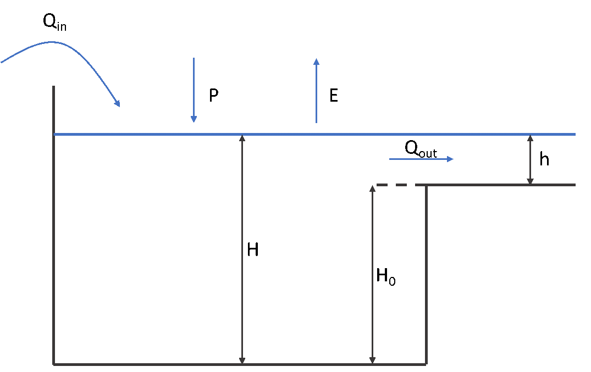

wflow_funcs Module
==================

Introduction
------------
wflow_funcs is a library of hydrological modules that can be used by any of the wflow models. It includes modules related to:

- the kinematic wave routing for surface and subsurface flow

- rainfall interception by the vegetation

- snow and glaciers modelling

- reservoirs and lakes modelling.


Kinematic Wave
--------------

Surface flow routing
~~~~~~~~~~~~~~~~~~~~

The main flow routing scheme used by the wflow models (wflow\_sbm and wflow\_hbv) is the kinematic wave approach for channel and overland flow, assuming that the topography controls water flow mostly.
The kinemative wave equations are (Chow, 1988): :math:`\dfrac{dQ}{dx} + \dfrac{dA}{dt} = q` and :math:`A = \alpha * Q^{\beta}`. These equations can then be combined as a function of streamflow only:

.. math:: \dfrac{dQ}{dx} + \alpha * \beta * Q^{\beta - 1} * \dfrac{dQ}{dt} = q

where :math:`Q` is the surface runoff in the kinematic wave [m\ :math:`^{3}`/s], :math:`x` is the length of the runoff pathway [m], :math:`A` is the cross-section area of the runoff pathway [m\ :math:`^{2}`],
:math:`t` is the integration timestep [s] and \alpha and \beta are coefficients.


These equations are solved with a nonlinear scheme using Newton’s method and can also be iterated depending on the wflow models space and time resolutions. By default, the iterations are performed until a stable solution is
reached (\epsilon < 10\ :math:`^{-12}`). For larger models, the number of iterations can also be fixed for wflow\_sbm to a specific sub-timestep (in seconds) for both overland and channel flows to improve simulation time. To enable (fixed or not) iterations
of the kinematic wave the following lines can be inserted in the ini files of the related models:

::
    [model]
    # Enable iterations of the kinematic wave
    kinwaveIters = 1
    # Fixed sub-timestep for iterations of channel flow (river cells)
    kinwaveRiverTstep = 900
    # Fixed sub-timestep for iterations of overland flow (land cells)
    kinwaveLandTstep = 3600

Subsurface flow routing
~~~~~~~~~~~~~~~~~~~~~~~

In wflow\_sbm the kinematic wave approach is used to route subsurface flow laterally. The saturated store :math:`S` can be drained laterally by
saturated downslope subsurface flow per unit width of slope :math:`w` [mm] according to: 

.. math:: q=\frac{K_{0}\mathit{tan(\beta)}}{f}(e^{(-fz_{i})}-e^{(-fz_{t})})

where :math:`\beta` is element slope angle [deg.], :math:`q` is subsurface flow [:math:`mm^{2}/t`], 
:math:`K_{0}` is the saturated hydraulic conductivity at the soil surface [mm/t], :math:`z_{i}` is the water table depth [mm],
:math:`z_{t}` is total soil depth [mm], and :math:`f` is a scaling parameter [:math:`mm^{-1}`]:

.. math:: f=\frac{\theta_{s}-\theta_{r}}{M}

where :math:`\theta_{s}` is saturated water content [mm/mm] and :math:`\theta_{r}` is residual water content [mm/mm]
and :math:`M` represents a model parameter [mm], that determines the decrease of vertical saturated conductivity
with depth.

Combining with the following continuity equation:

.. math:: (\theta_s-\theta_r)\frac{\partial h}{\partial t} = -w\frac{\partial q}{\partial x} + wr

where :math:`h` is the water table height [mm], :math:`x` is the distance downslope [mm], and :math:`r` is the netto input rate
[mm/t] to the saturated store.

and substituting for :math:`h (\frac{\partial q}{\partial h})`, gives:

.. math:: w \frac{\partial q}{\partial t} = -cw\frac{\partial q}{\partial x} + cwr

where celerity :math:`c = \frac{K_{0}\mathit{tan(\beta)}}{(\theta_s-\theta_r)} e^{(-fz_{i})}`

The kinematic wave equation for lateral subsurface flow is solved iteratively using Newton's method.

.. note::

    For the lateral subsurface flow kinematic wave the model timestep is not adjusted. For certain model timestep
    and model grid size combinations this may result in loss of accuracy.


Rainfall Interception
---------------------
Both the Gash and Rutter models are available in the wflow framework to estimate rainfall interception by the vegetation.
The selection of an interception model depends on the simulation timestep. These modules are used by the wflow\_sbm model.

The analytical (Gash) model
~~~~~~~~~~~~~~~~~~~~~~~~~~~

The analytical model of rainfall interception is based on Rutter’s
numerical model. The simplifications that introduced allow the model to
be applied on a daily basis, although a storm-based approach will yield
better results in situations with more than one storm per day. The
amount of water needed to completely saturate the canopy is defined as:

.. math:: 

    P'=\frac{-\overline{R}S}{\overline{E}_{w}}ln\left[1-\frac{\overline{E}_{w}}{\overline{R}}(1-p-p_{t})^{-1}\right]

where :math:`\overline{R}` is the average precipitation intensity on a saturated canopy 
and :math:`\overline{E}_{w}` the average evaporation from the wet canopy
and with the vegetation parameters :math:`S`, :math:`p` and :math:`p_t` as defined
previously. The model uses a series of expressions to calculate the
interception loss during different phases of a storm.
An analytical integration of the total evaporation and rainfall under
saturated canopy conditions is then done for each storm to determine
average values of :math:`\overline{E}_{w}` and :math:`\overline{R}`. 
The total evaporation from the canopy (the
total interception loss) is calculated as the sum of the components
listed in the table below. Interception losses from the stems are
calculated for days with :math:`P\geq S_{t}/p_{t}`. :math:`p_t` and :math:`S_t` are
small and neglected in the wflow\_sbm model.

Table: Formulation of the components of interception loss  according to Gash:

+---------------------------------------------------------------------------------------+-------------------------------------------------------------------+
|For :math:`m` small storms (:math:`P_{g}<{P'}_{g}`)                                    |  :math:`(1-p-p_{t})\sum_{j=1}^{m}P_{g,j}`                         |
+---------------------------------------------------------------------------------------+------------------------+------------------------------------------+
|Wetting up the canopy in :math:`n` large storms (:math:`P_{g}\geq{P'}_{g}`)            | :math:`n(1-p-p_{t}){P'}_{g}-nS`                                   |
+---------------------------------------------------------------------------------------+-------------------------------------------------------------------+
|Evaporation from saturated canopy during rainfall                                      | :math:`\overline{E}/\overline{R}\sum_{j=1}^{n}(P_{g,j}-{P'}_{g})` |
+---------------------------------------------------------------------------------------+-------------------------------------------------------------------+
|Evaporation after rainfall ceases for :math:`n` large storms                           | :math:`nS`                                                        |
+---------------------------------------------------------------------------------------+-------------------------------------------------------------------+
|Evaporation from trunks in :math:`q` storms that  fill the trunk storage               | :math:`qS_{t}`                                                    |
+---------------------------------------------------------------------------------------+-----------+-------------------------------------------------------+
|Evaporation from  trunks in (:math:`m+n-q`) storms that do not fill the trunk  storage | :math:`p_{t}\sum_{j=1}^{m+n-q}P_{g,j}`                            |
+---------------------------------------------------------------------------------------+-------------------------------------------------------------------+


In applying the analytical model, saturated conditions are assumed to
occur when the hourly rainfall exceeds a certain threshold. Often a
threshold of 0.5 mm/hr is used. :math:`\overline{R}` is calculated for all hours when the
rainfall exceeds the threshold to give an estimate of the mean rainfall
rate onto a saturated canopy.

Gash (1979) has shown that in a regression of interception loss on rainfall (on a storm basis) the regression
coefficient should equal to :math:`\overline{E}_w/\overline{R}`. Assuming that neither :math:`\overline{E}_w` nor
:math:`\overline{R}` vary considerably in time, :math:`\overline{E}_w` can be estimated in this way from
:math:`\overline{R}` in the absence of above-canopy climatic observations. Values derived in this way generally tend to
be (much) higher than those calculated with the penman-monteith equation.


Running with parameters derived from LAI
````````````````````````````````````````
The model can determine the Gash parameters from an LAI maps. In order to switch this on
you must define the LAI variable to the model (as in the example below).

::

    [modelparameters]
    LAI=inmaps/clim/LAI,monthlyclim,1.0,1
    Sl=inmaps/clim/LCtoSpecificLeafStorage.tbl,tbl,0.5,1,inmaps/clim/LC.map
    Kext=inmaps/clim/LCtoExtinctionCoefficient.tbl,tbl,0.5,1,inmaps/clim/LC.map
    Swood=inmaps/clim/LCtoBranchTrunkStorage.tbl,tbl,0.5,1,inmaps/clim/LC.map

Here LAI refers to a MAP with LAI (in this case one per month), Sl to a lookuptable
result of land cover to specific leaf storage, Kext to a lookuptable result of
land cover to extinction coefficient and Swood  to a lookuptable result of
"canopy" capacity of the vegetation woody fraction.


Here it is assumed that Cmax(leaves) (Gash’ canopy capacity for the leaves only) relates linearly with LAI (c.f. Van Dijk and Bruijnzeel 2001). This done
via the Sl (specific leaf storage). Sl is determined via a lookup table with land cover. Next the Cmax(leaves) is
determined using:

.. math::

    Cmax(leaves)  = Sl  * LAI

The table below shows lookup table for Sl (as determined from Pitman 1986, Lui 1998) and GlobCover land cover map.

::


    11   0.1272    Post-flooding or irrigated croplands (or aquatic)
    14   0.1272    Rainfed croplands
    20   0.1272    Mosaic cropland (50-70%) / vegetation (grassland/shrubland/forest) (20-50%)
    30   0.1272    Mosaic vegetation (grassland/shrubland/forest) (50-70%) / cropland (20-50%)
    40   0.03926   Closed to open (>15%) broadleaved evergreen or semi-deciduous forest (>5m)
    50   0.036     Closed (>40%) broadleaved deciduous forest (>5m)
    60   0.036     Open (15-40%) broadleaved deciduous forest/woodland (>5m)
    70   0.045     Closed (>40%) needleleaved evergreen forest (>5m)
    90   0.045     Open (15-40%) needleleaved deciduous or evergreen forest (>5m)
    100  0.03926   Closed to open (>15%) mixed broadleaved and needleleaved forest (>5m)
    110  0.07      Mosaic forest or shrubland (50-70%) / grassland (20-50%)
    120  0.1272    Mosaic grassland (50-70%) / forest or shrubland (20-50%)
    130  0.07      Closed to open (>15%) (broadleaved or needleleaved, evergreen or deciduous) shrubland (<5m)
    140  0.09      Closed to open (>15%) herbaceous vegetation (grassland, savannas or lichens/mosses)
    150  0.04      Sparse (<15%) vegetation
    160  0.04      Closed to open (>15%) broadleaved forest regularly flooded (semi-permanently or temporarily) - Fresh or brackish water
    170  0.036     Closed (>40%) broadleaved forest or shrubland permanently flooded - Saline or brackish water
    180  0.1272    Closed to open (>15%) grassland or woody vegetation on regularly flooded or waterlogged soil - Fresh, brackish or saline water
    190  0.04      Artificial surfaces and associated areas (Urban areas >50%)
    200  0.04      Bare areas
    210  0.04      Water bodies
    220  0.04      Permanent snow and ice
    230   -        No data (burnt areas, clouds,…)


To get to total storage (Cmax) the woody part of the vegetation also needs to be added. This is done via a simple
lookup table between land cover the Cmax(wood):

.. digraph:: cmax

    "GlobCover LandCover" -> "Sl lookuptable";
    "Sl lookuptable" -> Sl -> Multiply;
    "LAI (monthly)" -> Multiply -> "Cmax (leaves)" -> add;
    "GlobCover LandCover" -> "Cmax Wood lookuptable";
    "Cmax Wood lookuptable" -> "Cmax (wood)";
    "Cmax (wood)"-> add;
    add -> Cmax;

The  table below relates the land cover map to the woody part of the Cmax.

::

    11   0.01    Post-flooding or irrigated croplands (or aquatic)
    14   0.0     Rainfed croplands
    20   0.01    Mosaic cropland (50-70%) / vegetation (grassland/shrubland/forest) (20-50%)
    30   0.01    Mosaic vegetation (grassland/shrubland/forest) (50-70%) / cropland (20-50%)
    40   0.5     Closed to open (>15%) broadleaved evergreen or semi-deciduous forest (>5m)
    50   0.5     Closed (>40%) broadleaved deciduous forest (>5m)
    60   0.5     Open (15-40%) broadleaved deciduous forest/woodland (>5m)
    70   0.5     Closed (>40%) needleleaved evergreen forest (>5m)
    90   0.5     Open (15-40%) needleleaved deciduous or evergreen forest (>5m)
    100  0.5     Closed to open (>15%) mixed broadleaved and needleleaved forest (>5m)
    110  0.2     Mosaic forest or shrubland (50-70%) / grassland (20-50%)
    120  0.05    Mosaic grassland (50-70%) / forest or shrubland (20-50%)
    130  0.1     Closed to open (>15%) (broadleaved or needleleaved, evergreen or deciduous) shrubland (<5m)
    140  0.0     Closed to open (>15%) herbaceous vegetation (grassland, savannas or lichens/mosses)
    150  0.04    Sparse (<15%) vegetation
    160  0.1     Closed to open (>15%) broadleaved forest regularly flooded (semi-permanently or temporarily) - Fresh or brackish water
    170  0.2     Closed (>40%) broadleaved forest or shrubland permanently flooded - Saline or brackish water
    180  0.01    Closed to open (>15%) grassland or woody vegetation on regularly flooded or waterlogged soil - Fresh, brackish or saline water
    190  0.01    Artificial surfaces and associated areas (Urban areas >50%)
    200  0.0     Bare areas
    210  0.0     Water bodies
    220  0.0     Permanent snow and ice
    230   -      No data (burnt areas, clouds,…)


The canopy gap fraction is determined using the  k: extinction coefficient (van Dijk and Bruijnzeel 2001):

.. math::

    CanopyGapFraction = exp(-k * LAI)

The table below show how k is related to land cover:

::

    11   0.6    Post-flooding or irrigated croplands (or aquatic)
    14   0.6    Rainfed croplands
    20   0.6    Mosaic cropland (50-70%) / vegetation (grassland/shrubland/forest) (20-50%)
    30   0.6    Mosaic vegetation (grassland/shrubland/forest) (50-70%) / cropland (20-50%)
    40   0.6    Closed to open (>15%) broadleaved evergreen or semi-deciduous forest (>5m)
    50   0.8    Closed (>40%) broadleaved deciduous forest (>5m)
    60   0.8    Open (15-40%) broadleaved deciduous forest/woodland (>5m)
    70   0.8    Closed (>40%) needleleaved evergreen forest (>5m)
    90   0.8    Open (15-40%) needleleaved deciduous or evergreen forest (>5m)
    100  0.8    Closed to open (>15%) mixed broadleaved and needleleaved forest (>5m)
    110  0.6    Mosaic forest or shrubland (50-70%) / grassland (20-50%)
    120  0.6    Mosaic grassland (50-70%) / forest or shrubland (20-50%)
    130  0.6    Closed to open (>15%) (broadleaved or needleleaved, evergreen or deciduous) shrubland (<5m)
    140  0.6    Closed to open (>15%) herbaceous vegetation (grassland, savannas or lichens/mosses)
    150  0.6    Sparse (<15%) vegetation
    160  0.6    Closed to open (>15%) broadleaved forest regularly flooded (semi-permanently or temporarily) - Fresh or brackish water
    170  0.8    Closed (>40%) broadleaved forest or shrubland permanently flooded - Saline or brackish water
    180  0.6    Closed to open (>15%) grassland or woody vegetation on regularly flooded or waterlogged soil - Fresh, brackish or saline water
    190  0.6    Artificial surfaces and associated areas (Urban areas >50%)
    200  0.6    Bare areas
    210  0.7    Water bodies
    220  0.6    Permanent snow and ice
    230   -     No data (burnt areas, clouds,…)d


The modified rutter model
~~~~~~~~~~~~~~~~~~~~~~~~~

For subdaily timesteps the model uses a simplification of the Rutter model. The simplified
model is solved explicitly and does not take drainage from the canopy into account.

::

    def rainfall_interception_modrut(Precipitation, PotEvap, CanopyStorage, CanopyGapFraction, Cmax):
    """
    Interception according to a modified Rutter model. The model is solved
    explicitly and there is no drainage below Cmax.
    
    Returns:
        - NetInterception: P - TF - SF (may be different from the actual wet canopy evaporation)
        - ThroughFall:
        - StemFlow:
        - LeftOver: Amount of potential eveporation not used
        - Interception: Actual wet canopy evaporation in this thimestep
        - CanopyStorage: Canopy storage at the end of the timestep
    
    """

    ##########################################################################
    # Interception according to a modified Rutter model with hourly timesteps#
    ##########################################################################

    p = CanopyGapFraction
    pt = 0.1 * p

    # Amount of P that falls on the canopy
    Pfrac = pcr.max((1 - p - pt), 0) * Precipitation

    # S cannot be larger than Cmax, no gravity drainage below that
    DD = pcr.ifthenelse(CanopyStorage > Cmax, CanopyStorage - Cmax, 0.0)
    CanopyStorage = CanopyStorage - DD

    # Add the precipitation that falls on the canopy to the store
    CanopyStorage = CanopyStorage + Pfrac

    # Now do the Evap, make sure the store does not get negative
    dC = -1 * pcr.min(CanopyStorage, PotEvap)
    CanopyStorage = CanopyStorage + dC

    LeftOver = PotEvap + dC
    # Amount of evap not used

    # Now drain the canopy storage again if needed...
    D = pcr.ifthenelse(CanopyStorage > Cmax, CanopyStorage - Cmax, 0.0)
    CanopyStorage = CanopyStorage - D

    # Calculate throughfall
    ThroughFall = DD + D + p * Precipitation
    StemFlow = Precipitation * pt

    # Calculate interception, this is NET Interception
    NetInterception = Precipitation - ThroughFall - StemFlow
    Interception = -dC

    return NetInterception, ThroughFall, StemFlow, LeftOver, Interception, CanopyStorage

Snow and Glaciers
-----------------
Snow and glaciers processes, from the HBV model, are available in the wflow framework. The snow and glacier functions are
used by the wflow\_sbm model, and the glacier function is used by the wflow\_hbv model.

Snow modelling
~~~~~~~~~~~~~~

If the air temperature, :math:`T_{a}`, is below a user-defined threshold :math:`TT (\approx0^{o}C)`
precipitation occurs as snowfall, whereas it occurs as rainfall if
:math:`T_{a}\geq TT`. A another parameter :math:`TTI` defines how precipitation
can occur partly as rain of snowfall (see the figure below).
If precipitation occurs as snowfall, it is added to the dry snow component
within the snow pack. Otherwise it ends up in the free water reservoir,
which represents the liquid water content of the snow pack. Between
the two components of the snow pack, interactions take place, either
through snow melt (if temperatures are above a threshold :math:`TT`) or
through snow refreezing (if temperatures are below threshold :math:`TT`).
The respective rates of snow melt and refreezing are:

.. math::

    Q_{m}  =  cfmax(T_{a}-TT)\;\;;T_{a}>TT

    Q_{r}  =  cfmax*cfr(TT-T_{a})\;;T_{a}<TT


where :math:`Q_{m}` is the rate of snow melt, :math:`Q_{r}` is the rate of snow
refreezing, and $cfmax$ and $cfr$ are user defined model parameters
(the melting factor :math:`mm/(^{o}C*day)` and the refreezing factor
respectively)

.. note::

    The FoCFMAX parameter from the original HBV version is not used. instead
    the CFMAX is presumed to be for the landuse per pixel. Normally for
    forested pixels the CFMAX is 0.6 {*} CFMAX


The air temperature, :math:`T_{a}`, is related to measured daily average
temperatures. In the original HBV-concept, elevation differences within
the catchment are represented through a distribution function (i.e.
a hypsographic curve) which makes the snow module semi-distributed.
In the modified version that is applied here, the temperature, :math:`T_{a}`,
is represented in a fully distributed manner, which means for each
grid cell the temperature is related to the grid elevation.

The fraction of liquid water in the snow pack (free water) is at most
equal to a user defined fraction, :math:`WHC`, of the water equivalent
of the dry snow content. If the liquid water concentration exceeds
:math:`WHC`, either through snow melt or incoming rainfall, the surpluss
water becomes available for infiltration into the soil:

.. math::

    Q_{in}=max\{(SW-WHC*SD);\;0.0\}


where :math:`Q_{in}` is the volume of water added to the soil module, :math:`SW`
is the free water content of the snow pack and :math:`SD` is the dry snow
content of the snow pack.


.. figure:: _images/hbv-snow.png
	:width: 600px

	Schematic view of the snow routine


Glacier modelling
~~~~~~~~~~~~~~~~~
Glacier processes can be modelled if the snow model is enabled in wflow\_sbm.
For wflow\_hbv snow modelling is not optional.
Glacier modelling is very close to snow modelling and considers two main processes: glacier build-up from snow turning 
into firn/ice (using the HBV-light model) and glacier melt (using a temperature degree-day model).

The definition of glacier boundaries and initial volume is defined in two staticmaps. *GlacierFrac* is a map 
that gives the fraction of each grid cell covered by a glacier as a number between zero and one. *GlacierStore* 
is a state map that gives the amount of water (in mm w.e.) within the glaciers at each gridcell. Because the 
glacier store (GlacierStore.map) cannot be initialized by running the model for a couple of years, a default 
initial state map should be supplied by placing a GlacierStore.map file in the staticmaps directory. These two 
maps are prepared from available glacier datasets.

First, a fixed fraction of the snowpack on top of the glacier is converted into ice for each timestep and added 
to the glacier store using the HBV-light model (Seibert et al.,2017). This fraction, defined in the lookup table 
*G_SIfrac*, typically ranges from 0.001 to 0.006.

Then, when the snowpack on top of the glacier is almost all melted (snow cover < 10 mm), glacier melt is enabled 
and estimated with a degree-day model. If the air temperature,
:math:`T_{a}`, is below a certain threshold  :math:`G\_TT (\approx0^{o}C)`
precipitation occurs as snowfall, whereas it occurs as rainfall if
:math:`T_{a}\geq G\_TT`.

With this the rate of glacier melt in mm is estimated as:

.. math::

    Q_{m}  =  G\_Cfmax(T_{a}-G\_TT)\;\;;T_{a}>G\_TT

where :math:`Q_{m}` is the rate of glacier melt and :math:`G\_Cfmax` is the melting factor in :math:`mm/(^{o}C*day)`.
Parameters *G_TT* and *G_Cfmax* are defined in two lookup tables. *G_TT* can be taken as equal to the snow TT parameter.
Values of the melting factor normally varies from one glacier to another and some values are reported in the literature. 
*G_Cfmax* can also be estimated by multiplying snow Cfmax by a factor between 1 and 2, to take into account the higher 
albedo of ice compared to snow. 


Glacier modelling can be enabled by including the following four entries in the 
modelparameters section:

::

    [modelparameters]
    GlacierFrac=staticmaps/GlacierFrac.map,staticmap,0.0,0
    G_TT=intbl/G_TT.tbl,tbl,0.0,1,staticmaps/GlacierFrac.map
    G_Cfmax=intbl/G_Cfmax.tbl,tbl,3.0,1,staticmaps/GlacierFrac.map
    G_SIfrac=intbl/G_SIfrac.tbl,tbl,0.001,1,staticmaps/GlacierFrac.map

The initial glacier volume GlacierStore.map should also be added in the staticmaps folder.


Reservoirs and Lakes
--------------------
Simplified reservoirs and lakes models are included in the framwork and used by the wflow\_sbm, wflow\_hbv and wflow\_routing models.

Reservoirs
~~~~~~~~~~
Simple reservoirs can be included within the kinematic wave routing by supplying two maps, one map with the outlet of the
reservoirs in which each reservoir has a unique id (ReserVoirSimpleLocs), and one map with the extent of reservoir (ReservoirSimpleAreas). 
Furthermore a set of lookuptables must be defined linking the reservoir-id's to reservoir characteristics:

+ ResTargetFullFrac.tbl - Target fraction full (of max storage) for the reservoir: number between 0 and 1
+ ResTargetMinFrac.tbl - Target minimum full fraction (of max storage). Number between 0 and 1 <  ResTargetFullFrac
+ ResMaxVolume.tbl - Maximum reservoir storage (above which water is spilled) [m\ :math:`^3`]
+ ResDemand.tbl - Minimum (environmental) flow requirement downstream of the reservoir  m\ :math:`^3`/s
+ ResMaxRelease.tbl - Maximum Q that can be released if below spillway [m\ :math:`^3`/s]
+ ResSimpleArea.tbl - Surface area of the reservoir [m\ :math:`^{2}`]

By default the reservoirs are not included in the model. To include them put the following
lines in the .ini file of the model.

::

    [modelparameters]
    # Add this if you want to model reservoirs
    ReserVoirSimpleLocs=staticmaps/wflow_reservoirlocs.map,staticmap,0.0,0
    ReservoirSimpleAreas=staticmaps/wflow_reservoirareas.map,staticmap,0.0,0
    ResSimpleArea = intbl/ResSimpleArea.tbl,tbl,0,0,staticmaps/wflow_reservoirlocs.map
    ResTargetFullFrac=intbl/ResTargetFullFrac.tbl,tbl,0.8,0,staticmaps/wflow_reservoirlocs.map
    ResTargetMinFrac=intbl/ResTargetMinFrac.tbl,tbl,0.4,0,staticmaps/wflow_reservoirlocs.map
    ResMaxVolume=intbl/ResMaxVolume.tbl,tbl,0.0,0,staticmaps/wflow_reservoirlocs.map
    ResMaxRelease=intbl/ResMaxRelease.tbl,tbl,1.0,0,staticmaps/wflow_reservoirlocs.map
    ResDemand=intbl/ResDemand.tbl,tblmonthlyclim,1.0,0,staticmaps/wflow_reservoirlocs.map
    

In the above example most values are fixed thoughout the year, only the ResDemand is in given per month of the year.


Natural Lakes
~~~~~~~~~~~~~
Natural (uncontrolled) lakes can be modelled in wflow using a mass balance approach:

.. math:: \dfrac{S(t + \Delta t)}{\Delta t} = \dfrac{S(t)}{\Delta t} + Q_{in} + \dfrac{(P-E)*A}{\Delta t} - Q_{out}

where :math:`S` is lake storage [m\ :math:`^{3}`], :math:`\Delta t` is the model timestep [seconds], :math:`Q_{in}` is the sum of inflows (surface runoff and seepage) 
[m\ :math:`^{3}`/s], :math:`Q_{out}` is the lake outflow at the outlet [m\ :math:`^{3}`/s], :math:`P` is precipitation [m], :math:`E` is lake evaporation [m] and :math:`A` is lake surface.



    Lake schematisation.
	
Most of the variables in this equation are already known or coming from previous timestep, apart from :math:`S(t+ \Delta t)` and :math:`Q_{out}` which can both be linked to the water level :math:`H` in the lake 
using a storage curve :math:`S = f(H)` and a rating curve :math:`Q = f(H)`. In wflow, several options are available to select storage and rating curves, and in most cases, the mass balance is 
then solved by linearization and iteration or using the Modified Puls Approach from Maniak (Burek et al., 2013).
Storage curves in wflow can either:

- Come from the interpolation of field data linking volume and lake height,

- Be computed from the simple relationship :math:`S = A*H`.

Rating curves in wlow can either:

- Come from the interpolation of field data linking lake outflow and water height,

- Be computed from a rating curve of the form :math:`Q_{out} = \alpha *{(H-H_{0})}^{\beta}`, where :math:`H_{0}` is the minimum water level under which the outflow is zero. Usual values for :math:`\beta` are 3/2 for a rectangular weir or 2 for a parabolic weir (Bos, 1989).


Modified Puls Approach
``````````````````````
The Modified Puls Approach is a resolution method of the lake balance that uses an explicit relationship between storage and outflow. Storage is assumed to be equal to 
A*H and the rating curve for a parabolic weir (\beta =2):

.. math:: S = A*H = A * (h + H_{0}) = \dfrac{A}{\sqrt{\alpha}} \sqrt{Q} + A*H_{0}

Inserting this equation in the mass balance gives:

.. math:: \dfrac{A}{\Delta t \sqrt{\alpha}} \sqrt{Q} + Q = \dfrac{S(t)}{\Delta t} + Q_{in} + \dfrac{(P-E)*A}{\Delta t} - \dfrac{A*H_{0}}{\Delta t} = SI - \dfrac{A*H_{0}}{\Delta t}

The solution for Q is then:

- :math:`Q = { \left( -LF + \sqrt{LF^{2} + 2 * \left( SI - \dfrac{A*H_{0}}{\Delta t} \right) } \right) }^{2}` for :math:`SI > \dfrac{A*H_{0}}{\Delta t}` and where :math:`LF = \dfrac{A}{\Delta t \sqrt{\alpha}}`

- :math:`Q = 0` for :math:`SI \leq \dfrac{A*H_{0}}{\Delta t}`

Setup and input files
`````````````````````
Natural lakes can be included within the kinematic wave routing in wflow, by supplying two maps with the locations of the lakes (one map for the extents, LakeAreas.map, and one for the outlets, LakeLocs.map) 
and in which each lake has a unique id. Furthermore a set of lookuptables must be defined linking the lake id’s to lake characteristics:
 
- LakeArea: surface area of the lakes [m\ :math:`^{2}`]
- LakeAvgLevel: average lake water level [m], used to reinitiate model states [m].
- LakeThreshold: water level threshold H\ :math:`_{0}` under which outflow is zero [m].
- LakeStorFunc: type of lake storage curve ; 1 for S = AH (default) and 2 for S = f(H) from lake data and interpolation.
- LakeOutflowFunc: type of lake rating curve ; 1 for Q = f(H) from lake data and interpolation, 2 for general Q = b(H - H\ :math:`_{0}`)\ :math:`^{e}` and 3 in the case of Puls Approach Q = b(H - H\ :math:`_{0}`)\ :math:`^{2}` (default).
- Lake\_b: rating curve coefficient.
- Lake\_e: rating curve exponent.

By default, the lakes are not included in the model. To include them, put the following lines in the .ini file of the model:

::

	LakeLocs=staticmaps/wflow_lakelocs.map,staticmap,0.0,0
	LakeAreasMap=staticmaps/wflow_lakeareas.map,staticmap,0.0,0
	LinkedLakeLocs=intbl/LinkedLakeLocs.tbl,tbl,0,0,staticmaps/wflow_lakelocs.map
	LakeStorFunc = intbl/LakeStorFunc.tbl,tbl,1,0,staticmaps/wflow_lakelocs.map
	LakeOutflowFunc = intbl/LakeOutflowFunc.tbl,tbl,3,0,staticmaps/wflow_lakelocs.map
	LakeArea = intbl/LakeArea.tbl,tbl,1,0,staticmaps/wflow_lakelocs.map
	LakeAvgLevel = intbl/LakeAvgLevel.tbl,tbl,1,0,staticmaps/wflow_lakelocs.map
	LakeAvgOut = intbl/LakeAvgOut.tbl,tbl,1,0,staticmaps/wflow_lakelocs.map
	LakeThreshold = intbl/LakeThreshold.tbl,tbl,0,0,staticmaps/wflow_lakelocs.map
	Lake_b = intbl/Lake_b.tbl,tbl,50,0,staticmaps/wflow_lakelocs.map
	Lake_e = intbl/Lake_e.tbl,tbl,2.0,0,staticmaps/wflow_lakelocs.map


Additional settings
```````````````````

- Storage / rating curve from data

Storage and rating curves coming from field measurement can be supplied to wflow via tbl files supplied in the intbl folder. Naming of the files uses the ID of the lakes where data 
are available and is of the form Lake\_SH\_1.tbl and Lake\_HQ\_1.tbl for respectively the storage and rating curves of lake with ID 1.

The storage curve is a tbl with lake level [m] in the first column and corresponding lake storage [m\ :math:`^{3}`] in the second column.

The rating curve uses level and discharge data depending on the Julian day of the year (JDOY). The first line contains the minimum level and corresponding average yearly discharge, 
and the second line the maximum level and corresponding average yearly discharge. The third line contains first a blank cell and numbers for the days of the year (from 1 to 365). 
The other lines contain the water level and the corresponding discharges for the different JDOY (example below).

::

	394.00   43.000
	398.00 1260.000
                         1          2           3 …       364         365
	394.00      43.000     43.000      43.000 …    43.000      43.000
	394.01      44.838     44.838      44.838 …    44.838      44.838
	…
	397.99 1256.229 1256.229 1256.229 … 1256.229 1256.229
	398.00 1260.000 1260.000 1260.000 … 1260.000 1260.000
	

- Estimating the lake water level threshold for outflow

By default, the lake water level threshold (for which lake ouflow is zero) is set to zero. For some more specific studies, this threshold can be estimated using the lake average outflow 
and level as well as the river characteristics at the outlet (relationship between discharge and water level from the kinematic wave). After estimation of the threshold, the parameter :math:`\alpha` from 
the lake rating curve is also adjusted. 

To enable this option, the line estimatelakethresh = 1 should be added to the [model] section of the ini file (default value is 0), and the tbls LakeAvgOut [m\ :math:`^{3}`/s] and LakeAvgLevel [m] with the 
lake average ouflow and level should be supplied.

- Linked lakes

In some cases, close lakes can be linked and return flow can be allowed from the downstream to the upstream lake. The linked lakes are defined in the LinkedLakeLocs.tbl file by linking the lake ID of the upstream 
lake (first column) to the ID of the linked downstream lake (second column). 

Note: in every file, level units are meters [m] and NOT meters above sea level [m asl]. Especially with storage/rating curves coming from data, please be careful and convert units if needed.


References
``````````

- Burek P., Van der Knijf J.M., Ad de Roo, 2013. LISFLOOD – Distributed Water Balance and flood Simulation Model – Revised User Manual. DOI: http://dx.doi.org/10.2788/24719.

- Bos M.G., 1989. Discharge measurement structures. Third revised edition, International Institute for Land Reclamation and Improvement ILRI, Wageningen, The Netherlands.


wflow_funcs module documentation
--------------------------------

.. automodule:: wflow_funcs
    :members:
    :undoc-members:
    :show-inheritance:

    .. autoattribute:: usage


