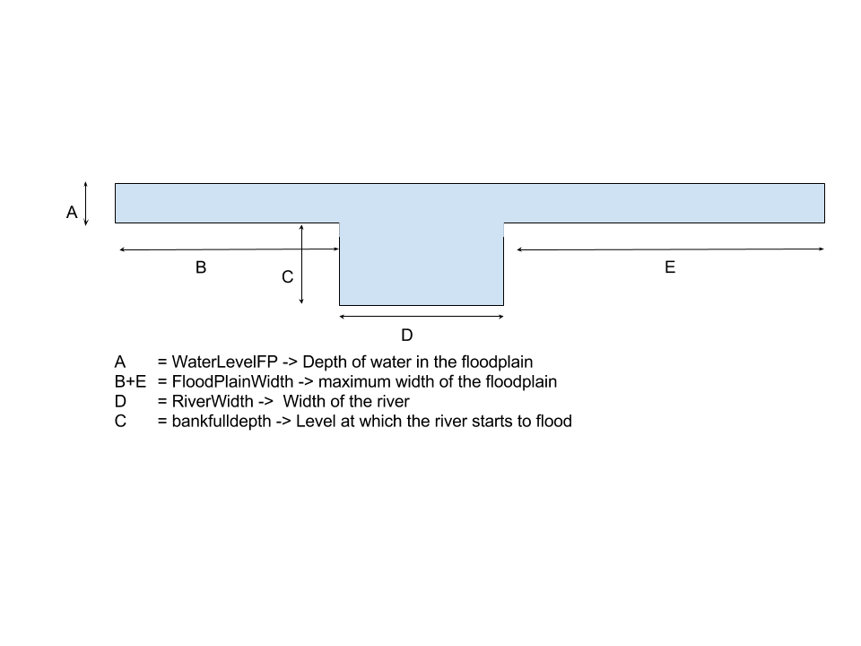

The wflow_routing Model
=======================

Introduction
------------
The wflow routing module uses the pcraster kinematic wave to route water over a DEM. By adding a bankfull level
and a floodplainwidth to the configuration the model can also include estimated flow over a floodplain.

Method
------

A simple river profile is defined using a river width a bankfull heigth and a floodplainwidth. A schematic
drawing is shown in the figure below.

First the maximum bankfull flow for each cell is determined using:

.. math:: Q_b = (\frac{H_{b}}{\alpha{_{ch}}} * Bw)^{1/\beta}

Next the channel flow is determined by taking the mimumm value of the total flow and the maximum banfull flow and the
floodplain flow is determined by subtracting the bankfull flow from the total flow.

In normal conditions (below bankfull), the waterlevel in the river is determined as follows:

.. math:: H_{ch} = \alpha{_{ch}} {Q_{ch}}^{\beta}/ Bw

Where :math:`H_{ch}`  is the water level for the channel, :math:`\alpha{_{ch}}` is the kinematic wave coefficient for the channel,
:math:`Q_{ch}` is the discharge in the channel and :math:`Bw` is the width of the river.

If the water level is above bankfull the water level on the floodplains is calculated as follows:

.. math::  H_{fp} = \alpha{_{fp}} {Q_{fp}}^{\beta}/ (Bw + P_{fp})

where :math:`H_{ch}` is the water level on the floodplain, :math:`Q_{fp}` is the discharge on the floodplain
and :math:`P_{fp}` is the wetted perimiter of the floodplain and  :math:`\alpha{_{fp}}` is the kinematic wave
coefficient for the floodplain,

The wetted perimiter of the channel, :math:`P_{ch}`,  is determined by:

.. math:: P_{ch} = 2.0 H_{ch} + Bw

The wetted perimiter of the floodplain is defined as follows:

.. math::

    N = max(0.0001,1.0/(1.0 + exp(-c * H_{fp}) - 0.5) * 2.0

    P_{fp} = N  W_{fp}

This first equation defines the upper half of an S or sigmoid curve and will return values between 0.001 and 1.0. The
c parameter defines the sharpness of the function, a high value of c will turn this into a step-wise function while
a low value will make the function more smooth. The default value for c = 0.5. For example, with this default value
a floodplain level of 1m will result in an N value of 0.25 and 2m will return 0.46. In the second equation this
fraction is multiplied with the maximum floodplain width :math:`W_{fp}`.

The :math:`\alpha` for the channel and floodplain are calculated as follows:

pow((self.NFloodPlain / (sqrt(self.SlopeDCL))), self.Beta)

.. math::

    \alpha_{ch} = (n_{ch}/\sqrt{slope})^\beta  P_{ch}^{(2.0 / 3.0)\beta}

    \alpha_{fp} = (n_{fp}/\sqrt{slope})^\beta  P_{fp}^{(2.0 / 3.0)\beta}

In which slope is the flope of the river bed and floodplain and :math:`n_{ch}` and :math:`n_{fp}` represent
the manning's n for the channel and floodplain respectively.

A compound :math:`\alpha_{total}` is estimated by first calculating a compound n value :math:`n_{total}`:

.. math::

    n_{total} = (P_{ch}/P_{total} n_{ch}^{3/2} + P_{fp}/P_{total} n_{fp}^{3/2})^{2/3}

    \alpha_{total}  = (n_{total}/\sqrt{slope})^\beta (P_{fp} + P_{ch})^{(2.0 / 3.0)\beta}

The :math:`\alpha_{total}` is used in the pcraster kinematic function to get the dischareg for the next
timestep.

The code is implemented in the updateRunoff attribute of the model class as follows:

::

        self.Qbankfull = pow(self.bankFull/self.AlphaCh * self.Bw,1.0/self.Beta)
        self.Qchannel = min(self.SurfaceRunoff,self.Qbankfull)
        self.floodcells  = boolean(ifthenelse(self.WaterLevelCH > self.bankFull, boolean(1), boolean(0)))
        self.Qfloodplain = max(0.0,self.SurfaceRunoff - self.Qbankfull)

        self.WaterLevelCH = self.AlphaCh * pow(self.Qchannel, self.Beta) / (self.Bw)
        self.WaterLevelFP = ifthenelse(self.River,self.AlphaFP * pow(self.Qfloodplain, self.Beta) / (self.Bw + self.Pfp),0.0)
        self.WaterLevel = self.WaterLevelCH + self.WaterLevelFP

        # Determine Qtot as a check
        self.Qtot = pow(self.WaterLevelCH/self.AlphaCh * self.Bw,1.0/self.Beta) + pow(self.WaterLevelFP/self.AlphaFP * (self.Pfp + self.Bw),1.0/self.Beta)
        # wetted perimeter (m)
        self.Pch = self.wetPerimiterCH(self.WaterLevelCH,self.Bw)
        self.Pfp = ifthenelse(self.River,self.wetPerimiterFP(self.WaterLevelFP,self.floodPlainWidth,sharpness=self.floodPlainDist),0.0)

        # Alpha
        self.WetPComb = self.Pch + self.Pfp
        self.Ncombined = (self.Pch/self.WetPComb*self.N**1.5 + self.Pfp/self.WetPComb*self.NFloodPlain**1.5)**(2./3.)
        self.AlpTermFP = pow((self.NFloodPlain / (sqrt(self.SlopeDCL))), self.Beta)
        self.AlpTermComb = pow((self.Ncombined / (sqrt(self.SlopeDCL))), self.Beta)
        self.AlphaFP = self.AlpTermFP * pow(self.Pfp, self.AlpPow)
        self.AlphaCh = self.AlpTerm * pow(self.Pch, self.AlpPow)
        self.Alpha = ifthenelse(self.River,self.AlpTermComb * pow(self.Pch + self.Pfp, self.AlpPow),self.AlphaCh)
        self.OldKinWaveVolume = self.KinWaveVolume
        self.KinWaveVolume = (self.WaterLevelCH * self.Bw * self.DCL) + (self.WaterLevelFP * (self.Pfp + self.Bw) * self.DCL)

Configuration
-------------
The default name for the file is wflow\_routing.ini.

Subcatchment flow
~~~~~~~~~~~~~~~~~
Normally the the kinematic wave is continuous throughout the model. By using the
the SubCatchFlowOnly entry in the model section of the ini file all flow is at the
subcatchment only and no flow is transferred from one subcatchment to another. This can be handy
when connecting the result of the model to a water allocation model such as Ribasim.

Example:

::

    [model]
    SubCatchFlowOnly = 1

Forcing data
~~~~~~~~~~~~

The model needs one set of forcing data: IW (water entering the model for each cell in mm). The name
of the mapstack is can be defined in the ini file. By default it is inmaps/IW

See below for an example: 

.. include:: _download/wflow_routing.ini
   :literal:

A description of the implementation of the kinematic wave is given on the pcraster website at
http://pcraster.geo.uu.nl/pcraster/4.0.2/doc/manual/op_kinematic.html
 
In addition to the settings in the ini file you need to give the model additional maps
or lookuptables in the staticmaps or intbl directories:

Lookup tables
~~~~~~~~~~~~~

:N.tbl:
    Manning's N for all no-river cells. Defaults to 0.072

:N_River.tbl:
    Manning's N for the river cells. Defaults to 0.036

:N_FloodPlain.tbl:
    Manning's N for the floodplain. A floodplain is always linked to a river cell. Defaults to 2* N of the river

As with all models the lookup tables can be replaced by a map with the same name (but with the .map extension) in the staticmaps directory.

staticmaps
~~~~~~~~~~

:wflow_subcatch.map:
    Map of the subcatchment in the area. Usually shared with the hydrological model

:wflow_dem.map:
    The digital elevation model. Usually shared with the hydrological model

:wflow_ldd.map:
    The D8 local drainage network.

:wflow_river.map:
    Definition of the river cells.

:wflow_riverlength.map:
    Optional map that defines the actual legth of the river in each cell.

:wflow_riverlength_fact.map:
    Optional map that defines a multiplication factor for the river length in each cell.

:wflow_gauges.map:
    Map of river gauges that can be used in outputting timeseries

:wflow_inflow.map:
    Optional map of inflow points into the surface water. Limited testing.

:wflow_riverwidth.map:
    Optional map of the width of the river for each river cell.

:wflow_floodplainwidth.map:
    Optional map of the width of the floodplain for each river cell.

:wflow_bankfulldepth.map:
    Optional map of the level at which the river starts to flood and water will also be conducted over the floodplain.

:wflow_floodplaindist.map:
    Optional map that defines the relation between the water level in the floodplain

:wflow_landuse.map:
    Required map of landuse/land cover. This map is used in the lookup tables to relate parameters to landuse/landcover.
    Usually shared with the hydrological model

:wflow_soil.map:
    Required map of soil type. Usually shared with the hydrological model

initial conditions
------------------

The model needs the following files with initial conditions:

:WaterLevelCH:
    Water level in the channel or the grid-cell water level for non-river cells.

:WaterLevelFP:
    Water level in the floodplain

:SurfaceRunoff:
    Discharge in each grid-cell

The total waterlevel is obtained by adding the two water levels.

wflow_routing module documentation
----------------------------------

.. automodule:: wflow_routing
    :members:
    :undoc-members:
    :show-inheritance:
