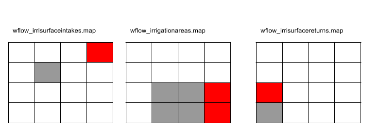

The wflow_sbm Model
===================


Introduction
------------

The soil part of wflow\_sbm model has its roots in the
topog\_sbm model but has had considerable changes over time. topog\_sbm is specifically designed to simulate fast
runoff processes in small catchments while wflow\_sbm can be applied more
widely. The main differences are:


+ The unsaturated zone can be split-up in different layers

+ The addition of evapotranspiration losses

+ The addition of a capilary rise

+ Wflow routes water over a D8 network while topog uses an element 
  network based on contour lines and trajectories.
  

The sections below describe the working of the model in more detail.


.. figure:: _images/wflow_sbm_soil.png
    :width: 640px
    :align: center

    Overview of the different processes and fluxes in the wflow_sbm model.

Limitations
~~~~~~~~~~~

The wflow\_sbm concept uses the kinematic wave approach for channel, overland and lateral subsurface flow, assuming that the
topography controls water flow mostly. This assumption holds for steep terrain, but in less steep terrain the hydraulic gradient
is likely not equal to the surface slope (subsurface flow), or pressure differences and inertial momentum cannot be neglected (channel and overland flow).
In addition, while the kinemative wave equations are solved with a nonlinear scheme using Newton's method (Chow, 1988), other model 
equations are solved through a simple explicit scheme. In summary the following limitations apply:

+ Channel flow, and to a lesser degree overland flow, may be unrealistic in terrain that is not steep, 
  and where pressure forces and inertial momentum are important

+ The lateral movement of subsurface flow may be very wrong in terrain that is not steep

+ The simple numerical solution means that results from a daily timestep model may be different from those
  with an hourly timestep. This can also cause water budget problems


Potential and Reference evaporation
-----------------------------------

The wflow\_sbm model assumes the input to be potential evaporation. In many case the evaporation
will be a reference evaporation for a different land cover. In that case you can use the
et_reftopot.tbl file to set the mutiplication per landuse to go from the supplied evaporation
to the potential evaporation for each land cover. By default al is set to 1.0 assuming the evaporation
to be potential.


Snow
----

Precipitation enters the model via the snow routine. If the air temperature,
:math:`T_{a}`, is below a user-defined threshold :math:`TT (\approx0^{o}C)`
precipitation occurs as snowfall, whereas it occurs as rainfall if
:math:`T_{a}\geq TT`. A another parameter :math:`TTI` defines how precipitation
can occur partly as rain of snowfall (see the figure below).
If precipitation occurs as snowfall, it is added to the dry snow component
within the snow pack. Otherwise it ends up in the free water reservoir,
which represents the liquid water content of the snow pack. Between
the two components of the snow pack, interactions take place, either
through snow melt (if temperatures are above a threshold :math:`TT`) or
through snow refreezing (if temperatures are below threshold :math:`TT`).
The respective rates of snow melt and refreezing are:

.. math::

    Q_{m}  =  cfmax(T_{a}-TT)\;\;;T_{a}>TT

    Q_{r}  =  cfmax*cfr(TT-T_{a})\;;T_{a}<TT


where :math:`Q_{m}` is the rate of snow melt, :math:`Q_{r}` is the rate of snow
refreezing, and $cfmax$ and $cfr$ are user defined model parameters
(the melting factor :math:`mm/(^{o}C*day)` and the refreezing factor
respectively)

.. note::

    The FoCFMAX parameter from the original HBV version is not used. instead
    the CFMAX is presumed to be for the landuse per pixel. Normally for
    forested pixels the CFMAX is 0.6 {*} CFMAX


The air temperature, :math:`T_{a}`, is related to measured daily average
temperatures. In the original HBV-concept, elevation differences within
the catchment are represented through a distribution function (i.e.
a hypsographic curve) which makes the snow module semi-distributed.
In the modified version that is applied here, the temperature, :math:`T_{a}`,
is represented in a fully distributed manner, which means for each
grid cell the temperature is related to the grid elevation.

The fraction of liquid water in the snow pack (free water) is at most
equal to a user defined fraction, :math:`WHC`, of the water equivalent
of the dry snow content. If the liquid water concentration exceeds
:math:`WHC`, either through snow melt or incoming rainfall, the surpluss
water becomes available for infiltration into the soil:

.. math::

    Q_{in}=max\{(SW-WHC*SD);\;0.0\}


where :math:`Q_{in}` is the volume of water added to the soil module, :math:`SW`
is the free water content of the snow pack and :math:`SD` is the dry snow
content of the snow pack.


.. figure:: _images/hbv-snow.png
	:width: 600px

	Schematic view of the snow routine


The snow model als has an optional (experimental) 'mass-wasting' routine. This transports snow downhill
using the local drainage network. To use it set the variable MassWasting in the model section to 1.

::

       # Masswasting of snow
       # 5.67 = tan 80 graden
       SnowFluxFrac = min(0.5,self.Slope/5.67) * min(1.0,self.DrySnow/MaxSnowPack)
       MaxFlux = SnowFluxFrac * self.DrySnow
       self.DrySnow = accucapacitystate(self.TopoLdd,self.DrySnow, MaxFlux)
       self.FreeWater = accucapacitystate(self.TopoLdd,self.FreeWater,SnowFluxFrac * self.FreeWater )


Glaciers
--------
wflow\_sbm can model glacier processes if the snow model is enabled. Glacier modelling is very close to 
snow modelling and considers two main processes: glacier build-up from snow turning into firn/ice (using 
the HBV-light model) and glacier melt (using a temperature degree-day model).

The definition of glacier boundaries and initial volume is defined in two staticmaps. *GlacierFrac* is a map 
that gives the fraction of each grid cell covered by a glacier as a number between zero and one. *GlacierStore* 
is a state map that gives the amount of water (in mm w.e.) within the glaciers at each gridcell. Because the 
glacier store (GlacierStore.map) cannot be initialized by running the model for a couple of years, a default 
initial state map should be supplied by placing a GlacierStore.map file in the staticmaps directory. These two 
maps are prepared from available glacier datasets.

First, a fixed fraction of the snowpack on top of the glacier is converted into ice for each timestep and added 
to the glacier store using the HBV-light model (Seibert et al.,2017). This fraction, defined in the lookup table 
*G_SIfrac*, typically ranges from 0.001 to 0.006.

Then, when the snowpack on top of the glacier is almost all melted (snow cover < 10 mm), glacier melt is enabled 
and estimated with a degree-day model. If the air temperature,
:math:`T_{a}`, is below a certain threshold  :math:`G\_TT (\approx0^{o}C)`
precipitation occurs as snowfall, whereas it occurs as rainfall if
:math:`T_{a}\geq G\_TT`.

With this the rate of glacier melt in mm is estimated as:

.. math::

    Q_{m}  =  G\_Cfmax(T_{a}-G\_TT)\;\;;T_{a}>G\_TT

where :math:`Q_{m}` is the rate of glacier melt and :math:`G\_Cfmax` is the melting factor in :math:`mm/(^{o}C*day)`.
Parameters *G_TT* and *G_Cfmax* are defined in two lookup tables. *G_TT* can be taken as equal to the snow TT parameter.
Values of the melting factor normally varies from one glacier to another and some values are reported in the literature. 
*G_Cfmax* can also be estimated by multiplying snow Cfmax by a factor between 1 and 2, to take into account the higher 
albedo of ice compared to snow. 


If snow modeling is enabled, Glacier modelling can also be enabled by including the following four entries in the 
modelparameters section:

::

    [modelparameters]
    GlacierFrac=staticmaps/GlacierFrac.map,staticmap,0.0,0
    G_TT=intbl/G_TT.tbl,tbl,0.0,1,staticmaps/GlacierFrac.map
    G_Cfmax=intbl/G_Cfmax.tbl,tbl,3.0,1,staticmaps/GlacierFrac.map
    G_SIfrac=intbl/G_SIfrac.tbl,tbl,0.001,1,staticmaps/GlacierFrac.map

The initial glacier volume GlacierStore.map should also be added in the staticmaps folder.


The rainfall interception model
-------------------------------

The analytical (Gash) model
~~~~~~~~~~~~~~~~~~~~~~~~~~~

The analytical model of rainfall interception is based on Rutter’s
numerical model. The simplifications that introduced allow the model to
be applied on a daily basis, although a storm-based approach will yield
better results in situations with more than one storm per day. The
amount of water needed to completely saturate the canopy is defined as:

.. math:: 

    P'=\frac{-\overline{R}S}{\overline{E}_{w}}ln\left[1-\frac{\overline{E}_{w}}{\overline{R}}(1-p-p_{t})^{-1}\right]

where :math:`\overline{R}` is the average precipitation intensity on a saturated canopy 
and :math:`\overline{E}_{w}` the average evaporation from the wet canopy
and with the vegetation parameters :math:`S`, :math:`p` and :math:`p_t` as defined
previously. The model uses a series of expressions to calculate the
interception loss during different phases of a storm.
An analytical integration of the total evaporation and rainfall under
saturated canopy conditions is then done for each storm to determine
average values of :math:`\overline{E}_{w}` and :math:`\overline{R}`. 
The total evaporation from the canopy (the
total interception loss) is calculated as the sum of the components
listed in the table below. Interception losses from the stems are
calculated for days with :math:`P\geq S_{t}/p_{t}`. :math:`p_t` and :math:`S_t` are
small and neglected in the wflow\_sbm model.

Table: Formulation of the components of interception loss  according to Gash:

+---------------------------------------------------------------------------------------+-------------------------------------------------------------------+
|For :math:`m` small storms (:math:`P_{g}<{P'}_{g}`)                                    |  :math:`(1-p-p_{t})\sum_{j=1}^{m}P_{g,j}`                         |
+---------------------------------------------------------------------------------------+------------------------+------------------------------------------+
|Wetting up the canopy in :math:`n` large storms (:math:`P_{g}\geq{P'}_{g}`)            | :math:`n(1-p-p_{t}){P'}_{g}-nS`                                   |
+---------------------------------------------------------------------------------------+-------------------------------------------------------------------+
|Evaporation from saturated canopy during rainfall                                      | :math:`\overline{E}/\overline{R}\sum_{j=1}^{n}(P_{g,j}-{P'}_{g})` |
+---------------------------------------------------------------------------------------+-------------------------------------------------------------------+
|Evaporation after rainfall ceases for :math:`n` large storms                           | :math:`nS`                                                        |
+---------------------------------------------------------------------------------------+-------------------------------------------------------------------+
|Evaporation from trunks in :math:`q` storms that  fill the trunk storage               | :math:`qS_{t}`                                                    |
+---------------------------------------------------------------------------------------+-----------+-------------------------------------------------------+
|Evaporation from  trunks in (:math:`m+n-q`) storms that do not fill the trunk  storage | :math:`p_{t}\sum_{j=1}^{m+n-q}P_{g,j}`                            |
+---------------------------------------------------------------------------------------+-------------------------------------------------------------------+


In applying the analytical model, saturated conditions are assumed to
occur when the hourly rainfall exceeds a certain threshold. Often a
threshold of 0.5 mm/hr is used. :math:`\overline{R}` is calculated for all hours when the
rainfall exceeds the threshold to give an estimate of the mean rainfall
rate onto a saturated canopy.

Gash (1979) has shown that in a regression of interception loss on rainfall (on a storm basis) the regression
coefficient should equal to :math:`\overline{E}_w/\overline{R}`. Assuming that neither :math:`\overline{E}_w` nor
:math:`\overline{R}` vary considerably in time, :math:`\overline{E}_w` can be estimated in this way from
:math:`\overline{R}` in the absence of above-canopy climatic observations. Values derived in this way generally tend to
be (much) higher than those calculated with the penman-monteith equation.


Running with parameters derived from LAI
````````````````````````````````````````
The model can determine the Gash parameters from an LAI maps. In order to switch this on
you must define the LAI variable to the model (as in the example below).

::

    [modelparameters]
    LAI=inmaps/clim/LAI,monthlyclim,1.0,1
    Sl=inmaps/clim/LCtoSpecificLeafStorage.tbl,tbl,0.5,1,inmaps/clim/LC.map
    Kext=inmaps/clim/LCtoExtinctionCoefficient.tbl,tbl,0.5,1,inmaps/clim/LC.map
    Swood=inmaps/clim/LCtoBranchTrunkStorage.tbl,tbl,0.5,1,inmaps/clim/LC.map

Here LAI refers to a MAP with LAI (in this case one per month), Sl to a lookuptable
result of land cover to specific leaf storage, Kext to a lookuptable result of
land cover to extinction coefficient and Swood  to a lookuptable result of
"canopy" capacity of the vegetation woody fraction.


Here it is assumed that Cmax(leaves) (Gash’ canopy capacity for the leaves only) relates linearly with LAI (c.f. Van Dijk and Bruijnzeel 2001). This done
via the Sl (specific leaf storage). Sl is determined via a lookup table with land cover. Next the Cmax(leaves) is
determined using:

.. math::

    Cmax(leaves)  = Sl  * LAI

The table below shows lookup table for Sl (as determined from Pitman 1986, Lui 1998).

::

    0   0	    Water
    1	0.045	Evergreen Needle leaf Forest
    2 	0.036	Evergreen Broadleaf Forest
    3	0.045	Deciduous Needle leaf Forest
    4 	0.036	Deciduous Broadleaf Forest
    5 	0.03926	Mixed Forests
    6 	0.07	Closed Shrublands
    7	0.07	Open Shrublands
    8 	0.07	Woody Savannas
    9 	0.09	Savannas
    10 	0.1272	Grasslands
    11 	0.1272	Permanent Wetland
    12 	0.1272	Croplands
    13 	0.04	Urban and Built-Up
    14	0.1272	Cropland/Natural Vegetation Mosaic
    15 	0.0	    Snow and Ice
    16 	0.04	Barren or Sparsely Vegetated


To get to total storage (Cmax) the woody part of the vegetation also needs to be added. This is done via a simple
lookup table between land cover the Cmax(wood):

.. digraph:: cmax

    "MODIS LandCover" -> "Sl lookuptable";
    "Sl lookuptable" -> Sl -> Multiply;
    "LAI (monthly)" -> Multiply -> "Cmax (leaves)" -> add;
    "MODIS LandCover" -> "Cmax Wood lookuptable";
    "Cmax Wood lookuptable" -> "Cmax (wood)";
    "Cmax (wood)"-> add;
    add -> Cmax;

The  table below relates the land cover map to the woody part of the Cmax.

::

    0	0	    Water
    1	0.5 	Evergreen Needle leaf Forest
    2 	0.5	    Evergreen Broadleaf Forest
    3	0.5	    Deciduous Needle leaf Forest
    4 	0.5	    Deciduous Broadleaf Forest
    5 	0.5	    Mixed Forests
    6 	0.2	    Closed Shrublands
    7	0.1	    Open Shrublands
    8 	0.2	    Woody Savannas
    9 	0.01	Savannas
    10 	0.0	    Grasslands
    11 	0.01	Permanent Wetland
    12 	0.0	    Croplands
    13 	0.01	Urban and Built-Up
    14	0.01	Cropland/Natural Vegetation Mosiac
    15 	0.0	    Snow and Ice
    16 	0.04	Barren or Sparsely Vegetated


The canopy gap fraction is determined using the  k: extinction coefficient (van Dijk and Bruijnzeel 2001):

.. math::

    CanopyGapFraction = exp(-k * LAI)

The table below show how k is related to land cover:

::

    0	0.7	Water
    1	0.8	Evergreen Needle leaf Forest
    2 	0.8	Evergreen Broadleaf Forest
    3	0.8	Deciduous Needle leaf Forest
    4 	0.8	Deciduous Broadleaf Forest
    5 	0.8	Mixed Forests
    6 	0.6	Closed Shrublands
    7	0.6	Open Shrublands
    8 	0.6	Woody Savannas
    9 	0.6	Savannas
    10 	0.6	Grasslands
    11 	0.6	Permanent Wetland
    12 	0.6	Croplands
    13 	0.6	Urban and Built-Up
    14	0.6	Cropland/Natural Vegetation Mosaic
    15 	0.6	Snow and Ice
    16 	0.6	Barren or Sparsely Vegetated


The modified rutter model
~~~~~~~~~~~~~~~~~~~~~~~~~

For subdaily timesteps the model uses a simplification of the Rutter model. The simplified
model is solved explicitly and does not take drainage from the canopy into account.

::

 def rainfall_interception_modrut(Precipitation,PotEvap,CanopyStorage,CanopyGapFraction,Cmax):
    """
    Interception according to a modified Rutter model. The model is solved
    explicitly and there is no drainage below Cmax.
    
    Returns:
        - NetInterception: P - TF - SF (may be different from the actual wet canopy evaporation)
        - ThroughFall:
        - StemFlow:
        - LeftOver: Amount of potential eveporation not used
        - Interception: Actual wet canopy evaporation in this thimestep
        - CanopyStorage: Canopy storage at the end of the timestep
    
    """
    
    ##########################################################################
    # Interception according to a modified Rutter model with hourly timesteps#
    ##########################################################################

    p = CanopyGapFraction
    pt = 0.1 * p

    # Amount of P that falls on the canopy
    Pfrac = (1 - p -pt) * Precipitation

    # S cannot be larger than Cmax, no gravity drainage below that
    DD = ifthenelse (CanopyStorage > Cmax , Cmax - CanopyStorage , 0.0)
    self.CanopyStorage = CanopyStorage - DD

    # Add the precipitation that falls on the canopy to the store
    CanopyStorage = CanopyStorage + Pfrac

    # Now do the Evap, make sure the store does not get negative
    dC = -1 * min(CanopyStorage, PotEvap)
    CanopyStorage = CanopyStorage + dC
    
    LeftOver = PotEvap +dC; # Amount of evap not used


    # Now drain the canopy storage again if needed...
    D = ifthenelse (CanopyStorage > Cmax , CanopyStorage - Cmax , 0.0)
    CanopyStorage = CanopyStorage - D
    
    # Calculate throughfall
    ThroughFall = DD + D + p * Precipitation
    StemFlow = Precipitation * pt
    
    # Calculate interception, this is NET Interception
    NetInterception = Precipitation - ThroughFall - StemFlow
    Interception = -dC
    
    return NetInterception, ThroughFall, StemFlow, LeftOver, Interception, CanopyStorage

 
 

The soil model
--------------

Infiltration
~~~~~~~~~~~~

If the surface is (partly) saturated the throughfall and stemflow that falls onto the
saturated area is added to the river runoff component (based on fraction rivers, self.RiverFrac)
and to the overland runoff component (based on open water fraction (self.WaterFrac) minus self.RiverFrac). 
Infiltration of the remaining water is determined as follows:

The soil infiltration capacity can be adjusted in case the soil is frozen, this is optional and can be set
in the ini file as follows:

::

    [model]
    soilInfRedu = 1

The remaining storage capacity of the unsaturated store is determined. 
The infiltrating water is split in two parts, the part that
falls on compacted areas and the part that falls on non-compacted areas.
The maximum amount of water that can infiltrate in these areas is calculated by taking 
the minimum of the maximum infiltration rate (InfiltCapsoil for non-compacted areas 
and InfiltCapPath for compacted areas) and the water on these areas. The water that can
actual infiltrate is calculated by taking the minimum of the total maximum infiltration rate
(compacted and non-compacted areas) and the remaining storage capacity.

Infiltration excess occurs when the infiltration capacity is smaller then the throughfall and stemflow rate.
This amount of water (self.InfiltExcess) becomes overland flow (infiltration excess overland flow). Saturation excess
occurs when the (upper) soil becomes saturated and water cannot infiltrate anymore. This amount of water
(self.ExcessWater) becomes overland flow (saturation excess overland flow).

The wflow\_sbm soil water accounting scheme
~~~~~~~~~~~~~~~~~~~~~~~~~~~~~~~~~~~~~~~~~~~
A detailed description of the Topog_SBM model has been given by [vertessy]_. Briefly:
the soil is considered as a bucket with a certain depth
(:math:`z_{t}`), divided into a saturated store (:math:`S`) and an
unsaturated store (:math:`U`), the magnitudes of which are expressed
in units of depth. The top of the :math:`S` store forms a pseudo-water
table at depth :math:`z_{i}` such that the value of :math:`S` at any
time is given by: 

.. math:: 

    S=(z_{t}-z_{i})(\theta_{s}-\theta_{r})

where:

:math:`\theta_{s}` and :math:`\theta_{r}` are the
saturated and residual soil water contents, respectively. 

The unsaturated store (:math:`U`) is subdivided into storage
(:math:`U_{s}`) and deficit (:math:`U_{d}`) which are again
expressed in units of depth:

.. math::

    U_{d}=(\theta_{s}-\theta_{r})z_{i}-U

    U_{s}=U-U_{d}


The saturation deficit (:math:`S_{d}`) for the soil profile as a
whole is defined as: 

.. math::

    S_{d}=(\theta_{s}-\theta_{r})z_{t}-S


All infiltrating water enters the :math:`U` store first. The unsaturated layer can be
split-up in different layers, by providing the thickness [mm] of the layers in the
ini file. The following example specifies three layers (from top to bottom) of 100, 300
and 800 mm: 

::

    [model]
    UStoreLayerThickness = 100,300,800

The code checks for each grid cell the specified layers against the SoilThickness, and adds
or removes (partly) layer(s) based on the SoilThickness.

Assuming a unit head gradient, the transfer of water (:math:`st`) from a :math:`U` store layer is controlled by 
the saturated hydraulic conductivity :math:`K_{sat}` at depth :math:`z` (bottom layer) or :math:`z_{i}`,
the effective saturation degree of the layer, and a Brooks-Corey power coefficient (parameter :math:`c`)
based on the pore size distribution index :math:`\lambda` (Brooks and Corey (1964)):

.. math::

    st=K_{\mathit{sat}}\left(\frac{\theta-\theta_{r}}{\theta_{s}-\theta_{r}}\right)^{c}
    
    c=\frac{2+3\lambda}{\lambda}

When the unsaturated layer is not split-up into different layers, it is possible to use
the original Topog_SBM vertical transfer formulation, by specifying in the ini file:

::

    [model]
    transfermethod = 1

The transfer of water from the :math:`U` store to the :math:`S` store
(:math:`st`) is in that case controlled by the saturated hydraulic conductivity :math:`K_{sat}`
at depth :math:`z_{i}` and the ratio between :math:`U` and
:math:`S_{d}`: 

.. math::

    st=K_{\mathit{sat}}\frac{U_{s}}{S_{d}}


.. figure:: _images/wflow_soil.png

    Schematisation of the soil within the wflow\_sbm model

Saturated conductivity (:math:`K_{sat}`) declines with soil depth (:math:`z`) in
the model according to: 

.. math::

    K_{sat}=K_{0}e^{(-fz)}

where:

    :math:`K_{0}` is the saturated conductivity at the soil surface and

    :math:`f` is a scaling parameter [:math:`mm^{-1}`]

The scaling parameter :math:`f` is defined by:

:math:`f=\frac{\theta_{s}-\theta_{r}}{M}` 

with :math:`\theta_{s}` and :math:`\theta_{r}` as defined
previously and :math:`M` representing a model parameter (expressed in
millimeter).


Figure: Plot of the relation between depth and conductivity for different values of M

.. plot:: plots/m-plot.py


The :math:`S` store can be drained laterally by applying the kinematic wave approach to
saturated downslope subsurface flow per unit width of slope :math:`w` according to: 

:math:`q=\frac{K_{0}\mathit{tan(\beta)}}{f}(e^{(-fz_{i})}-e^{(-fz_{t})})`

where:

    :math:`\beta` is element slope angle [deg.]

    :math:`q` is the calculated subsurface flow [:math:`mm^{2}d^{-1}`]

with :math:`K_{0}`, :math:`z_{i}` and :math:`z_{t}` as defined previously. 

Combining with the following continuity equation:

:math:`(\theta_s-\theta_r)\frac{\partial h}{\partial t} = -w\frac{\partial q}{\partial x} + wr`

and substituting for :math:`h (\frac{\partial q}{\partial h})`, gives:

:math:`w \frac{\partial q}{\partial t} = -cw\frac{\partial q}{\partial x} + cwr`

where celerity :math:`c = \frac{K_{0}\mathit{tan(\beta)}}{(\theta_s-\theta_r)} e^{(-fz_{i})}`

The kinematic wave equation for lateral subsurface flow is solved iteratively using Newton's method.

.. note::

    For the lateral subsurface flow kinematic wave the model timestep is not adjusted. For certain model timestep
    and model grid size combinations this may result in loss of accuracy.


Transpiration and soil evaporation
~~~~~~~~~~~~~~~~~~~~~~~~~~~~~~~~~~

The potential eveporation left over after interception and open water evaporation (rivers and water bodies) is split
in potential soil evaporation and potential transpiration based on the canopy gap fraction (assumed to be identical
to the amount of bare soil).

For the case of one single soil layer, soil evaporation is scaled according to:

:math:`soilevap = potensoilevap \frac{SaturationDeficit}{SoilWaterCapacity}`

As such, evaporation will be potential if the soil is fully wetted and it decreases linear
with increasing soil moisture deficit.

For more than one soil layer, soil evaporation is only provided from the upper soil layer (often 100 mm) 
and soil evaporation is split in evaporation from the unsaturated store and evaporation from the saturated 
store. First water is evaporated water from the unsaturated store.  Then the remaining potential soil evaporation
can be used for evaporation from the saturated store. This is only possible, when the water table is present 
in the upper soil layer (very wet conditions). Both the evaporation from the unsaturated store and the evaporation
from the saturated store are limited by the minimum of the remaining potential soil evaporation and the available water
in the unsaturated/saturated zone of the upper soil layer. Also for multiple soil layers, the evaporation
(both unsaturated and saturated) decreases linearly with decreasing water availability.

The original Topog_SBM model does not include transpiration or a notion of capilary rise. In  wflow\_sbm  transpiration is 
first taken from the :math:`S` store if the roots reach the water table :math:`z_{i}`. If the :math:`S` store cannot satisfy
the demand the :math:`U` store is used next. First the number of wet roots is determined (going from 1 to 0) using
a sigmoid function as follows:

.. math::

    WetRoots = 1.0/(1.0 + e^{-SharpNess (WaterTable - RootingDepth)})

Here the sharpness parameter (by default a large negative value, -80000.0) parameter determines if there is a
stepwise output or a more gradual output (default is stepwise). WaterTable is the level of the water table in the
grid cell in mm below the surface, RootingDepth is the maximum depth of the roots also in mm below the surface. For
all values of WaterTable smaller that RootingDepth a value of 1 is returned if they are equal a value of 0.5 is
returned if the WaterTable is larger than the RootingDepth a value of 0 is returned. The returned WetRoots fraction
is multiplied by the potential evaporation (and limited by the available water in saturated zone) to get the
transpiration from the saturated part of the soil:

::

    # evaporation from saturated store
    wetroots = _sCurve(dyn['zi'][idx], a=static['ActRootingDepth'][idx], c=static['rootdistpar'][idx])
    dyn['ActEvapSat'][idx] = min(PotTrans * wetroots, dyn['SatWaterDepth'][idx])
    dyn['SatWaterDepth'][idx] = dyn['SatWaterDepth'][idx] - dyn['ActEvapSat'][idx]              
    RestPotEvap = PotTrans - dyn['ActEvapSat'][idx]

Figure: Plot showing the fraction of wet roots for different values of c for a RootingDepth of 275 mm 

.. plot:: plots/s-curve-soil.py


Next the remaining potential evaporation is used to extract water from the unsaturated store. The fraction of roots 
(AvailCap) that cover the unsaturated zone for each soil layer is used to calculate the potential root water 
extraction rate (MaxExtr):

::

    MaxExtr = AvailCap * UstoreLayerDepth
  

When setting Whole_UST_Avail to 1 in the ini file as follows, the complete unsaturated storage is available for transpiration:

::

    [model]
    Whole_UST_Avail = 1
  
Next, the Feddes root water uptake reduction model (Feddes et al. (1978)) is used to calculate a reduction coefficient as a
function of soil water pressure. Soil water pressure is calculated following Brooks and Corey (1964):

.. math::

    \frac{(\theta-\theta_r)}{(\theta_s-\theta_r)} =  \Bigg\lbrace{\left(\frac{h_b}{h}\right)^{\lambda}, h > h_b \atop 1 , h \leq h_b}

where:

    :math:`h` is the pressure head (cm), :math:`h_b` is the air entry pressure head, and :math:`\theta`, :math:`\theta_s`, 
    :math:`\theta_r` and :math:`\lambda` as previously defined.

Feddes (1978) described a transpiration reduction-curve for the reduction coefficient :math:`\alpha`, as a function of :math:`h`.
Below, the function in wflow_sbm, that calculates for the actual transpiration from the unsaturated zone layer(s).

::

    def actTransp_unsat_SBM(RootingDepth, UStoreLayerDepth, sumLayer, RestPotEvap, sumActEvapUStore, c, L,
    thetaS, thetaR, hb, ust=0):
    
    """
    Actual transpiration function for unsaturated zone:

      if ust is True, all ustore is available for transpiration

    Input:

        - RootingDepth, UStoreLayerDepth, sumLayer (depth (z) of upper boundary unsaturated layer),
          RestPotEvap (remaining evaporation), sumActEvapUStore (cumulative actual transpiration (more than one UStore layers))
          c (Brooks-Corey coefficient), L (thickness of unsaturated zone), thetaS, thetaR, hb (air entry pressure), ust

    Output:

        - UStoreLayerDepth,  sumActEvapUStore, ActEvapUStore
    """

    # AvailCap is fraction of unsat zone containing roots
    if ust >= 1:
        AvailCap = UStoreLayerDepth * 0.99
    else:
        if L > 0:
            AvailCap = min(1.0, max(0.0, (RootingDepth - sumLayer) / L))
        else:
            AvailCap = 0.0

    MaxExtr = AvailCap * UStoreLayerDepth

    # Next step is to make use of the Feddes curve in order to decrease ActEvapUstore when soil moisture values
    # occur above or below ideal plant growing conditions (see also Feddes et al., 1978). h1-h4 values are
    # actually negative, but all values are made positive for simplicity.
    h1 = hb  # cm (air entry pressure)
    h2 = 100  # cm (pF 2 for field capacity)
    h3 = 400  # cm (pF 3, critical pF value)
    h4 = 15849  # cm (pF 4.2, wilting point)

    # According to Brooks-Corey
    par_lambda = 2 / (c - 3)
    if L > 0.0:
        vwc = UStoreLayerDepth / L
    else:
        vwc = 0.0
    vwc = max(vwc, 0.0000001)
    head = hb / (
        ((vwc) / (thetaS - thetaR)) ** (1 / par_lambda)
    )  # Note that in the original formula, thetaR is extracted from vwc, but thetaR is not part of the numerical vwc calculation
    head = max(head,hb)

    # Transform h to a reduction coefficient value according to Feddes et al. (1978).
    # For now: no reduction for head < h2 until following improvement (todo):
    #       - reduction only applied to crops
    if(head <= h1):
        alpha = 1
    elif(head >= h4):
        alpha = 0
    elif((head < h2) & (head > h1)):
        alpha = 1
    elif((head > h3) & (head < h4)):
        alpha = 1 - (head - h3) / (h4 - h3)
    else:
        alpha = 1

    ActEvapUStore = (min(MaxExtr, RestPotEvap, UStoreLayerDepth)) * alpha

    UStoreLayerDepth = UStoreLayerDepth - ActEvapUStore

    RestPotEvap = RestPotEvap - ActEvapUStore
    sumActEvapUStore = ActEvapUStore + sumActEvapUStore

    return UStoreLayerDepth, sumActEvapUStore, RestPotEvap

Capilary rise is determined using the following approach:
first the :math:`K_{sat}` is determined at the water table
:math:`z_{i}`; next a potential capilary rise is determined from the
minimum of the :math:`K_{sat}`, the actual transpiration taken from
the :math:`U` store, the available water in the :math:`S` store and
the deficit of the :math:`U` store. Finally the potential rise is
scaled using the distance between the roots and the water table using:

    :math:`CSF=CS/(CS+z_{i}-RT)`

in which :math:`CSF` is the scaling factor to multiply the potential
rise with, :math:`CS` is a model parameter (default = 100, use
CapScale.tbl to set differently) and :math:`RT` the rooting depth. If
the roots reach the water table (:math:`RT>z_{i}`) :math:`CS` is set
to zero thus setting the capilary rise to zero.


Leakage
~~~~~~~

If the MaxLeakage parameter is set > 0, water is lost from the saturated zone and runs out of the model.

Soil temperature
~~~~~~~~~~~~~~~~

The near surface soil temperature is modelled using a simple equation [Wigmosta]_:

.. math:: T_s^{t} = T_s^{t-1} + w  (T_a - T_s^{t-1})  

where :math:`T_s^{t}` is the near-surface soil temperature at time t, :math:`T_a` is air temperature and :math:`w` is a
weighting coefficient determined through calibration (default is 0.1125 for daily timesteps).

if T_s < 0 than a reduction factor is applied to the maximum infiltration rate (InfiltCapSoil and InfiltCapPath).
A S-curve (see plot below) is used to make a smooth transition (a c-factor of 8 is used).

.. plot:: plots/s-curve-freezingsoil.py


Irrigation and water demand
---------------------------

Water demand (surface water only) by irrigation can be configured in two ways:

1. By specifying the water demand externally (as a lookup table, series of maps etc)

2. By defining irrigation areas. Within those areas the demand is calculated as the difference between
   potential ET and actual transpiration

For both options a fraction of the supplied water can be put back into the river at specified locations

The following maps and variables can be defined:

**wflow_irrigationareas.map**:

    Map of areas where irrigation is applied. Each area has a unique id. The areas do not need to be continuous
    but all cells with the same id are assumed to belong to the same irrigation area.

**wflow_irrisurfaceintake.map**: 

    Map of intake points at the river(s). The id of each point should correspond to the id of an area in the wflow_irrigationareas map.

**wflow_irrisurfacereturns.map**:

    Map of water return points at the river(s). The id of each point should correspond to the id of an area in the
    wflow_irrigationareas map or/and the wflow_irrisurfaceintake.map.

**IrriDemandExternal**: Irrigation demand supplied to the model. This can be doen by adding an entry to the
    modelparameters section. if this is doen the irrigation demand supplied here is used and it is NOT determined
    by the model. Water demand should be given with a negative sign! See below for and example entry
    in the modelparameters section: ::

        IrriDemandExternal=intbl/IrriDemandExternal.tbl,tbl,-34.0,0,staticmaps/wflow_irrisurfaceintakes.map

    In this example the default demand is :math:`-34 m^3/s`. The demand must be linked to the map
    wflow_irrisurfaceintakes.map. Alternatively we can define this as a timeseries of
    maps: ::

        IrriDemandExternal=/inmaps/IRD,timeseries,-34.0,0


**DemandReturnFlowFraction**: Fraction of the supplied water the returns back into the river system (between 0 and 1).
    This fraction must  be supplied at the  wflow_irrisurfaceintakes.map locations but the water that is returned
    to the river will be returned at the wflow_irrisurfacereturns.map locations. If this variable is not defined
    the default is 0.0. See below for an example entry in the modelparameters section: ::

    DemandReturnFlowFraction=intbl/IrriDemandReturn.tbl,tbl,0.0,0,staticmaps/wflow_irrisurfaceintakes.map




    Figure showing the three maps that define the irrigation intake points areas and return flow locations.
    
The  irrigation model can be used in the following two modes:

1. An external water demand is given (the user has specified the IrriDemandExternal variable). In this case the demand
   is enforced. If a matching irrigation area is found the supplied water is converted to an amount in mm over the
   irrigation area. The supply is converted in the *next timestep* as extra water available for infiltration in
   the irrigation area. If a DemandReturnFlowFraction is defined this fraction is the supply is returned to the
   river at the wflow_irrisurfacereturns.map points.

2. Irrigation areas have been defined and no IrriDemandExternal has been defined. In this case the model will
   estimate the irrigation water demand. The irrigation algorithim works as follows: For each of the areas the
   difference between potential transpiration and actual transpiration is determined. Next, this is converted to a
   demand in :math:`m^3/s` at the corresponding intake point at the river. The demand is converted to a supply
   (taking into account the available water in the river) and converted to an amount in mm over the irrigation area.
   The supply is converted in the *next timestep* as extra water available for infiltration in the irrigation area.
   This option has only be tested in combination with a monthly LAI climatology as input. If a DemandReturnFlowFraction
   is defined this fraction is the supply is returned to the river at the wflow_irrisurfacereturns.map points.


Kinematic wave and River Width
------------------------------
Both overland flow (for non-river cells) and river discharge are routed through the catchment using the kinematic wave equation.
Width and length characteristics of non-river cells use the grid cell dimensions. For river cells, both width and maps can
either be supplied by separate maps or determined from the grid cell dimension for river length and from the DEM, the upstream area and yearly average discharge for
the river width ([Finnegan]_):

.. math:

    W = [\alpha (\alpha + 2)^{2/3}]^{3/8} Q^{3/8} S^{-3/16} n^{3/8}

The yearly average Q at outlet is scaled for each point in the drainage network 
with the upstream area. :math:`\alpha` ranges from 5 to > 60. Here 5 is used for hardrock,
large values are used for sediments.
  

Implementation::

        if (self.nrresSimple + self.nrlake) > 0:
            upstr = pcr.catchmenttotal(1, self.TopoLddOrg)
        else:
            upstr = pcr.catchmenttotal(1, self.TopoLdd)
        Qscale = upstr / pcr.mapmaximum(upstr) * Qmax
        W = (
            (alf * (alf + 2.0) ** (0.6666666667)) ** (0.375)
            * Qscale ** (0.375)
            * (pcr.max(0.0001, pcr.windowaverage(self.riverSlope, pcr.celllength() * 4.0)))
            ** (-0.1875)
            * self.NRiver ** (0.375)
        )
        # Use supplied riverwidth if possible, else calulate
        self.RiverWidth = pcr.ifthenelse(self.RiverWidth <= 0.0, W, self.RiverWidth)
 

The table below list commonly used Manning's N values (in the N_River .tbl file). 
Please note that  the values for non river cells may arguably be set 
significantly higher. (Use N.tbl for non-river cells and N_River.tbl for river cells)

.. csv-table:: Manning's N values
    :header: "Type of Channel and Description",  "Minimum",  "Normal",  "Maximum"
    :widths: 70,10,10,10

    "*Main Channels*"
    "clean, straight, full stage, no rifts or deep pools", "0.025", "0.03", "0.033 "
    "same as above, but more stones and weeds",  "0.03", "0.035", "0.04"
    "clean, winding, some pools and shoals", "0.033", "0.04","0.045" 
    "same as above, but some weeds and stones", 0.035, 0.045, 0.05
    "same as above, lower stages, more ineffective slopes and sections",   0.04, 0.048, 0.055 
    "same as second with more stones", 0.045, 0.05, 0.06 
    "sluggish reaches, weedy, deep pools", 0.05,    0.07, 0.08 
    "very weedy reaches, deep pools, or floodways with heavy stand of timber and underbrush", 0.075, 0.1, 0.15 
    "*Mountain streams*"
    "bottom: gravels, cobbles, and few  boulders", 0.03, 0.04, 0.05 
    "bottom: cobbles with large boulders", 0.04,  0.05, 0.07 

Natural lakes and reservoirs can also be added to the model and taken into account during the routing process. For more information,
see the documentation of the wflow_funcs module.
 
Subcatchment flow
-----------------
Normally the the kinematic wave is continuous throughout the model. By using the
the SubCatchFlowOnly entry in the model section of the ini file all flow is at the
subcatchment only and no flow is transferred from one subcatchment to another. This can be handy
when connecting the result of the model to a water allocation model such as Ribasim.

Example:

::

    [model]
    SubCatchFlowOnly = 1


Model variables stores and fluxes
---------------------------------

The diagram below shows the stores and fluxes in the model in terms of internal variable names. It
onlys shows the soil and Kinematic wave reservoir, not the canopy model.

.. digraph:: grids
 
    compound=true;
    node[shape=record];
    UStoreDepth [shape=box];
    OutSide [style=dotted];
    SatWaterDepth [shape=box];
    UStoreDepth -> SatWaterDepth [label="Transfer [mm]"];
    SatWaterDepth -> UStoreDepth [label="CapFlux [mm]"];        
    SatWaterDepth -> KinWaveStoreLand [label="ExfiltWater [mm]"];
    "OutSide" -> UStoreDepth [label="ActInfilt [mm]"];
    UStoreDepth -> OutSide [label="SumEvapUstore [mm]"];
    SatWaterDepth -> OutSide [label="SumEvapSat [mm]"];
    "OutSide" -> KinWaveStoreLand [label="InWaterL [m^{3}/s]"];
    KinWaveStoreLand -> KinWaveStoreRiver [label="qo_toriver [m^{3}/s]"]
    SatWaterDepth -> KinWaveStoreRiver [label="ssf_toriver [m^{3}/s]"]
    "OutSide" -> KinWaveStoreRiver [label="RunoffOpenWaterRiver [m^3/s]"] ;
    


Processing of meteorological forcing data
-----------------------------------------

Although the model has been setup to do as little data processing
as possible it includes an option to apply an altitude correction to the 
temperature inputs. The three squares below demonstrate the principle.

.. digraph:: grids

	node[shape=record];
	a[label="{5|5|5}|{5|5|5}|{5|5|5}"];
	b[label="{1|2|3}|{4|5|6}|{7|8|9}"];
	c[label="{4|3|2}|{1|0|-1}|{-2|-3|-4}"];
          "Average T input grid" -> a
          "Correction per cell" -> b
          "Resulting T" -> c

wflow\_sbm takes the correction grid as input and applies this to the input
temperature. The correction grid has to be made outside of the model.
The correction grid is optional.

.. note::

	The temperature correction map is specified in the model section of the ini file:

	[model]
	TemperatureCorrectionMap=NameOfTheMap

	If the entry is not in the file the correction will not be applied


Guidelines for wflow_sbm model parameters
-----------------------------------------

The tables below shows the most important parameters and suggested ranges

CanopyGapFraction
file:///media/schelle/BIG/LINUX/wflow/cases/maas/intbl/Cfmax.tbl

- EoverR - Ratio of average wet canopy evaporation rate over 
  precipitation rate - usually between 0.06 and 0.15 depending on climate and site.

- FirstZoneCapacity - 

::

    FirstZoneKsatVer.tbl
    file:///media/schelle/BIG/LINUX/wflow/cases/maas/intbl/FirstZoneMinCapacity.tbl
    file:///media/schelle/BIG/LINUX/wflow/cases/maas/intbl/InfiltCapPath.tbl
    file:///media/schelle/BIG/LINUX/wflow/cases/maas/intbl/InfiltCapSoil.tbl
    file:///media/schelle/BIG/LINUX/wflow/cases/maas/intbl/M.tbl
    file:///media/schelle/BIG/LINUX/wflow/cases/maas/intbl/MaxCanopyStorage.tbl
    file:///media/schelle/BIG/LINUX/wflow/cases/maas/intbl/MaxLeakage.tbl
    file:///media/schelle/BIG/LINUX/wflow/cases/maas/intbl/N_River.tbl
    file:///media/schelle/BIG/LINUX/wflow/cases/maas/intbl/N.tbl
    file:///media/schelle/BIG/LINUX/wflow/cases/maas/intbl/RootingDepth.tbl
    file:///media/schelle/BIG/LINUX/wflow/cases/maas/intbl/RunoffGeneratingGWPerc.tbl
    file:///media/schelle/BIG/LINUX/wflow/cases/maas/intbl/thetaR.tbl
    file:///media/schelle/BIG/LINUX/wflow/cases/maas/intbl/thetaS.tbl
    file:///media/schelle/BIG/LINUX/wflow/cases/maas/intbl/TT.tbl
    file:///media/schelle/BIG/LINUX/wflow/cases/maas/intbl/TTI.tbl
    file:///media/schelle/BIG/LINUX/wflow/cases/maas/intbl/WHC.tbl


Beta.tbl
    Beta parameter used in the kinematic wave function. Should be set to
    0.6 (will be removed later)

CanopyGapFraction.tbl
    Gash interception model parameter: the free throughfall coefficient.

EoverR.tbl
    Gash interception model parameter. Ratio of average wet canopy
    evaporation rate over average precipitation rate.

FirstZoneCapacity.tbl
    Maximum capacity of the saturated store [mm]

MaxLeakage.tbl
    Maximum leakage [mm/day]. Leakage is lost to the model. Usually
    only used for i.e. linking to a dedicated groundwater model.
    Normally set to zero in all other cases.

FirstZoneKsatVer.tbl
    Saturated conductivity of the store at the surface. The M parameter
    determines how this decreases with depth.

FirstZoneMinCapacity.tbl
    Minimum capacity of the saturated store [mm]

InfiltCapPath.tbl
    Infiltration capacity [mm/day] of the compacted soil (or paved
    area) fraction of each gridcell

InfiltCapSoil.tbl
    Infiltration capacity [mm/day] of the non-compacted soil
    fraction (unpaved area) of each gridcell

M.tbl
    Soil parameter determining the decrease of saturated conductivity
    with depth. Usually between 20 and 2000 (if the soil depth is in mm)

MaxCanopyStorage.tbl
    Canopy storage [mm]. Used in the Gash interception model

N.tbl
    Manning N parameter for the Kinematic wave function. Higher values
    dampen the discharge peak.

PathFrac.tbl
    Fraction of compacted area per gridcell

RootingDepth.tbl
    Rooting depth of the vegetation [mm]

thetaR.tbl
    Residual water content

thetaS.tbl
    Water content at saturation


Calibrating the  wflow_sbm model
--------------------------------

Introduction
~~~~~~~~~~~~
As with all hydrological models calibration is needed for optimal performance.
Currently we are working on getting the link with the OpenDA calibration
environment running (not tested yet). We have calibrated the Rhine/Meuse
models using simple shell scripts and the XX and XX command-line parameters
to multiply selected model parameters and evaluate the results later.


Parameters
~~~~~~~~~~

M
    Once the depth of the soil has been set for the different land-use
    types the M parameter is the most important variable in calibrating
    the model. The decay of the conductivity with depth controls the
    baseflow resession and part of the stormflow curve.

N
    The Manning N parameter controls the shape of the hydrograph (the
    peak parts). In general it is advised to set N to realistic values
    for the rivers, for the land phase higher values are usually needed.

Ksat
    Increasing the Ksat will lower the hydrograph (baseflow) and
    flatten the peaks. The latter also depend on the shape of the
    catchment.

FirstZoneCapacity
    Increasing the storage capacity of the soil will decrease the
    outflow

RunoffGeneratingGWPerc
    Default is 0.1. Determines the (upper) part of the groudwater that
    can generate runoff in a cell. This is only used of the
    RunoffGenSigmaFunction option is set to 1. In general generating
    more runoff before a cell is completely saturated (which is the case
    if RunoffGenSigmaFunction is set to 0) will lead to more baseflow
    and flattening of the peaks.


Changes in hydrographs for different values of parameters
~~~~~~~~~~~~~~~~~~~~~~~~~~~~~~~~~~~~~~~~~~~~~~~~~~~~~~~~~

    .. figure:: _images/mult_firstzonemin.png
       :align: center
       :alt: image
       :height: 600px


    .. figure:: _images/mult_ksat_rhine.png
       :align: center
       :alt: image
       :height: 600px


    .. figure:: _images/mult_m_rhine.png
       :align: center
       :height: 600px


References
----------

.. [vertessy]  Vertessy, R.A. and H. Elsenbeer, “Distributed modelling of storm flow generation in an Amazonian rainforest catchment: effects of model parameterization,” Water Resources Research, vol. 35, no. 7, pp. 2173–2187, 1999.

.. [Finnegan] Noah J. Finnegan et al 2005 Controls on the channel width of rivers: Implications for modeling fluvial incision of bedrock" 

.. [Wigmosta] Wigmosta, M. S., L. J. Lane, J. D. Tagestad, and A. M. Coleman (2009), Hydrologic and erosion models to assess land use and management practices affecting soil erosion, Journal of Hydrologic Engineering, 14(1), 27-41.

wflow_sbm module documentation
------------------------------

.. automodule:: wflow_sbm
    :members:
    :undoc-members:
    :show-inheritance:

    .. autoattribute:: usage


