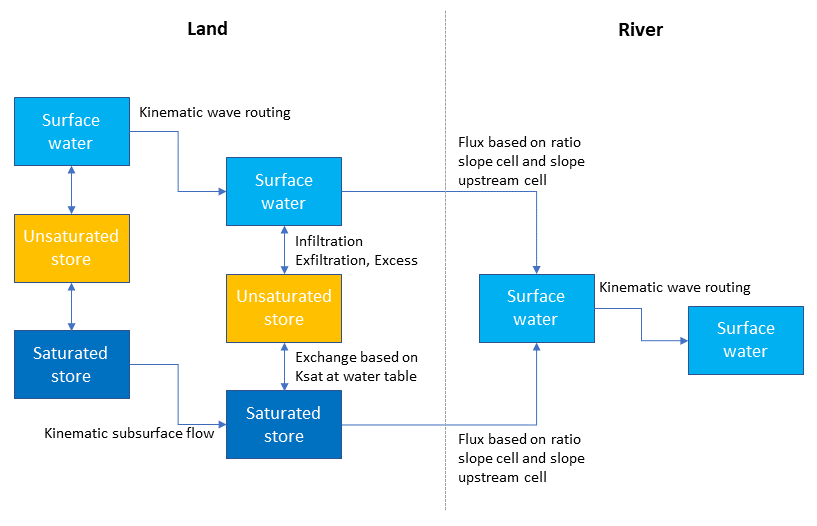

The wflow_sbm Model
===================


Introduction
------------

The soil part of wflow\_sbm model follows the same concepts as the 
topog\_sbm model. topog\_sbm is specifically designed to similate fast 
runoff processes in small catchments while wflow\_sbm can be applied more
widely. The main differences are:

+ The addition of evapotranspiration losses

+ The addition of a percolary rise

+ Wflow routes water over a D8 network while topog uses an element 
  network based on contour lines and trajectories.

+ The (optional) addition of sub-cell runoff to be able to 
  run on larger grid sizes


The sections below describe the working of the model in more detail.


Limitations
~~~~~~~~~~~

The \_sbm concept has been developed for small catchments and relatively thin soils. In addition, the numerical solution
of the soil water flow is a simple explicit scheme and the lateral groundwater flow follows topography rather than true
hydraulic head. Although the waterdem=1 forces the model to recalculate the flow direction each timestep -- thus giving
a more realistic groundwater flow -- the following limitation apply:

+ Results for deep soils > 2m may be unrealistic (also due to the simple representation of the unsaturated zone)

+ The lateral movement of groundwater may be very wrong in terrain that is not steep (use the waterdem=1 option)

+ The simple numerical solution means that results from a daily timestep model may be  different from those
  with an hourly timestep. This caa also cause water budget problems


Potential and Reference evaporation
-----------------------------------

The wflow\_sbm model assumes the input to be potential evaporation. In many case the evaporation
will be a reference evaporation for a different land cover. In that case you can use the
et_reftopot.tbl file to set the mutiplication per landuse to go from the supplied evaporation
to the potential evaporation for each land cover. By default al is set to 1.0 assuming the evaporation
to be potential.


Snow
----

The wflow\_sbm model uses the same snow routine as the wflow\_hbv model.

The rainfall interception model
-------------------------------

The analytical (Gash) model
~~~~~~~~~~~~~~~~~~~~~~~~~~~

The analytical model of rainfall interception is based on Rutter’s
numerical model. The simplifications that introduced allow the model to
be applied on a daily basis, although a storm-based approach will yield
better results in situations with more than one storm per day. The
amount of water needed to completely saturate the canopy is defined as:

.. math:: 

    P'=\frac{-\overline{R}S}{\overline{E}_{w}}ln\left[1-\frac{\overline{E}_{w}}{\overline{R}}(1-p-p_{t})^{-1}\right]

where :math:`\overline{R}` is the average precipitation intensity on a saturated canopy 
and :math:`\overline{E}_{w}` the average evaporation from the wet canopy
and with the vegetation parameters :math:`S`, :math:`p` and :math:`p_t` as defined
previously. The model uses a series of expressions to calculate the
interception loss during different phases of a storm.
An analytical integration of the total evaporation and rainfall under
saturated canopy conditions is then done for each storm to determine
average values of :math:`\overline{E}_{w}` and :math:`\overline{R}`. 
The total evaporation from the canopy (the
total interception loss) is calculated as the sum of the components
listed in the table below. Interception losses from the stems are
calculated for days with :math:`P\geq S_{t}/p_{t}`. :math:`p_t` and :math:`S_t` are
small and neglected in the wflow\_sbm model.

Table: Formulation of the components of interception loss  according to Gash:

+---------------------------------------------------------------------------------------+-------------------------------------------------------------------+
|For :math:`m` small storms (:math:`P_{g}<{P'}_{g}`)                                    |  :math:`(1-p-p_{t})\sum_{j=1}^{m}P_{g,j}`                         |
+---------------------------------------------------------------------------------------+------------------------+------------------------------------------+
|Wetting up the canopy in :math:`n` large storms (:math:`P_{g}\geq{P'}_{g}`)            | :math:`n(1-p-p_{t}){P'}_{g}-nS`                                   |
+---------------------------------------------------------------------------------------+-------------------------------------------------------------------+
|Evaporation from saturated canopy during rainfall                                      | :math:`\overline{E}/\overline{R}\sum_{j=1}^{n}(P_{g,j}-{P'}_{g})` |
+---------------------------------------------------------------------------------------+-------------------------------------------------------------------+
|Evaporation after rainfall ceases for :math:`n` large storms                           | :math:`nS`                                                        |
+---------------------------------------------------------------------------------------+-------------------------------------------------------------------+
|Evaporation from trunks in :math:`q` storms that  fill the trunk storage               | :math:`qS_{t}`                                                    |
+---------------------------------------------------------------------------------------+-----------+-------------------------------------------------------+
|Evaporation from  trunks in (:math:`m+n-q`) storms that do not fill the trunk  storage | :math:`p_{t}\sum_{j=1}^{m+n-q}P_{g,j}`                            |
+---------------------------------------------------------------------------------------+-------------------------------------------------------------------+


In applying the analytical model, saturated conditions are assumed to
occur when the hourly rainfall exceeds a certain threshold. Often a
threshold of 0.5 mm/hr is used. :math:`\overline{R}` is calculated for all hours when the
rainfall exceeds the threshold to give an estimate of the mean rainfall
rate onto a saturated canopy.

Gash (1979) has shown that in a regression of interception loss on rainfall (on a storm basis) the regression
coefficient should equal to :math:`\overline{E}_w/\overline{R}`. Assuming that neither :math:`\overline{E}_w` nor
:math:`\overline{R}` vary considerably in time, :math:`\overline{E}_w` can be estimated in this way from
:math:`\overline{R}` in the absence of above-canopy climatic observations. Values derived in this way generally tend to
be (much) higher than those calculated with the penman-monteith equation.


Running with parameters derived from LAI
````````````````````````````````````````
The model can determine the Gash parameters from an LAI maps. In order to switch this on
you must define the LAI variable to the model (as in the example below).

::

    [modelparameters]
    LAI=inmaps/clim/LAI,monthlyclim,1.0,1
    Sl=inmaps/clim/LCtoSpecificLeafStorage.tbl,tbl,0.5,1,inmaps/clim/LC.map
    Kext=inmaps/clim/LCtoSpecificLeafStorage.tbl,tbl,0.5,1,inmaps/clim/LC.map
    Swood=inmaps/clim/LCtoBranchTrunkStorage.tbl,tbl,0.5,1,inmaps/clim/LC.map

Here LAI refers to a MAP with LAI (in this case one per month), Sl to a lookuptable
result of land cover to specific leaf storage, Kext to a lookuptable result of
land cover to extinction coefficient and Swood  to a lookuptable result of
"canopy" capacity of the vegetation woody fraction.


Here it is assumed that Cmax(leaves) (Gash’ canopy capacity for the leaves only) relates linearly with LAI (c.f. Van Dijk and Bruijnzeel 2001). This done
via the Sl (specific leaf storage). Sl is determined via a lookup table with land cover. Next the Cmax(leaves) is
determined using:

.. math::

    Cmax(leaves)  = Sl  * LAI

The table below shows lookup table for Sl (as determined from Pitman 1986, Lui 1998).

::

    0   0	    Water
    1	0.045	Evergreen Needle leaf Forest
    2 	0.036	Evergreen Broadleaf Forest
    3	0.045	Deciduous Needle leaf Forest
    4 	0.036	Deciduous Broadleaf Forest
    5 	0.03926	Mixed Forests
    6 	0.07	Closed Shrublands
    7	0.07	Open Shrublands
    8 	0.07	Woody Savannas
    9 	0.09	Savannas
    10 	0.1272	Grasslands
    11 	0.1272	Permanent Wetland
    12 	0.1272	Croplands
    13 	0.04	Urban and Built-Up
    14	0.1272	Cropland/Natural Vegetation Mosaic
    15 	0.0	    Snow and Ice
    16 	0.04	Barren or Sparsely Vegetated


To get to total storage (Cmax) the woody part of the vegetation also needs to be added. This is done via a simple
lookup table between land cover the Cmax(wood):

.. digraph:: cmax

    "MODIS LandCover" -> "Sl lookuptable";
    "Sl lookuptable" -> Sl -> Multiply;
    "LAI (monthly)" -> Multiply -> "Cmax (leaves)" -> add;
    "MODIS LandCover" -> "Cmax Wood lookuptable";
    "Cmax Wood lookuptable" -> "Cmax (wood)";
    "Cmax (wood)"-> add;
    add -> Cmax;

The  table below relates the land cover map to the woody part of the Cmax.

::

    0	0	    Water
    1	0.5 	Evergreen Needle leaf Forest
    2 	0.5	    Evergreen Broadleaf Forest
    3	0.5	    Deciduous Needle leaf Forest
    4 	0.5	    Deciduous Broadleaf Forest
    5 	0.5	    Mixed Forests
    6 	0.2	    Closed Shrublands
    7	0.1	    Open Shrublands
    8 	0.2	    Woody Savannas
    9 	0.01	Savannas
    10 	0.0	    Grasslands
    11 	0.01	Permanent Wetland
    12 	0.0	    Croplands
    13 	0.01	Urban and Built-Up
    14	0.01	Cropland/Natural Vegetation Mosiac
    15 	0.0	    Snow and Ice
    16 	0.04	Barren or Sparsely Vegetated


The canopy gap fraction is determined using the  k: extinction coefficient (van Dijk and Bruijnzeel 2001):

.. math::

    CanopyGapFraction = exp(-k * LAI)

The table below show how k is related to land cover:

::

    0	0.7	Water
    1	0.8	Evergreen Needle leaf Forest
    2 	0.8	Evergreen Broadleaf Forest
    3	0.8	Deciduous Needle leaf Forest
    4 	0.8	Deciduous Broadleaf Forest
    5 	0.8	Mixed Forests
    6 	0.6	Closed Shrublands
    7	0.6	Open Shrublands
    8 	0.6	Woody Savannas
    9 	0.6	Savannas
    10 	0.6	Grasslands
    11 	0.6	Permanent Wetland
    12 	0.6	Croplands
    13 	0.6	Urban and Built-Up
    14	0.6	Cropland/Natural Vegetation Mosaic
    15 	0.6	Snow and Ice
    16 	0.6	Barren or Sparsely Vegetated


The modified rutter model
~~~~~~~~~~~~~~~~~~~~~~~~~

For subdaily timesteps the model uses a simplification of the Rutter model. The simplified
model is solved explicitly and does not take drainage from the canopy into account.

::

 def rainfall_interception_modrut(Precipitation,PotEvap,CanopyStorage,CanopyGapFraction,Cmax):
    """
    Interception according to a modified Rutter model. The model is solved
    explicitly and there is no drainage below Cmax.
    
    Returns:
        - NetInterception: P - TF - SF (may be different from the actual wet canopy evaporation)
        - ThroughFall:
        - StemFlow:
        - LeftOver: Amount of potential eveporation not used
        - Interception: Actual wet canopy evaporation in this thimestep
        - CanopyStorage: Canopy storage at the end of the timestep
    
    """
    
    ##########################################################################
    # Interception according to a modified Rutter model with hourly timesteps#
    ##########################################################################

    p = CanopyGapFraction
    pt = 0.1 * p

    # Amount of P that falls on the canopy
    Pfrac = (1 - p -pt) * Precipitation

    # S cannot be larger than Cmax, no gravity drainage below that
    DD = ifthenelse (CanopyStorage > Cmax , Cmax - CanopyStorage , 0.0)
    self.CanopyStorage = CanopyStorage - DD

    # Add the precipitation that falls on the canopy to the store
    CanopyStorage = CanopyStorage + Pfrac

    # Now do the Evap, make sure the store does not get negative
    dC = -1 * min(CanopyStorage, PotEvap)
    CanopyStorage = CanopyStorage + dC
    
    LeftOver = PotEvap +dC; # Amount of evap not used


    # Now drain the canopy storage again if needed...
    D = ifthenelse (CanopyStorage > Cmax , CanopyStorage - Cmax , 0.0)
    CanopyStorage = CanopyStorage - D
    
    # Calculate throughfall
    ThroughFall = DD + D + p * Precipitation
    StemFlow = Precipitation * pt
    
    # Calculate interception, this is NET Interception
    NetInterception = Precipitation - ThroughFall - StemFlow
    Interception = -dC
    
    return NetInterception, ThroughFall, StemFlow, LeftOver, Interception, CanopyStorage

 
 

The soil model
--------------

Infiltration
~~~~~~~~~~~~

If the surface is (partly) saturated the rainfall that falls onto the
saturated area is added to the surface runoff component. Infiltration of
the remaining water is determined as follows:

First the soil infiltration capacity is adjusted in case the soil is
frozen. The remaining storage capacity of the unsaturated store is
determined. The infiltrating water is split is two parts, the part that
falls on compacted areas and the part that falls on non-compacted areas.
First the amount of water that infiltrates in non-compacted areas is
calculated by taking the minimum of the remaining storage capacity, the
maximum soil infiltration rate and the water on non-compacted areas.
After adding the infiltrated water to the unsaturated store the same is
done for the compacted areas after updating the remaining storage
capacity.


The wflow\_sbm soil water accounting scheme
~~~~~~~~~~~~~~~~~~~~~~~~~~~~~~~~~~~~~~~~~~~
A detailed description of the SBM model has been given by [vertessy]_. Briefly:
the soil is considered as a bucket with a certain depth
(:math:`z_{t}`), divided into a saturated store (:math:`S`) and an
unsaturated store (:math:`U`), the magnitudes of which are expressed
in units of depth. The top of the :math:`S` store forms a pseudo-water
table at depth :math:`z_{i}` such that the value of :math:`S` at any
time is given by: 

.. math:: 

    S=(z_{t}-z_{i})(\theta_{s}-\theta_{r})

where:

:math:`\theta_{s}` and :math:`\theta_{r}` are the
saturated and residual soil water contents, respectively. 

The unsaturated store (:math:`U`) is subdivided into storage
(:math:`U_{s}`) and deficit (:math:`U_{d}`) which are again
expressed in units of depth:

.. math::

    U_{d}=(\theta_{s}-\theta_{r})z_{i}-U

    U_{s}=U-U_{d}


The saturation deficit (:math:`S_{d}`) for the soil profile as a
whole is defined as: 

.. math::

    S_{d}=(\theta_{s}-\theta_{r})z_{t}-S


All infiltrating rainfall enters the :math:`U` store first. The
transfer of water from the :math:`U` store to the :math:`S` store
(:math:`st`) is controlled by the saturated hydraulic conductivity {}
at depth :math:`z_{i}` and the ratio between :math:`U` and
:math:`S_{d}`: 

.. math::

    st=K_{\mathit{sat}}\frac{U_{s}}{S_{d}}

Hence, as the saturation deficit becomes smaller, the rate of the
transfer between the :math:`U` and :math:`S` stores increases.



    Schematisation of the soil within the wflow\_sbm model

Saturated conductivity (:math:`K_{sat}`) declines with soil depth (:math:`z`) in
the model according to: 

.. math::`K_{sat}=K_{0}e^{(-fz)}`

where:

    :math:`K_{0}` is the saturated conductivity at the soil surface and

    :math:`f` is a scaling parameter [:math:`m^{-1}`]

The scaling parameter :math:`f` is defined by:

:math:`f=\frac{\theta_{s}-\theta_{r}}{M}` 

with :math:`\theta_{s}` and :math:`\theta_{r}` as defined
previously and :math:`M` representing a model parameter (expressed in
meters).


Figure: Plot of the relation between depth and conductivity for different values of M

.. plot:: plots/m-plot.py


The :math:`S` store can be drained laterally via subsurface flow
according to: 

:math:`sf=K_{0}\mathit{tan}(\beta)e^{-S_{d}/M}`

where:

    :math:`\beta` is element slope angle [deg.]

    :math:`sf` is the calculated subsurface flow [:math:`m^{2}d^{-1}`]

    :math:`S_{d}` is the saturation deficit defined as:    (:math:`(\theta_{s}-\theta_{r})z_{t}-S`)

with :math:`M` and :math:`S_{d}` as defined previously. A schematic
representation of the various hydrological processes and pathways
modelled by SBM (infiltration, exfiltration, Hortonian and saturation
overland flow, subsurface flow) is provided by Vertessy (1999).


Transpiration and soil evaporation
~~~~~~~~~~~~~~~~~~~~~~~~~~~~~~~~~~

The potential eveporation left over after the interception is split
in potential soil evaporation and potential transpiration base on the canopy gap fraction (assumed to be identical
to the amount of bare soil).

Soi evaporation is scaled according to:

:math:`soilevap = potensoilevap * SaturationDeficit/FirstZoneCapacity`

As such, evaporation will be potential if the soil is fully wetted and it decreases linear
with increasing soil moisture deficit.

The original SBM model does not include transpiration or a notion of
capilary rise. In  wflow\_sbm  transpiration is first taken from the
:math:`S` store if the roots reach the water table :math:`z_{i}`. If
the :math:`S` store cannot satisfy the demand the :math:`U` store is
used next. First the number of wet roots is determined (going from 1 to 0) using
an sigmoid function as follows:

.. math::

    WetRoots = 1.0/(1.0 + e^{-SharpNess (WaterTable - RootingDepth)})

Here the sharpness parameter (by default a large negative value, -80000.0) parameter
determines if there is a stepwise output or a more gradual output (default is stepwise). 
WaterTable is the level of the Water table in the gridcell in mm below the 
surface, RootingDepth is the maximum depth of the roots also in mm below the 
surface. For all values of WaterTable smaller that RootingDepth a 
value of 1 is returned if they are
equal a value of 0.5 is returned if the WaterTable is larger than the RootingDepth 
a value of 0 is returned. The returned WetRoots fraction is multiplied
by the potential evaporation (and limited by the available water in saturated zone)
to get the transpiration from the saturated part of the soil.

Figure: Plot showing the fraction of wet roots for different values of c 
for a RootingDepth of 275mm 

.. plot:: plots/s-curve-soil.py


Next the remaining potential evaporation is used to extract water from the 
unsaturated store:

::

    FirstZoneDepth = FirstZoneDepth - ActEvapSat
    RestPotEvap = PotTrans - ActEvapSat
  
    # now try unsat store  
    AvailCap = min(1.0,max (0.0,(WTable - RootingDepth)/(RootingDepth + 1.0)))       
	
    MaxExtr = AvailCap  * UStoreDepth
    ActEvapUStore = min(MaxExtr,RestPotEvap,UStoreDepth)
    UStoreDepth = UStoreDepth - ActEvapUStore
    
    ActEvap = ActEvapSat + ActEvapUStore


Remaining evaporative demand is used to for evaporation of open water. This amount
is subtracted from the water that would otherwise enter the kinematic wave.

Capilary rise is determined using the following approach:
first the :math:`K_{sat}` is determined at the water table
:math:`z_{i}`; next a potential capilary rise is determined from the
minimum of the :math:`K_{sat}`, the actual transpiration taken from
the :math:`U` store, the available water in the :math:`S` store and
the deficit of the :math:`U` store. Finally the potential rise is
scaled using the distance between the roots and the water table using:

    :math:`CS=CSF/(CSF+z_{i}-RT)`

in which :math:`CS` is the scaling factor to multiply the potential
rise with, :math:`CSF` is a model parameter (default = 100, use
CapScale.tbl to set differently) and :math:`RT` the rooting depth. If
the roots reach the water table (:math:`RT>z_{i}`) :math:`CS` is set
to zero thus setting the capilary rise to zero.

#. Water in the saturated store is transferred laterally along the DEM
   using the following steps:

   #. a maximum flux for each cell is determined by determining the {}
      over the saturated part and the available water in each cell

   #. water is routed downslope (using the PCRaster accucapacityflux
      operator) by multiplying the {} by the slope and limiting the flux
      maximum determined in the previous step

   #. the program can either use the DEM to route the water or (more
      appropriate in flat areas) the actual slope of the water table.
      The latter option slows down the program considerably

#. surplus water in cells as a result of the previous step is added to
   the kinematic wave reservoir


Irrigation
~~~~~~~~~~

Irrigation areas can be defined by specifying two maps:

:wflow_irrigationareas.map:
    Map of areas where irrigation is applied. Each area has a unique id. The areas do not need to be continuous but
    all cells with the same id are assumed to belong to the same irrigation area.

:wflow_irrisurfaceintake.map:
    Map of intake points at the river(s). The id of each point should correspond to the id of an area in the
    wflow_irrigationareas map.

The irrigation algorithim works as follows: For each of the areas the difference between potential transpiration
and actual transpiration is determined. Next, this is converted to a demand in :math:`m^3/s` at the corresponding
intake point at the river. The demand is converted to a supply (taking into account the available water in the river)
and converted to an amount in mm over the irrigation area. The supply is converted in the *next timestep* as extra water
available for infiltration in the irrigation area.

This option has only be tested in combination with a monthly LAI climatology as input.

Leakage
~~~~~~~

If the MaxLeakage parameter may is set > 0  water is lost from the FirstZone and runs out of the model.

Soil temperature
~~~~~~~~~~~~~~~~

The near surface soil temperature is modelled using a simple equation [Wigmosta]_:

	.. math:: T_s^{t} = T_s^{t-1} + w  (T_a - T_s^{t-1})  

where :math:`T_s^{t}`  is the near-surface soil temperature at time t, :math:`T_a` is air temperature and :math:`w` is a
weighting coefficient determined through calibration (default is 0.1125 for daily timesteps, 0.9 for 3-hourly timesteps)

if T_s < 0 than a K_{sat} reduction factor (default 0.038) is applied. An S-curve (see plot below)
is used to make a smooth transition (a  c-factor of 8 is used).

.. plot:: plots/s-curve-freezingsoil.py


Sub-grid runoff generation
~~~~~~~~~~~~~~~~~~~~~~~~~~

Sub-grid runoff generaten can be switched on on off in the configuration file. In 
general this feature is used if the grid cell size is relatively larger compared
to the variation of topography. In addition you will need to have information
on the distribution of altitude within a grid-cell. Depending on the topography sub-grid
runoff generation may be useful around 1x1km and larger.

The basis is formed by a sigmoid (:math:`S`) function that is fitted using 
a 10, 50 and 90 percentile  DEM. The :math:`S` function is defined as:

    .. math:: S = 1.0/(b + e^{(-c (X - a))}) 

Where:

    X = input variable (in this case the absolute scaled groundwater level)

    b = 1.0 

    c = sharpness parameter. Higher values give sharper step

    a = centre-point of the curve (normally the 50% DEM)

The :math:`c` parameter is estimated by reversing the function above to:

    .. math:: c = log(1.0/p - 1)/(dem_{p} - dem_{50})

where:

    percentile is the percentile of :math:`dem_{p}`

    :math:`dem_{50}` is the average altitude in the gridcell

    :math:`dem_{p}` is the altitude below with percentile (p) cells of the dem
    are found
    

The outcome of the :math:`S` will range from 0 to 1 for inputs ranging from the 
minimum altitude to the maximum altitude (within the gridcell). Thereore,
the calculated groundwater levels within the cell are scale to match the minimum and 
maximum altitude within the cell using:

.. math:: G_s = (A_{max}-A_{min})/FZT/GWPerc

where:
    
    :math:`G_s` is the scaling factor
    
    :math:`A_{max}` the maximum altitude within the cell

    :math:`A_{min}` the minumum altitude within the cell

    :math:`FZT` the total thickness of the soil in the model

    :math:`GWperc` is a dimensionless parameter (from >0 to 1) that determines which 
    part of the soil profile generates runoff. If it is 1 runoff is generated whenever 
    there is groundwater in the system. If it is 0.1 only the top 10 % of the
    soil profile generated runoff

::

    self.DemMax=readmap(self.Dir + "/staticmaps/wflow_demmax")  
    self.DrainageBase=readmap(self.Dir + "/staticmaps/wflow_demmin")        
    self.CC = min(100.0,-log(1.0/0.1 - 1)/min(-0.1,self.DrainageBase - self.Altitude))
    self.GWScale = (self.DemMax-self.DrainageBase)/self.FirstZoneThickness / self.RunoffGeneratingGWPerc


.. note::

    The model determines the C for the upper hals and the lower half of the curve
     seperate and averages the results.

.. warning::

    This is an poorly tested feature

In the dynamic section of the model the absolute groundwater level is determined and 
scaled before it is
fed into the :math:`S` curve function. The result is a estimated saturated fraction within a
the gridcell. The saturated fraction is used to generated Saturation Overland Flow (SOF)
and generate ouflow from the groundwater reservoir:

1. The saturated conductivity for the average groundwaterlevel is determined
2. The available water at the surface is multiplied by the saturated fraction and
   added to the kinematic wave reservoir (SOF)
3. Outflow from the groundwater reservoir is determined using average slope multiplied 
   by the conductivity and the saturated fraction limited by the amount of water 
   in the groundwater reservoir.
 


in dynamic::

        self.AbsoluteGW=self.DemMax-(self.zi*self.GWScale)
        self.SubCellFrac = sCurve(self.AbsoluteGW,c=self.CC,a=self.Altitude+1.0)
        self.SubCellRunoff = self.SubCellFrac * FreeWaterDepth
        self.SubCellGWRunoff = min(self.SubCellFrac * self.FirstZoneDepth,\ 
            self.SubCellFrac * self.Slope * self.FirstZoneKsatVer * \ 
            exp(-self.f * self.zi) * self.timestepsecs/self.basetimestep)
        self.FirstZoneDepth=self.FirstZoneDepth-self.SubCellGWRunoff
        FreeWaterDepth = FreeWaterDepth - self.SubCellRunoff


Kinematic wave and River Width
------------------------------


The river width is determined from the DEM the upstream area and yearly
average discharge ([Finnegan]_):

.. math:

    W = [\alpha (\alpha + 2)^{2/3}]^{3/8} Q^{3/8} S^{-3/16} n^{3/8}

The early average Q at outlet is scaled for each point in the drainage network 
with the upstream area. :math:`\alpha` ranges from 5 to > 60. Here 5 is used for hardrock,
largre values are used for sediments
  

Implementation::

    upstr = catchmenttotal(1, self.TopoLdd)
    Qscale = upstr/mapmaximum(upstr) * Qmax
    W = (alf * (alf + 2.0)**(0.6666666667))**(0.375) * Qscale**(0.375) *\
         (max(0.0001,windowaverage(self.Slope,celllength() * 4.0)))**(-0.1875) *\
         self.N **(0.375)
    RiverWidth = W
 

The table below list commonly used Manning's N values (in the N_River .tbl file). 
Please note that  the values for non river cells may arguably be set 
significantly higher. (Use N.tbl for non-river cells and N_River.tbl for river cells)

.. csv-table:: Manning's N values
    :header: "Type of Channel and Description",  "Minimum",  "Normal",  "Maximum"
    :widths: 70,10,10,10

    "*Main Channels*"
    "clean, straight, full stage, no rifts or deep pools", "0.025", "0.03", "0.033 "
    "same as above, but more stones and weeds",  "0.03", "0.035", "0.04"
    "clean, winding, some pools and shoals", "0.033", "0.04","0.045" 
    "same as above, but some weeds and stones", 0.035, 0.045, 0.05
    "same as above, lower stages, more ineffective slopes and sections",   0.04, 0.048, 0.055 
    "same as second with more stones", 0.045, 0.05, 0.06 
    "sluggish reaches, weedy, deep pools", 0.05,    0.07, 0.08 
    "very weedy reaches, deep pools, or floodways with heavy stand of timber and underbrush", 0.075, 0.1, 0.15 
    "*Mountain streams*"
    "bottom: gravels, cobbles, and few  boulders", 0.03, 0.04, 0.05 
    "bottom: cobbles with large boulders", 0.04,  0.05, 0.07 
 
Subcatchment flow
-----------------
Normally the the kinematic wave is continuous throughout the model. By using the
the SubCatchFlowOnly entry in the model section of the ini file all flow is at the
subcatchment only and no flow is transferred from one subcatchment to another. This can be handy
when connecting the result of the model to a water allocation model such as Ribasim.

Example:

::

    [model]
    SubCatchFlowOnly = 1


Model variables stores and fluxes
---------------------------------

The diagram below shows the stores and fluxes in the model in terms of internal variable names. It
onlys shows the soil and Kinematic wave reservoir, not the canopy model.

.. digraph:: grids
 
    compound=true;
    node[shape=record];
    UStoreDepth [shape=box];
    OutSide [style=dotted];
    FirstZoneDepth [shape=box];
    UStoreDepth -> FirstZoneDepth [label="Transfer [mm]"];
    FirstZoneDepth -> UStoreDepth [label="CapFlux [mm]"];        
    FirstZoneDepth ->KinematicWaveStore [label="ExfiltWaterCubic [m^3/s]"];
    "OutSide" -> UStoreDepth [label="ActInfilt [mm]"];
    UStoreDepth -> OutSide [label="ActEvapUStore [mm]"];
    FirstZoneDepth -> OutSide [label="ActEvap-ActEvapUStore [mm]"];
    FirstZoneDepth -> KinematicWaveStore [label="SubCellGWRunoffCubic [m^3/s]"];
    "OutSide" -> KinematicWaveStore [label="SubCellRunoffCubic [m^3/s]"];
    "OutSide" -> KinematicWaveStore [label="RunoffOpenWater [m^3/s]"] ;
    "OutSide" -> KinematicWaveStore [label="FreeWaterDepthCubic [m^3/s]"] ;
    


Processing of meteorological forcing data
-----------------------------------------

Although the model has been setup to do as little data processing
as possible it includes an option to apply an altitude correction to the 
temperature inputs. The three squares below demonstrate the principle.

.. digraph:: grids

	node[shape=record];
	a[label="{5|5|5}|{5|5|5}|{5|5|5}"];
	b[label="{1|2|3}|{4|5|6}|{7|8|9}"];
	c[label="{4|3|2}|{1|0|-1}|{-2|-3|-4}"];
          "Average T input grid" -> a
          "Correction per cell" -> b
          "Resulting T" -> c

wflow\_sbm takes the correction grid as input and applies this to the input
temperature. The correction grid has to be made outside of the model.
The correction grid is optional.

.. note::

	The temperature correction map is specified in the model section of the ini file:

	[model]
	TemperatureCorrectionMap=NameOfTheMap

	If the entry is not in the file the correction will not be applied


Guidelines for wflow_sbm model parameters
-----------------------------------------

The tables below shows the most important parameters and suggested ranges

CanopyGapFraction
file:///media/schelle/BIG/LINUX/wflow/cases/maas/intbl/Cfmax.tbl

- EoverR - Ratio of average wet canopy evaporation rate over 
  precipitation rate - usually between 0.06 and 0.15 depending on climate and site.

- FirstZoneCapacity - 

::

    FirstZoneKsatVer.tbl
    file:///media/schelle/BIG/LINUX/wflow/cases/maas/intbl/FirstZoneMinCapacity.tbl
    file:///media/schelle/BIG/LINUX/wflow/cases/maas/intbl/InfiltCapPath.tbl
    file:///media/schelle/BIG/LINUX/wflow/cases/maas/intbl/InfiltCapSoil.tbl
    file:///media/schelle/BIG/LINUX/wflow/cases/maas/intbl/M.tbl
    file:///media/schelle/BIG/LINUX/wflow/cases/maas/intbl/MaxCanopyStorage.tbl
    file:///media/schelle/BIG/LINUX/wflow/cases/maas/intbl/MaxLeakage.tbl
    file:///media/schelle/BIG/LINUX/wflow/cases/maas/intbl/N_River.tbl
    file:///media/schelle/BIG/LINUX/wflow/cases/maas/intbl/N.tbl
    file:///media/schelle/BIG/LINUX/wflow/cases/maas/intbl/RootingDepth.tbl
    file:///media/schelle/BIG/LINUX/wflow/cases/maas/intbl/RunoffGeneratingGWPerc.tbl
    file:///media/schelle/BIG/LINUX/wflow/cases/maas/intbl/thetaR.tbl
    file:///media/schelle/BIG/LINUX/wflow/cases/maas/intbl/thetaS.tbl
    file:///media/schelle/BIG/LINUX/wflow/cases/maas/intbl/TT.tbl
    file:///media/schelle/BIG/LINUX/wflow/cases/maas/intbl/TTI.tbl
    file:///media/schelle/BIG/LINUX/wflow/cases/maas/intbl/WHC.tbl


Beta.tbl
    Beta parameter used in the kinematic wave function. Should be set to
    0.6 (will be removed later)

CanopyGapFraction.tbl
    Gash interception model parameter: the free throughfall coefficient.

EoverR.tbl
    Gash interception model parameter. Ratio of average wet canopy
    evaporation rate over average precipitation rate.

FirstZoneCapacity.tbl
    Maximum capacity of the saturated store [mm]

MaxLeakage.tbl
    Maximum leakage [mm/day]. Leakage is lost to the model. Usually
    only used for i.e. linking to a dedicated groundwater model.
    Normally set to zero in all other cases.

FirstZoneKsatVer.tbl
    Saturated conductivity of the store at the surface. The M parameter
    determines how this decreases with depth.

FirstZoneMinCapacity.tbl
    Minimum capacity of the saturated store [mm]

InfiltCapPath.tbl
    Infiltration capacity [mm/day] of the compacted soil (or paved
    area) fraction of each gridcell

InfiltCapSoil.tbl
    Infiltration capacity [mm/day] of the non-compacted soil
    fraction (unpaved area) of each gridcell

M.tbl
    Soil parameter determining the decrease of saturated conductivity
    with depth. Usually between 20 and 2000 (if the soil depth is in mm)

MaxCanopyStorage.tbl
    Canopy storage [mm]. Used in the Gash interception model

N.tbl
    Manning N parameter for the Kinematic wave function. Higher values
    dampen the discharge peak.

PathFrac.tbl
    Fraction of compacted area per gridcell

RootingDepth.tbl
    Rooting depth of the vegetation [mm]

thetaR.tbl
    Residual water content

thetaS.tbl
    Water content at saturation


Calibrating the  wflow_sbm model
--------------------------------

Introduction
~~~~~~~~~~~~
As with all hydrological models calibration is needed for optimal performance.
Currently we are working on getting the link with the OpenDA calibration
environment running (not tested yet). We have calibrated the Rhine/Meuse
models using simple shell scripts and the XX and XX command-line parameters
to multiply selected model parameters and evaluate the results later.


Parameters
~~~~~~~~~~

M
    Once the depth of the soil has been set for the different land-use
    types the M parameter is the most important variable in calibrating
    the model. The decay of the conductivity with depth controls the
    baseflow resession and part of the stormflow curve.

N
    The Manning N parameter controls the shape of the hydrograph (the
    peak parts). In general it is advised to set N to realistic values
    for the rivers, for the land phase higher values are usually needed.

Ksat
    Increasing the Ksat will lower the hydrograph (baseflow) and
    flatten the peaks. The latter also depend on the shape of the
    catchment.

FirstZoneCapacity
    Increasing the storage capacity of the soil will decrease the
    outflow

RunoffGeneratingGWPerc
    Default is 0.1. Determines the (upper) part of the groudwater that
    can generate runoff in a cell. This is only used of the
    RunoffGenSigmaFunction option is set to 1. In general generating
    more runoff before a cell is completely saturated (which is the case
    if RunoffGenSigmaFunction is set to 0) will lead to more baseflow
    and flattening of the peaks.


Changes in hydrographs for different values of parameters
~~~~~~~~~~~~~~~~~~~~~~~~~~~~~~~~~~~~~~~~~~~~~~~~~~~~~~~~~

    .. figure:: _images/mult_firstzonemin.png
       :align: center
       :alt: image
       :height: 600px


    .. figure:: _images/mult_ksat_rhine.png
       :align: center
       :alt: image
       :height: 600px


    .. figure:: _images/mult_m_rhine.png
       :align: center
       :height: 600px


References
----------

.. [vertessy]  Vertessy, R.A. and H. Elsenbeer, “Distributed modelling of storm flow generation in an Amazonian rainforest catchment: effects of model parameterization,” Water Resources Research, vol. 35, no. 7, pp. 2173–2187, 1999.

.. [Finnegan] Noah J. Finnegan et al 2005 Controls on the channel width of rivers: Implications for modeling fluvial incision of bedrock" 

.. [Wigmosta] Wigmosta, M. S., L. J. Lane, J. D. Tagestad, and A. M. Coleman (2009), Hydrologic and erosion models to assess land use and management practices affecting soil erosion, Journal of Hydrologic Engineering, 14(1), 27-41.

wflow_sbm module documentation
------------------------------

.. automodule:: wflow_sbm
    :members:
    :undoc-members:
    :show-inheritance:

    .. autoattribute:: usage


