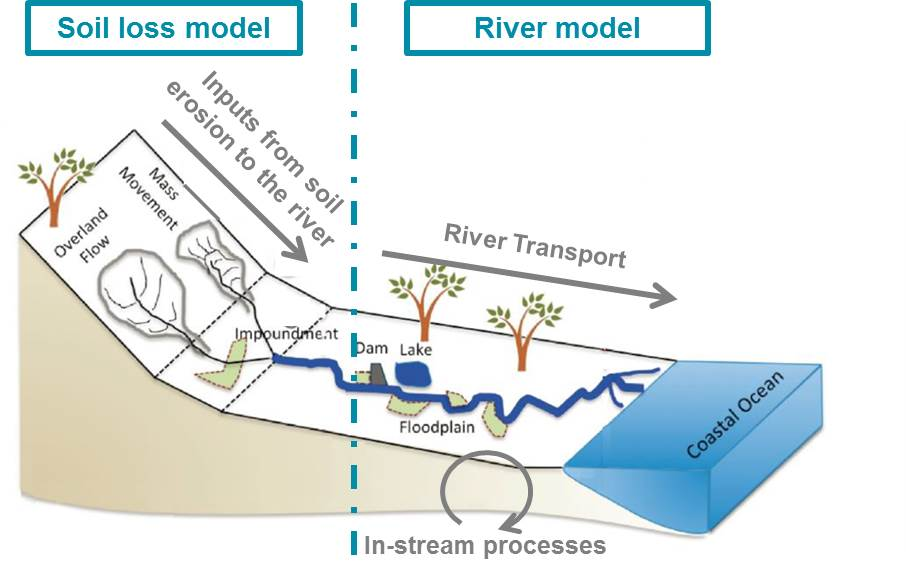
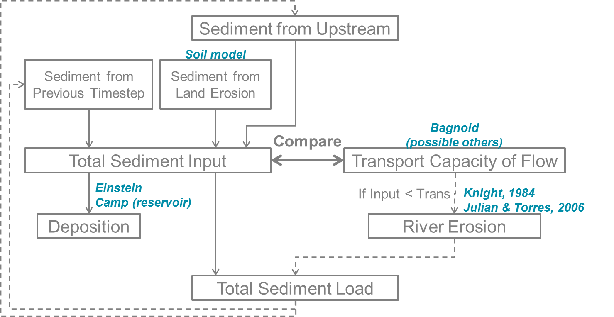

The wflow_sediment Model
========================

.. note::

    Experimental version
	
Introduction
------------
The processes and fate of many particles and pollutants impacting water quality at the catchment level are
intricately linked to the processes governing sediment dynamics. Both nutrients such as phosphorus, carbon
or other pollutants such as metals are influenced by sediment properties in processes such as mobilization,
flocculation or deposition. To better assert and model water quality in inland systems, a better comprehension
and modelling of sediment sources and fate in the river is needed at a spatial and time scale relevant to such
issues. 

The wflow_sediment model was developed to answer such issues. It is a distributed physics-based model,
based on the distributed hydrologic wflow_sbm model. It is able to simulate both land and in-stream processes, and
relies on available global datasets, parameter estimation and small calibration effort.

In order to model the exports of terrestrial sediment to the coast through the Land Ocean Aquatic 
Continuum or LOAC (inland waters network such as streams, lakes...), two different modelling parts 
were considered (see Figure below). The first part is the modelling and estimation of soil 
loss and sediment yield to the river system by land erosion, called the soil loss model. The second part is the 
transport and processes of the sediment in the river system, called the river model. The two models together 
constitute the wflow\_sediment model.



    Overview of the concepts of the wflow_sediment model.

Method
------
The wflow\_sediment model was developed using the same framework and tool as the wflow\_sbm hydrologic model. 
It uses the results from the hydrology to then deduce soil erosion and delivery to the river system, in what 
is called the soil loss part of the model. It finally follows the fate and transport of the incoming sediments 
in the stream network, in what is called the river part of the model. To keep the consistency with wflow\_sbm, 
the model is also developed in Python using PCRaster functions and should use the same datasets.

Soil Loss part
~~~~~~~~~~~~~~
The first process to consider in sediment dynamics is the generation of sediments by land erosion. The main 
processes behind soil loss are rainfall erosion and overland flow erosion. In order to model such processes 
at a fine time and space scale, physics-based models such as ANSWERS and EUROSEM were chosen here.

Rainfall erosion
````````````````
In wflow\_sediment, rainfall erosion can both be modelled using EUROSEM or ANSWERS equation. The main difference 
between the models is that EUROSEM uses a more physics-based approach using the kinetic energy of the rain drops 
impacting the soil (Morgan et al, 1998), while ANSWERS is more empirical and uses parameters from the USLE model 
(Beasley et al, 1991).

In EUROSEM, rainfall erosion is modelled according to rainfall intensity and its kinetic energy while it reaches 
the soil according to equations developed by Brandt (1990). As the intensity of the rain kinetic energy depends 
on the length of the fall, rainfall intercepted by vegetation will then be reduced compared to direct throughfall. 
The kinetic energy of direct throughfall is estimated by (Morgan et al, 1998):

.. math::

   KE_{direct} = 8.95 + 8.44 * log_{10} R_{i}

where :math:`KE_{direct}` is kinetic energy of direct throughfall (J m\ :math:`^{-2}` mm\ :math:`^{-1}`) and :math:`R_{i}` 
is rainfall intensity (mm h\ :math:`^{-1}`). If the rainfall is intercepted by vegetation and falls as leaf drainage, 
its kinetic energy is then reduced according to (Brandt, 1990):

.. math::

   KE_{leaf} = 15.8 * H_{p}^{0.5} - 5.87

where :math:`KE_{leaf}` is kinetic energy of leaf drainage (J m\ :math:`^{-2}` mm\ :math:`^{-1}`) and :math:`H_{p}` 
is the effective canopy height (half of plant height in m). In the global version of wflow_sediment, canopy height 
can be derived from the global map from Simard & al. (2011) or user input depending on the land use.

Kinetic energies from both direct throughfall and leaf drainage are then multiplied by the respective depths of direct 
throughfall and leaf drainage (mm) and added to get the total rainfall kinetic energy :math:`KE`. The soil detached by 
rainfall :math:`D_{R}` (g m\ :math:`^{-2}`) is then:

.. math::

   D_{R} = k * KE * e^{-\varphi h}

where :math:`k` is an index of the detachability of the soil (g :math:`J^{-1}`), :math:`KE` is the total rainfall 
kinetic energy (J m\ :math:`^{-2}`), :math:`h` is the surface runoff depth on the soil (m) and :math:`\varphi` is 
an exponent varying between 0.9 and 3.1 used to reduce rainfall impact if the soil is already covered by water. As a
simplification, Torri (1987) has shown that a value of 2.0 for :math:`\varphi` is representative enough for a wide range 
of soil conditions. The detachability of the soil :math:`k` depends on the soil texture (proportion of clay, silt 
and sand content) and correponding values are defined in EUROSEM user guide (Morgan et al, 1998). As a simplification, 
in wflow_sediment, the mean value of the detachability shown in the table below are used. Soil texture is derived 
from the topsoil clay and silt content from SoilGrids (Hengl et al, 2017).

.. csv-table:: Mean detachability of soil depending on its texture (Morgan et al, 1998).
    :header: "Texture (USDA system)",  "Mean detachability :math:`k` (g/J)"
    :widths: 40,40
	:align: center

    "Clay", "2.0"
	"Clay Loam", "1.7"
	"Silt", "1.2"
	"Silt Loam", "1.5"
	"Loam", "2.0"
	"Sandy Loam", "2.6"
	"Loamy Sand", "3.0"
	"Fine Sand", "3.5"
	"Sand", "1.9"

Rainfall erosion is handled differently in ANSWERS. There, the impacts of vegetation and soil properties are handled 
through the USLE coefficients in the equation (Beasley et al, 1991):

.. math::

   D_{R} = 0.108 * C_{USLE} * K_{USLE} * A_{i} * R_{i}^{2}

where :math:`D_{R}` is the soil detachment by rainfall (here in kg min\ :math:`^{-1}`), :math:`C_{USLE}` is the 
soil cover-management factor from the USLE equation, :math:`K_{USLE}` is the soil erodibility factor from the USLE 
equation, :math:`A_{i}` is the area of the cell (m:math:`^{2}`) and :math:`R_{i}` is the rainfall intensity (here 
in mm min\ :math:`^{-1}`). In wflow_sediment, there are several methods available to estimate the :math:`C` and
:math:`K` factors from the USLE. They can come from user input maps, for example maps resulting from Panagos & al.’s 
recent studies for Europe (Panagos et al, 2015) (Ballabio et al, 2016). To get an estimate of the :math:`C` factor 
globally, the other method is to estimate :math:`C` values for the different land use type in GlobCover. These values, 
summed up in the table below, come from a literature study including Panagos & al.’s review (2015), Gericke & al. (2015), 
Mansoor & al. (2013), Chadli & al. (2016), de Vente & al. (2009), Borrelli & al. (2014), Yang & al. (2003) and Bosco & al.
(2015).

The other methods to estimate the USLE :math:`K` factor are to use either topsoil composition or topsoil geometric mean 
diameter. :math:`K` estimation from topsoil composition is estimated with the equation developed in the EPIC model 
(Williams et al, 1983):

.. math::

   K_{USLE} = \left\{ 0.2 + 0.3exp\left[-0.0256SAN\frac{(1-SIL)}{100}\right] \right\} \left(\frac{SIL}{CLA+SIL}\right)^{0.3}
   * \left(1-\frac{0.25OC}{OC+exp(3.72-2.95OC)}\right) * \left(1-\frac{0.75SN}{SN+exp(-5.51+22.9SN)}\right)

where :math:`CLA`, :math:`SIL`, :math:`SAN` are respectively the clay, silt and sand fractions of the topsoil (%) from SoilGrids,
:math:`OC` is the topsoil organic carbon content (%) from SoilGrids and :math:`SN` is :math:`1-SAN/100`. The :math:`K` factor 
can also be estimated from the soil mean geometric diameter using the formulation from the RUSLE guide by Renard & al. (1997):

.. math:: 

	K_{USLE} = 0.0034 + 0.0405exp\left[-\dfrac{1}{2}\left(\dfrac{log_{10}(D_{g})+1.659}{0.7101}\right)^{2}\right]

where :math:`D_{g}` is the soil geometric mean diameter (mm) estimated from topsoil clay, silt, sand fraction.

.. csv-table:: Estimation of USLE C factor per Globcover land use type
    :header: "GlobCover Value",  "Globcover label", ":math:`C_{USLE}`"
    :widths: 10,80,10
	:align: center

	"11", "Post-flooding or irrigated croplands (or aquatic)", "0.2"
	"14", "Rainfed croplands", "0.35"
	"20", "Mosaic cropland (50-70\%) / vegetation (grassland/shrubland/forest) (20-50\%)", "0.27"
	"30", "Mosaic vegetation (grassland/shrubland/forest) (50-70\%) / cropland (20-50\%)", "0.25"
	"40", "Closed to open (>15\%) broadleaved evergreen or semi-deciduous forest (>5m)", "0.0065"
	"50", "Closed (>40\%) broadleaved deciduous forest (>5m)", "0.001"
	"60", "Open (15-40\%) broadleaved deciduous forest/woodland (>5m)", "0.01"
	"70", "Closed (>40\%) needleleaved evergreen forest (>5m)", "0.001"
	"90", "Open (15-40\%) needleleaved deciduous or evergreen forest (>5m)", "0.01"
	"100", "Closed to open (>15\%) mixed broadleaved and needleleaved forest (>5m)", "0.02"
	"110", "Mosaic forest or shrubland (50-70\%) / grassland (20-50\%)", "0.015"
	"120", "Mosaic grassland (50-70\%) / forest or shrubland (20-50\%)", "0.03"
	"130", "Closed to open (>15\%) (broadleaved or needleleaved, evergreen or deciduous) shrubland (<5m)", "0.035"
	"140", "Closed to open (>15\%) herbaceous vegetation (grassland, savannas or lichens/mosses)", "0.05"
	"150", "Sparse (<15\%) vegetation", "0.35"
	"160", "Closed to open (>15\%) broadleaved forest regularly flooded (semi-permanently or temporarily) - Fresh or brackish water", "0.001"
	"170", "Closed (>40\%) broadleaved forest or shrubland permanently flooded - Saline or brackish water", "0.0005"
	"180", "Closed to open (>15\%) grassland or woody vegetation on regularly flooded or waterlogged soil - Fresh, brackish or saline water", "0.04"
	"190", "Artificial surfaces and associated areas (Urban areas >50\%)", "0.0"
	"200", "Bare areas", "0.0"
	"210", "Water bodies", "0.0"
	"220", "Permanent snow and ice", "0.0"
	"230", "No data (burnt areas, clouds,…)", "0.0"
	

Overland flow erosion
`````````````````````
Overland flow (or surface runoff) erosion is induced by the strength of the shear stress of the
surface water on the soil. As in rainfall erosion, the effect of the flow shear stress can be 
reduced by the soil vegetation or by the soil properties. In wflow_sediment, soil detachment
by overland flow is modelled as in ANSWERS with (Beasley et al, 1991):

.. math:: 

	D_{F} = 0.90 * C_{USLE} * K_{USLE} * A_{i} * S * q

where :math:`D_{F}` is soil detachment by flow (kg min\ :math:`^{-1}`), :math:`C_{USLE}` and 
:math:`K_{USLE}` are the USLE cover and soil erodibility factors, :math:`A_{i}` is the cell area 
(m:math:`^{2}`), :math:`S` is the slope gradient and :math:`q` is the overland flow rate per unit 
width (m:math:`^{2}` min\ :math:`^{-1}`). The USLE :math:`C` and :math:`K` factors can be 
estimated with the same methods as for rainfall erosion and here the slope gradient is obtained 
from the sinus rather than the tangent of the slope angle.	

Delivery to the river system
````````````````````````````
Once the amount of soil detached by both rainfall and overland flow has been estimated, it has 
then to be routed and delivered to the river network. Inland routing in sediment models is usually 
done by comparing the amount of detached sediment with the transport capacity of the flow, which is 
the maximum amount of sediment than the flow can carry downslope. There are several existing formulas 
available in the literature. For a wide range of slope and for overland flow, the Govers equation (1990) 
seems the most appropriate choice (Hessel et al, 2007). However, as the wflow_sediment model was 
developed to be linked to water quality issues, the Yalin transport equation was chosen as it can handle
particle differentiation  (Govers equation can still be used if wflow_sediment is used to only
model inland processes with no particle differentiation). For land cells, wflow_sediment assumes
that erosion can mobilize 5 classes of sediment:

-  Clay (mean diameter of 2 :math:`\mu`m)

-  Silt (mean diameter of 10 :math:`\mu`m)

-  Sand (mean diameter of 200 :math:`\mu`m)

-  Small aggregates (mean diameter of 30 :math:`\mu`m)

-  Large aggregates (mean diameter of 500 :math:`\mu`m).

To deduce the amount of small and large aggregates from topsoil clay, silt and sand contents, 
the following equations from the SWAT model are used (Neitsch et al, 2011):

.. math:: PSA = SAN *(1-CLA)^{2.4}

.. math:: PSI = 0.13SIL

.. math:: PCL = 0.20CLA

.. math::

   SAG = 2.0CLA for CLA < 0.25 
       = 0.28(CLA-0.25)+0.5 for  0.25 \leq CLA \leq 0.5
       = 0.57 for CLA > 0.5

.. math:: LAG = 1 - PSA - PSI - PCL - SAG

where :math:`CLA`, :math:`SIL` and :math:`SAN` are the primary clay, silt, sand fractions 
of the topsoil and :math:`PCL`, :math:`PSI`, :math:`PSA`, :math:`SAG` and :math:`LAG` are 
the clay, silt, sand, small and large aggregates fractions of the detached sediment respectively.
The transport capacity of the flow using Yalin’s equation with particle differentiation, 
developed by Foster (1982), is:

.. math:: TC_{i} = (P_{e})_{i} * (S_{g})_{i} *\rho_{w} * g * d_{i} * V_{*}

where :math:`TC_{i}` is the transport capacity of the flow for the particle class i, 
:math:`(P_{e})_{i}` is the effective number of particles of class i, :math:`(S_{g})_{i}` 
is the specific gravity for the particle class i (kg m\ :math:`^{-3}`), :math:`\rho_{w}` 
is the mass density of the fluid (kg m\ :math:`^{-3}`), :math:`g` is the acceleration 
due to gravity (m s\ :math:`^{-2}`), :math:`d_{i}` is the diameter of the particle of 
class i (m) and :math:`V_{*}=(g* R * S)^{0.5}` is the shear velocity of the flow
(m s\ :math:`^{-1}`) with :math:`S` the slope gradient and :math:`R` the hydraulic radius 
of the flow (m). The detached sediment are then routed downslope until the river network 
using the accucapacityflux, accupacitystate functions from the PCRaster Python framework 
depending on the transport capacity from Yalin.

Finally, the different processes happening for a land cell in the soil
loss part of wflow_sediment are summarized in the figure below:


    Overview of the different processes for a land cell in wflow_sediment (adapted from Kinnell et al, 2010).


River part
~~~~~~~~~~
As wflow_sediment was developed for applications across Europe, it must
be able to simulate sediment dynamics both for small and large
catchments. Which is why, for large catchments, it needed to model more
precisely processes happening in the stream network. Thus once sediments
coming from land erosion reach a river cell in the model, processes and
equations change. There are not so many models available to model in-stream 
sediment dynamics with only hydrology. In the end, the more physics-based approach 
of the SWAT model was chosen as it requires little or no calibration and it can separate
both the suspended from the bed load (Neitsch et al, 2011). As
in SWAT, in the river part of wflow_sediment, 5 particles class are
modelled: clay, silt, sand, small and large aggregates and gravel. Small
and large aggregates are assumed to only come from land erosion, gravel
only from river erosion, while clay, silt and sand can both come from
either land or river erosion. In the river, suspended sediment load is
assumed to be the sum of clay and silt and the bed sediment load is
assumed to be composed of sand, gravel, small and large aggregates.

Sediment inputs in a river cell
```````````````````````````````
The first part of the river model assesses how much detached sediment
are in the river cell at the beginning of the timestep t. Sources of
detached sediment are sediments coming from land erosion, estimated with
the soil loss part of wflow_sediment model, the sediment coming from
upstream river cells and the detached sediment that were left in the
cell at the end of the previous timestep (t-1):

.. math:: 
	(sed_{in})_{t} = (sed_{land})_{t} + upstream\left[(sed_{out})_{t-1}\right] + (sed_{riv})_{t-1}

Sediment coming from upstream river cells is estimated using the
PCRaster upstream function and the local drainage direction map to spot
the upstream river cells.

River transport and erosion
```````````````````````````
Once the amount of sediment inputs at the beginning of the timestep is
known, the model then estimates transport, and river erosion if there is
a deficit of sediments. Transport in the river system is estimated via a
transport capacity formula. There are several transport capacity
formulas available in wflow_sediment, some requiring calibration and
some not. Choosing a transport capacity equation depends on the river
characteristics (some equation are more suited for narrow or wider
rivers), and on the reliability of the required
river parameters (such as slope, width or mean particle diameter of the
river channel). Available transport capacity equations are:

-  **Simplified Bagnold**: originally more valid for intermediate to
   large rivers, this simplified version of the Bagnold equation relates
   sediment transport to flow velocity with two simple calibration
   parameters (Neitsch et al, 2011):

   .. math:: C_{max} = c_{sp} * \left( \dfrac{prf * Q}{h * W} \right) ^{sp_{exp}}

   where :math:`C_{max}` is the sediment concentration (ton
   m\ :math:`^{-3}` or kg/L), :math:`Q` is the surface runoff in the
   river cell (m:math:`^{3}`/s), :math:`h` is the river water level (m),
   :math:`W` is the river width (m) and :math:`c_{sp}`, :math:`prf` and
   :math:`sp_{exp}` are calibration parameters. The :math:`prf`
   coefficient is usually used to deduce the peak velocity of the flow,
   but for simplification in wflow_sediment, the equation was simplified
   to only get two parameters to calibrate: :math:`sp_{exp}` and
   :math:`c_{Bagnold} = c_{sp} * prf^{sp_{exp}}`. The coefficient
   :math:`sp_{exp}` usually varies between 1 and 2 while :math:`prf` and
   :math:`c_{sp}` have a wider range of variation. The table below 
   summarizes ranges and values of the three Bagnold
   coefficients used by other studies:
   
   .. csv-table:: Range of the simplified Bagnold coefficients (and calibrated value)
		:header: "Study", "River", ":math:`prf` range", ":math:`c_{sp}` range", ":math:`sp_{exp}` range"
		:widths: 15,15,15,30,15
		:align: center

		"Vigiak 2015", "Danube", "0.5-2 (/)", "0.0001-0.01 (0.003-0.006)", "1-2 (1.4)"
		"Vigiak 2017", "Danube", "/", "0.0001-0.01 (0.0015)", "1-2 (1.4)"
		"Abbaspour 2007", "Thur (CH)", "0.2-0.25 (/)", "0.001-0.002 (/)", "1.35-1.47 (/)"
		"Oeurng 2011", "Save (FR)", "0-2 (0.58)", "0.0001-0.01 (0.01)", "1-2 (2)"
   
-  **Engelund and Hansen**: not present in SWAT but used in many models
   such as Delft3D-WAQ, Engelund and Hansen calculates the total sediment
   load as (Engelund and Hansen, 1967):

   .. math:: C_{w} = 0.05 \left( \dfrac{\rho_{s}}{\rho_{s} - \rho} \right) \left( \dfrac{u * S}{\sqrt{\left( \dfrac{\rho_{s}}{\rho_{s} - \rho} \right) * g * D_{50}}} \right) \theta^{1/2}

   where :math:`C_{w}` is the sediment concentration by weight,
   :math:`\rho` and :math:`\rho_{s}` are the fluid and sediment density
   (here equal to 1000 and 2650 g m\ :math:`^{-3}`), :math:`u` is the water
   mean velocity (m/s), :math:`S` is the river slope, :math:`g` is the
   acceleration due to gravity, :math:`D_{50}` is the river mean diameter
   (m) and :math:`\theta` is the Shields parameter. 

-  **Kodatie**: Kodatie (1999) developped the power relationships from
   Posada (1995) using field data and linear optimization so that they
   would be applicable for a wider range of riverbed sediment size. The
   resulting equation, for a rectangular channel, is (Neitsch et al, 2011):

   .. math:: C_{max} = \left( \dfrac{a* u^{b}* h^{c} * S^{d}}{V_{in}} \right) * W

   where :math:`V_{in}` in the volume of water entering the river cell  
   during the timestep (m:math:`^{3}`) and :math:`a`, :math:`b`, :math:`c`
   and :math:`d` are coefficients depending on the riverbed sediment size.
   Values of these coefficients are summarized in the table below:

   .. csv-table:: Range of the simplified Bagnold coefficients (and calibrated value)
	   :header: "River sediment diameter", "a", "b", "c", "d"
	   :widths: 40,10,10,10,10
	   :align: center
   
	   ":math:`D_{50} \leq` 0.05mm",        "281.4",     "2.622", "0.182", "0"
	   "0.05 :math:`< D_{50} \leq` 0.25mm", "2 829.6",   "3.646", "0.406", "0.412"
	   "0.25 :math:`< D_{50} \leq` 2mm",    "2 123.4",   "3.300", "0.468", "0.613"
	   ":math:`D_{50} >` 2mm",              "431 884.8", "1.000", "1.000", "2.000"
	   
-  **Yang**: Yang (1996) developed a set of two equations giving transport
   of sediments for sand-bed or gravel-bed rivers. The sand equation
   (:math:`D_{50} < 2mm`) is:

   .. math::

       log\left(C_{ppm}\right) = 5.435-0.286log\frac{\omega_{s,50}D_{50}}{\nu}-0.457log\frac{u_{*}}{\omega_{s,50}} \\
       +\left(1.799-0.409log\frac{\omega_{s,50}D_{50}}{\nu}-0.314log\frac{u_{*}}{\omega_{s,50}}\right)log\left(\frac{uS}{\omega_{s,50}}-\frac{u_{cr}S}{\omega_{s,50}}\right)

   And the gravel equation (:math:`2 \leq D_{50} < 10 mm`) is:

   .. math::

       log\left(C_{ppm}\right) = 6.681-0.633log\frac{\omega_{s,50}D_{50}}{\nu}-4.816log\frac{u_{*}}{\omega_{s,50}} \\
       +\left(2.784-0.305log\frac{\omega_{s,50}D_{50}}{\nu}-0.282log\frac{u_{*}}{\omega_{s,50}}\right)log\left(\frac{uS}{\omega_{s,50}}-\frac{u_{cr}S}{\omega_{s,50}}\right)

   where :math:`C_{ppm}` is sediment concentration in parts per million by
   weight, :math:`\omega_{s,50}` is the settling velocity of a particle
   with the median riverbed diameter estimated with Stokes (m/s),
   :math:`\nu` is the kinematic viscosity of the fluid (m:math:`^{2}`/s),
   :math:`u_{*}` is the shear velocity (:math:`\sqrt{gR_{H}S}` in m/s with
   :math:`R_{H}` the hydraulic radius of the river) and :math:`u_{cr}` is
   the critical velocity (m/s, equation can be found in Hessel, 2007).
 
-  **Molinas and Wu**: The Molinas and Wu (2001) transport equation was
   developed for large sand-bed rivers based on the universal stream power
   :math:`\psi`. The corresponding equation is (Neitsch et al, 2011):

   .. math:: C_{w} = \dfrac{1430*(0.86+\sqrt{\psi})* \psi^{1.5}}{0.016+\psi}* 10^{-6}

   where :math:`\psi` is the universal stream power given by:

   .. math:: \psi = \dfrac{\psi^{3}}{\left(\dfrac{\rho_{s}}{\rho}-1\right)* g* h* \omega_{s,50} * \left[ log_{10}\left(\dfrac{h}{D_{50}}\right)\right]^{2}} 
   
Once the maximum concentration :math:`C_{max}` is established with one
of the above transport formula, the model then determines if there is
erosion of the river bed and bank. In order to do that, the difference
:math:`sed_{ex}` between the maximum amount of sediment estimated with
transport (:math:`sed_{max} = C_{max}* V_{in}`) and the sediment
inputs to the river cell (:math:`sed_{in}` calculated above) is
calculated. If too much sediment is coming in and :math:`sed_{ex}` is
negative, then there is no river bed and bank erosion. And if the river
has not reach its maximum transport capacity, then erosion of the river
happens.

First, the sediments stored in the cell from deposition in previous
timesteps :math:`sed_{stor}` are eroded from clay to gravel. If this
amount is not enough to cover :math:`sed_{ex}`, then erosion of the
local river bed and bank material starts.

Instead of just setting river erosion amount to just cover the remaining
difference :math:`sed_{exeff}` between :math:`sed_{ex}` and
:math:`sed_{stor}`, actual erosion potential is adjusted using river
characteristics and is separated between the bed and bank of the river
using the physics-based approach of Knight (1984).

The bed and bank of the river are
supposed to only be able to erode a maximum amount of their material
:math:`E_{R,bed}` for the bed and :math:`E_{R,bank}` for the river bank.
For a rectangular channel, assuming it is meandering and thus only one
bank is prone to erosion, they are calculated from the equations(Neitsch et al, 2011):

.. math:: E_{R,bed} = k_{d,bed} * \left( \tau_{e,bed} - \tau_{cr,bed} \right)* 10^{-6} * L * W * \rho_{b, bed} * \Delta t

.. math:: E_{R,bank} = k_{d,bank} * \left( \tau_{e,bank} - \tau_{cr,bank} \right)* 10^{-6} * L * h * \rho_{b, bank} * \Delta t

where :math:`E_{R}` is the potential bed/bank erosion rates (tons),
:math:`k_{d}` is the erodibility of the bed/bank material
(cm:math:`^{3}` N\ :math:`^{-1}` s\ :math:`^{-1}`), :math:`\tau_{e}` is
the effective shear stress from the flow on the bed/bank
(N/m:math:`^{2}`), :math:`\tau_{cr}` is the critical shear stress for
erosion to happen (N/m:math:`^{2}`), :math:`L`, :math:`W` and :math:`h`
are the channel length, width and water height (m), :math:`\rho_{b}` is
the bulk density of the bed/bank of the river (g/cm:math:`^{3}`) and
:math:`\Delta t` is the model timestep (s).

In wflow_sediment, the erodibility of the bed/bank are approximated
using the formula from Hanson and Simon (2001):

.. math:: k_{d}=0.2* \tau_{cr}^{-0.5}

Normally erodibilities are evaluated using jet test in the field and
there are several reviews and some adjustments possible to this equation
(Simon et al, 2011). However, to avoid too heavy calibration
and for the scale considered, this equation is supposed to be efficient
enough. The critical shear stress :math:`\tau_{cr}` is evaluated
differently for the bed and bank. For the bed, the most common formula
from Shields initiation of movement is used. For the bank, a more recent
approach from Julian and Torres (2006) is used :

.. math:: \tau_{cr,bank} = (0.1+0.1779* SC+0.0028* SC^{2}-2.34* 10^{-5} * SC^{3})*C_{ch}

where :math:`SC` is the percent clay and silt content of the river bank
and :math:`C_{ch}` is a coefficient taking into account the positive
impact of vegetation on erosion reduction. This coefficient is then
dependent on the land use and classical values are shown in the table below. 
These values where then adapted for use with the
GlobCover land use map. Percent of clay and silt (along with sand and
gravel) for the channel is estimated from the river median particle
diameter assuming the same values as SWAT shown in the table below.
Median particle diameter is here estimated depending on the Strahler
river order. The higher the order, the smaller the diameter is. As the
median diameter is only used in wflow_sediment for the estimation of the
river bed/bank sediment composition, this supposition should be enough.
Actual refined data or calibration may however be needed if the median
diameter is also required for the transport formula. In a similar way,
the bulk densities of river bed and bank are also just assumed to be of
respectively 1.5 and 1.4 g/cm\ :math:`^{3}`.

.. csv-table:: Classical values of the channel cover vegetation coefficent (Julian and Torres, 2006)
   :header: "Bank vegetation", ":math:`C_{ch}`"
   :widths: 30,10
   :align: center
   
   "None", "1.00"
   "Grassy", "1.97"
   "Sparse trees", "5.40"
   "Dense trees", "19.20"
 
Composition of the river bed/bank depending on the median diameter (Neitsch et al, 2011) 
+--------------------+--------------+-------+----------+---------------+
|Sediment Fraction   | :math:`d_{50}` (:math:`\mu`\ m)                 |
+                    +--------------+-------+----------+---------------+               
|                    |:math:`\leq` 5|5 to 50|50 to 2000|:math:`>`\ 2000|
+====================+==============+=======+==========+===============+
|Sand                | 0.15         | 0.15  |  0.65    |  0.15         |
|Silt                | 0.15         | 0.65  | 0.15     | 0.15          |
|Clay                | 0.65         | 0.15  | 0.15     | 0.05          |
|Gravel              | 0.05         | 0.05  | 0.05     | 0.65          |
+--------------------+--------------+-------+----------+---------------+

Then, the repartition of the flow shear stress is refined into the
effective shear stress and the bed and bank of the river using the
equations developed by Knight (1984) for a rectangular channel:

.. math:: \tau_{e,bed} = \rho g R_{H} S * \left(1 - \dfrac{SF_{bank}}{100}\right) * \left(1+\dfrac{2h}{W}\right)

.. math:: \tau_{e,bank} = \rho g R_{H} S * \left( SF_{bank}\right) * \left(1+\dfrac{W}{2h}\right)

where :math:`\rho g` is the fluid specific weight (9800
N/m\ :math:`^{3}` for water), :math:`R_{H}` is the hydraulic radius of
the channel (m), :math:`h` and :math:`W` are the water level and river
width (m). :math:`SF_{bank}` is the proportion of shear stress acting on
the bank (%) and is estimated from (Knight, 1984):

.. math:: SF_{bank} = exp \left( -3.230* log_{10}\left(\dfrac{W}{h}+3\right)+6.146 \right)

Finally the relative erosion potential of the bank and bed of the river
is calculated by:

.. math:: RTE_{bed} = \dfrac{E_{R,bed}}{E_{R,bed}+E_{R,bank}}

.. math:: RTE_{bank} = 1 - RTE_{bed}

And the final actual eroded amount for the bed and bank is the maximum
between :math:`RTE * sed_{exeff}` and the erosion potential
:math:`E_{R}`. Total eroded amount of sediment :math:`sed_{erod}` is
then the sum of the eroded sediment coming from the storage of
previously deposited sediment and the river bed/bank erosion.

River deposition
````````````````
As sediments have a higher density than water, moving sediments in water
can be deposited in the river bed. The deposition process depends on the
mass of the sediment, but also on flow characteristics such as velocity.
In wflow_sediment, as in SWAT, deposition is modelled with Einstein’s
equation (Neitsch et al, 2011):

.. math:: P_{dep}=\left(1-\dfrac{1}{e^{x}}\right)* 100

where :math:`P_{dep}` is the percentage of sediments that is deposited
on the river bed and x is a parameter calculated with:

.. math:: x = \dfrac{1.055* L * \omega_{s}}{u* h}

where :math:`L` and :math:`h` are channel length and water height (m),
:math:`\omega_{s}` is the particle settling velocity calculated with
Stokes formula (m/s) and :math:`u` is the mean flow velocity (m/s). The
calculated percentage is then subtracted from the amount of sediment
input and eroded river sediment for each particle size class
(:math:`sed_{dep} = P_{dep}/100 * (sed_{in} + sed_{erod})`).
Resulting deposited sediment are then stored in the river bed and can be
re-mobilized in future time steps by erosion.

Mass balance and sediment concentration
```````````````````````````````````````
Finally after estimating inputs, deposition and erosion with the
transport capacity of the flow, the amount of sediment actually leaving
the river cell to go downstream is estimated using:

.. math:: sed_{out} = (sed_{in} + sed_{erod} - sed_{dep}) * \dfrac{V_{out}}{V}

where :math:`sed_{out}` is the amount of sediment leaving the river cell
(tons), :math:`sed_{in}` is the amount of sediment coming into the river
cell (storage from previous timestep, land erosion and sediment flux
from upstream river cells in tons), :math:`sed_{erod}` is the amount of
sediment coming from river erosion (tons), :math:`sed_{dep}` is the
amount of deposited sediments (tons), :math:`V_{out}` is the volume of
water leaving the river cell (surface runoff :math:`Q` times timestep
:math:`\Delta t` in m\ :math:`^{3}`) and :math:`V` is the total volume
of water in the river cell (:math:`V_{out}` plus storage
:math:`h* W * L` in m\ :math:`^{3}`).

A mass balance is then used to calculate the amount of sediment
remaining in the cell at the end of the timestep
:math:`(sed_{riv})_{t}`:

.. math:: (sed_{riv})_{t} = (sed_{riv})_{t-1} + (sed_{land})_{t} + upstream\left[(sed_{out})_{t-1}\right] + (sed_{erod})_{t} - (sed_{dep})_{t} - (sed_{out})_{t}

Finally, the different processes happening for a land cell in the river
part of wflow_sediment are summarized in the figure below:



    Overview of the different processes for a river cell in wflow_sediment.

Lake modelling
``````````````
Apart from land and river, the hydrologic wflow_sbm model also handles
lakes and reservoirs modelling. In wflow_sbm, lakes and large reservoirs
are modelled using a 1D bucket model at the cell corresponding to the
outlet. For the other cells belonging to the lake/reservoir which are
not the outlet, processes such as precipitation and evaporation are
filtered out and shifted to the outlet cell. wflow_sediment then handles
the lakes in the same way. If a cell belongs to a lake/reservoir and is
not the outlet then the model assumes that no erosion/deposition of
sediments is happening and the sediments are only all transported to the
lake/reservoir outlet. Once the sediments reach the outlet, then
sediments are deposited in the lake/reservoir according to Camp’s model
(1945) (Verstraeten et al, 2000):

.. math:: TE = \dfrac{\omega_{s}}{u_{cr,res}} = \dfrac{A_{res}}{Q_{out,res}} * \omega_{s}

where :math:`TE` is the trapping efficiency of the lake/reservoir (or
the fraction of particles trapped), :math:`\omega_{s}` is the particle
velocity from Stokes (m/s), :math:`u_{cr,res}` is the reservoir’s
critical settling velocity (m/s) which is equal to the reservoir’s
outflow :math:`Q_{out,res}` (m:math:`^{3}`/s) divided by the reservoir’s
surface area :math:`A_{res}` (m:math:`^{2}`).


Configuration
-------------
The wflow\_sediment model was developed as part of the wflow hydrologic platform and is therefore a
nother wflow module, developed in Python, and using the same framework than wflow\_sbm. First, the model 
case is set up and run normally with wflow\_sbm. Then wflow\_sediment is run using the outputs of the hydrologic model.
As settings for wflow\_sbm are explained in the corresponding part of this documentation, only specific details 
regarding the run of wflow\_sediment are developed here.

Running wflow_sbm
~~~~~~~~~~~~~~~~~
To model sediment dynamics, the first step is to build a wflow_sbm model
and to run it for the catchment considered. Apart from the usual settings for
the wflow_sbm model, additional ones for a run with wflow_sediment are
to save the following variables in the outputmaps section of the
wflow_sbm.ini file:

-  Precipitation "self.Precipitation" (can also be taken directly from
   the wflow_sbm forcings)

-  Surface runoff from the kinematic wave "self.SurfaceRunoff"

-  Water level in the kinematic wave "self.WaterLevel"

-  Rainfall interception by the vegetation "self.Interception".

wflow_sediment also needs some static output maps which are saved by
default by wflow_sbm. These maps are the map of the actual width and
length of the flow volume (Bw and DCL.map). After the set up, wflow_sbm
is run normally either via a batch file or via the command line.


Running wflow_sediment
~~~~~~~~~~~~~~~~~~~~~~
As wflow_sediment is built in the same way as wflow_sbm, its settings
and use are very similar. First, some additional data must be
downloaded. Then the corresponding ini file that summarizes all inputs
and outputs of the model run is completed and the model can finally be
run.

Additional data needed
``````````````````````
Apart from many data, such as landuse, catchment map, ldd map etc, that
are already needed for the wflow_sbm run, wflow_sediment requires some
extra additional data which are:

-  Map with topsoil percent of clay: this can be download, as for
   wflow_sbm other soil data, from the SoilGrids database (Hengl et al, 2017).
   Values then needs to be resampled and adjusted to the model grid size (for 
   the global version of wflow by averaging). This data is mandatory for the sediment model to run.

-  Map with topsoil percent of silt: this can also be downloaded from
   SoilGrids and processed in the same way as the topsoil clay map. This
   data is mandatory for the sediment model to run.

-  Map with topsoil percent of organic carbon: this data can be
   downloaded from SoilGrids. Units should be in percent (SoilGrids
   gives it in per-mille) and adjusted to the model grid cells. This
   data is only needed if the user wishes to calculate the USLE K
   parameter of soil erosion using the EPIC formula.

-  Map of vegetation height: this is available globally using the map
   published by Simard & al (2011). Other
   sources can however be used. Units should be in meters. Vegetation
   height is only needed if the EUROSEM model is used to calculate
   rainfall erosion.

Setting the ini file
````````````````````
As for wflow\_sbm, the setting up of the wflow\_sediment model is also done via an ini 
file and its different sections. A complete example is given in the wflow examples folder. 
The main sections and options needed are:
-  **inputmapstacks**: Links to the dynamic outputs of the wflow_sbm run
   either stored as maps in the outmaps folder of the sbm run or in the
   netcdf file. Dynamic data needed are Precipitation, SurfaceRunoff,
   WaterLevel and Interception.
   
::	
	[inputmapstacks]
	# Outputs from wflow_sbm
	Precipitation		= /inmaps/P
	Interception		= /inmaps/int
	SurfaceRunoff = /inmaps/run
	WaterLevel = /inmaps/levKin

-  **framework**: As for wflow_sbm, specifies if the inputs or outputs
   of the model are in netcdf format or PCRaster maps. If the results of
   wflow_sbm are saved in a netcdf file, link to this file is precised
   in the *netcdfinput* argument.

-  **run**: Info on the run parameters of the model. The start time, end
   time and timesteps of the model are written in this section. The
   *reinit* argument precise if the model should start from cold states
   (all the states maps of the model are set to zero if reinit = 1) or
   from the states maps given in the instate folder of the model (reinit
   = 0).

-  **modelparameters**: Other parameters used by the model. This section
   should include the same inputs as the wflow_sbm.ini file for
   reservoir modelling and Leaf Area Index data.

-  **model**: Parameters and settings for the sediment model. It
   contains both links to the staticmaps of the model (DEM, LDD etc.)
   and settings to decide which equations to use. These switches are
   used to choose if both the soil loss and river part of the model
   should be run (*runrivermodel* = 1 or 0 for just the soil loss part)
   and how the model should compute the USLE K factor (*uslekmethod* = 1
   for a staticmap, 2 for geometric mean equation and 3 for EPIC
   equation), the USLE C factor (*uslecmethod* = 1 for a staticmap, 2
   for a table based on land use), rainfall erosion (*rainerodmethod* =
   1 for EUROSEM and 2 for ANSWERS), inland transport (*landtransportmethod* = 1
   for Yalin with particle differentiation, 2 for Govers total transport and 3
   for Yalin total transport) and the river transport
   (*rivtransportmethod* = 1 for Engelund and Hansen, 2 for simplified
   Bagnold, 3 for Kodatie, 4 for Yang and 5 for Molinas and Wu).
   
::
	# Model parameters and settings
	[model]
	modeltype= sediment
	configfile = wflow_sediment.ini
	intbl = intbl
	# Run only the soil erosion model (0) or also the river transport model (1)
	runrivermodel = 1
	#Use original (0) or minimum dem (1) for river slope computation
	slopecorr = 1
	#USLE K computation method
	#1=map ; 2=geometric mean ; 3=EPIC 
	uslekmethod = 2
	#USLE C computation method
	#1=map ; 2=TBL based on land use
	uslecmethod=2
	#Rainfall erosion
	#1=EUROSEM ; 2=ANSWERS
	rainerodmethod = 1
	#Inland sediment transport formula
	#1=Yalin (particle differentiation) ; 2=Govers (total) ; 3=Yalin (total)
	#If the river transport model is run, will be set to 1
	landtransportmethod = 1
	#River sediment transport formula for erosion threshold
	#1=Engelund and Hansen ; 2=Bagnold ; 3=Kodatie ; 4=Yang ; 5=Molinas and Wu
	rivtransportmethod = 2
	#sCatch = 0

	#Model maps from wflow_sbm
	wflow_dem = staticmaps/wflow_dem.map
	wflow_landuse = staticmaps/wflow_landuse.map
	wflow_soil = staticmaps/wflow_soil.map
	wflow_subcatch = staticmaps/wflow_subcatch.map
	wflow_Hype = staticmaps/SUBID-HYPE-Rhine.map
	wflow_ldd = staticmaps/wflow_ldd.map
	wflow_river = staticmaps/wflow_river.map
	wflow_riverwidth = staticmaps/wflow_riverwidth.map
	wflow_dcl = staticmaps/DCL.map
	wflow_streamorder = staticmaps/wflow_streamorder.map

	#Additional model maps for wflow_sediment
	wflow_clay = staticmaps/percent_clay.map
	wflow_silt = staticmaps/percent_silt.map
	wflow_oc = staticmaps/percent_oc.map

	wflow_canopyheight = staticmaps/canopy_height.map   

-  **layout**: Specifies if the cell size is given in lat-lon
   (*sizeinmetres* = 0) or in meters (1). Should be set as in wflow_sbm.

-  **outputmaps**: As in wflow_sbm, this section is used to choose which
   dynamic data to save from the wflow_sediment run. These are:

::
	##### Output grids #####
	[outputmaps]
	#Gross precipitation [mm] (input)
	self.Precipitation=P
	#Surface runoff in the kinematic wave [m^3/s]
	self.SurfaceRunoff=run
	#Water level in the kinematic wave [m] (above the bottom)
	self.WaterLevel=levKin
	#Overland flow [m3/s]
	self.OvRun = ovRun
	#Soil loss by surface runoff erosion [ton/timestep/cell]
	self.SedOv=sedov
	#Soil loss by splash erosion [ton/timestep/cell]
	self.SedSpl=sedspl
	#Total soil loss [ton/timestep/cell]
	self.SoilLoss=soilloss
	#Total sediment input in the river per subcatchment [kg/ha/timestep]
	self.HYPEOvSedCatch = sedcatch
	#Sediment from land erosion entering the river [ton]
	self.InLandSed = landsed
	#Total river inputs [ton]
	self.InSedLoad = insed
	#River erosion [ton]
	self.RivErodSed = erodsed
	#Deposition in rivers [ton]
	self.DepSedLoad = depsed
	#Sediment stored on the river bed [ton]
	self.RivStoreSed = rivstore
	#Sediment output [ton]
	self.OutSedLoad = outsed
	#Final sediment load in river cells [ton]
	self.SedLoad = sedload
	#Total sediment concentration [mg/L]
	self.SedConc = sedconc
	#Suspended sediment concentration [mg/L]
	self.SSConc = ssconc

-  **summary**: Used to save summary maps of wflow_sediment outputs such
   as yearly average or yearly sum etc. It works in the same way than
   for wflow_sbm (see wflow documentation for more details).

-  **outputcsv** and **outputtss**: Used to save the evolution of
   wflow_sediment outputs for specific points or areas of interest in
   csv or tss format. It works in the same way than for wflow_sbm (see
   wflow documentation for more details). 


Running the model
`````````````````
Once all the settings are ready, the wflow_sediment model is run
similarly to wflow_sbm via the command line or a batch file. The minimum
command line requires:

-  The link to the wflow_sediment script.

-  -C option stating the name of the wflow case directory.

-  -R option stating the name of the directory of wflow_sediment
   outputs.

-  -c option stating the link to the wflow_sediment ini file.


Running the model
`````````````````
As in wflow_sbm, the outputs of the wflow_sediment model can both be
dynamic netcdf/pcraster maps data, static data, or dynamic data for
points/areas of interest. The main outputs variables are soil loss by
rainfall and overland flow erosion ("self.SedSpl" + "self.SedOv" =
"self.soilloss" in ton/timestep/cell), all the arguments from the
sediment mass balance in the river and the total, suspended and bed
sediment concentration ("self.SedConc", "self.SSConc" and "self.BedConc"
in mg/L). The other outputs are some default summary maps, saved in the
outsum folder, and are the USLE C and K factors, the topsoil percent
sand (deduced from clay and silt content) and the median river sediment
diameter :math:`d_{50}` in mm. The last outputs are the final states of
the model, stored in the outstate folder. In the river model,
wflow_sediment need to use the sediment load in the river at the
beginning of the timestep, the sediment load coming from upstream river
cells at the beginning of the timestep and the amount of deposited
sediment that are stored in the river bed and are available for erosion.
The three variables are stored in state map files for all particle size
class (clay, silt, sand, small and large aggregates, gravel) and total
sediment resulting in 21 state maps. If the model is run for the first
time and the states are not available, then, as in wflow_sbm, a cold run
with initial zero maps for the states can be done first for a year (at
least 6 months depending on the size of the model).


References
----------
..	K.C. Abbaspour, J. Yang, I. Maximov, R. Siber, K. Bogner, J. Mieleitner, J.
	Zobrist, and R.Srinivasan. Modelling hydrology and water quality in the pre-alpine/alpine Thur
	watershed using SWAT. Journal of Hydrology, 333(2-4):413-430, 2007. 10.1016/j.jhydrol.2006.09.014
  
..	C. Ballabio, P. Panagos, and L. Monatanarella. Mapping topsoil physical properties at European
	scale using the LUCAS database. Geoderma, 261:110-123, 2016. 10.1016/j.geoderma.2015.07.006
  
..	D.B Beasley and L.F Huggins. ANSWERS - Users Manual. Technical report, EPA, 1991.

..	P. Borrelli, M. Marker, P. Panagos, and B. Schutt. Modeling soil erosion and river
	sediment yield for an intermountain drainage basin of the Central Apennines, Italy. Catena, 114:45-58,
	2014. 10.1016/j.catena.2013.10.007
	  
..	C. Bosco, D. De Rigo, O. Dewitte, J. Poesen, and P. Panagos. Modelling soil erosion at European scale:
	Towards harmonization and reproducibility. Natural Hazards and Earth System Sciences, 15(2):225-245,
	2015. 10.5194/nhess-15-225-2015
	  
..	C.J Brandt. Simulation of the size distribution and erosivity of raindrops and throughfall drops. Earth
	Surface Processes and Landforms, 15(8):687-698, dec 1990.
	  
..	K. Chadli. Estimation of soil loss using RUSLE model for Sebou watershed (Morocco). Modeling Earth
	Systems and Environment, 2(2):51, 2016. 10.1007/s40808-016-0105-y
	  
..	F. Engelund and E. Hansen. A monograph on sediment transport in alluvial streams. Technical University
	of Denmark 0stervoldgade 10, Copenhagen K., 1967.
	 
..	G R Foster. Modeling the erosion process. Hydrologic modeling of small watersheds, pages 295-380, 1982.

..	A. Gericke. Soil loss estimation and empirical relationships for sediment delivery ratios of European
	river catchments. International Journal of River Basin Management, 2015. 10.1080/15715124.2014.1003302
	  
..	G. Govers. Empirical relationships for the transport capacity of overland 
	flow. IAHS Publication, (January 1990):45-63 ST, 1990.
	  
..	G.J Hanson and A Simon. Erodibility of cohesive streambeds in the loess area of the midwestern USA.
	Hydrological Processes, 15(May 1999):23-38, 2001.
	 
..	T. Hengl, J. Mendes De Jesus, G.B.M. Heuvelink, M. Ruiperez Gonzalez, M.
	Kilibarda, A. Blagotic, W. Shangguan, M. N. Wright, X. Geng, B. Bauer-
	Marschallinger, M.A. Guevara, R. Vargas, R.A. MacMillan, N.H. Batjes, J.G.B.
	Leenaars, E. Ribeiro, I. Wheeler, S. Mantel, and B. Kempen. SoilGrids250m: Global gridded
	soil information based on machine learning. PLoS ONE, 12(2), 2017. 10.1371/journal.pone.0169748
	  
..	R Hessel and V Jetten. Suitability of transport equations in modelling soil erosion for a small Loess
	Plateau catchment. Engineering Geology, 91(1):56-71, 2007. 10.1016/j.enggeo.2006.12.013
	  
..	J.P Julian, and R. Torres. Hydraulic erosion of cohesive riverbanks. Geomorphology, 76:193-206,
	2006. 10.1016/j.geomorph.2005.11.003
	  
..	D.W. Knight, J.D. Demetriou, and M.E. Hamed. Boundary Shear in Smooth Rectangular
	Channels. J. Hydraul. Eng., 110(4):405-422, 1984. 10.1061/(ASCE)0733-9429(1987)113:1(120)
	  
..	L.D.K. Mansoor, M.D. Matlock, E.C. Cummings, and L.L. Nalley. Quantifying and mapping
	multiple ecosystem services change in West Africa. Agriculture, Ecosystems and Environment, 165:6-18,
	2013. 10.1016/j.agee.2012.12.001
	  
..	Q Morgan, J.N Smith, R.E Govers, G Poesen, J.W.A Auerswald, K Chisci, G Torri, D Styczen,
	and M E Folly. The European soil erosion model (EUROSEM): documentation and user guide. Technical
	report, 1998.
	  
..	S.L Neitsch, J.G Arnold, J.R Kiniry, and J.R Williams. SWAT Theoretical Documentation Version 2009.
	Texas Water Resources Institute, pages 1-647, 2011. 10.1016/j.scitotenv.2015.11.063
	  
..	C. Oeurng, S. Sauvage, and J.M. Sanchez-Perez. Assessment of hydrology, sediment
	and particulate organic carbon yield in a large agricultural catchment using the SWAT model. Journal of
	Hydrology, 401:145-153, 2011. 10.1016/j.hydrol.2011.02.017
	  
..	P. Panagos, P. Borrelli, K. Meusburger, C. Alewell, E. Lugato, and L.
	Montanarella. Estimating the soil erosion cover-management factor at the European scale. Land Use
	Policy, 48:38-50, 2015. 10.1016/j.landusepol.2015.05.021
	  
..	K Renard, Gr Foster, Ga Weesies, Dk McCool, and Dc Yoder. Predicting soil erosion by water: a guide to
	conservation planning with the Revised Universal Soil Loss Equation (RUSLE). Washington, 1997.
	  
..	M. Simard, N.Pinto, J. B. Fisher, and A. Baccini. Mapping forest canopy height
	globally with spaceborne lidar. Journal of Geophysical Research: Biogeosciences, 2011. 10.1029/2011JG001708
	  
..	A. Simon, N. Pollen-Bankhead, and R.E Thomas. Development and application of a
	deterministic bank stability and toe erosion model for stream restoration. Geophysical Monograph Series,
	194:453-474, 2011. 10.1029/2010GM001006
	  
..	D. Torri, M. Sfalanga, and M. Del Sette. Splash detachment: Runoff depth and soil cohesion. Catena,
	14(1-3):149-155, 1987. 10.1016/S0341-8162(87)80013-9
	  
..	J. de Vente, J. Poesen, G. Govers, and C. Boix-Fayos. The implications of data selection for
	regional erosion and sediment yield modelling. Earth Surface Processes and Landforms, 34(15):1994-2007,
	2009. 10.1002/esp.1884
	  
..	G. Verstraeten and J. Poesen. Estimating trap efficiency of small reservoirs and ponds: methods and
	implications for the assessment of sediment yield. Progress in Physical Geography, 24(2):219-251, 2000. 10.1177/030913330002400204
	  
..	O. Vigiak, A. Malago, F. Bouraoui, M. Vanmaercke, and J. Poesen. Adapting SWAT
	hillslope erosion model to predict sediment concentrations and yields in large Basins. Science of the Total
	Environment, 538:855-875, 2015. 10.1016/j.scitotenv.2015.08.095
	  
..	O. Vigiak, A. Malago, F. Bouraoui, M. Vanmaercke, F. Obreja, J. Poesen, H.
	Habersack, J. Feher, and S. Groselj. Modelling sediment fluxes in the Danube River Basin with
	SWAT. Science of the Total Environment, 2017. 10.1016/j.scitotenv.2017.04.236
	  
..	J.R. Williams, K.G. Renard, and P.T. Dyke. EPIC A new method for assessing erosion's effect on soil
	productivity. Journal of Soil and Water Conservation, 38(5):381-383, sep 1983.
	  
..	D. Yang, S. Kanae, T. Oki, T. Koike, and K. Musiake. Global potential soil erosion
	with reference to land use and climate changes. Hydrological Processes, 17(14):2913-2928, 2003. 10.1002/hyp.1441