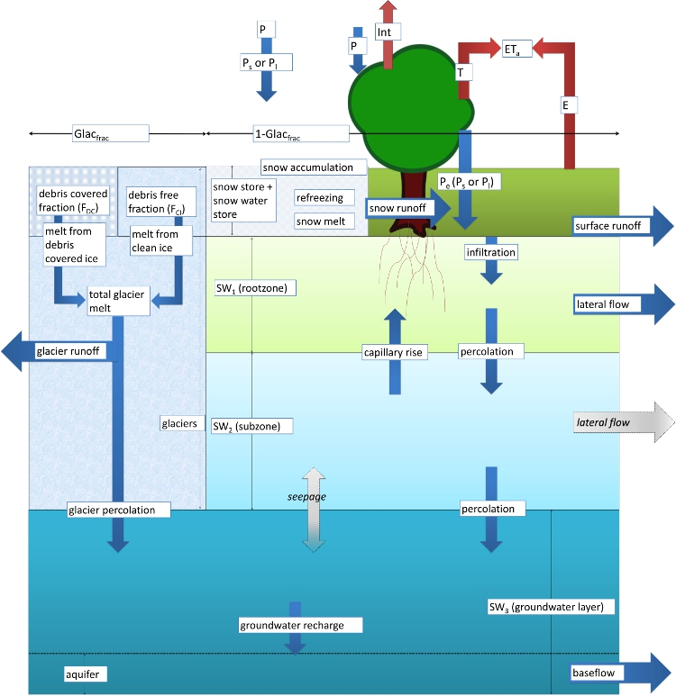

The wflow_sphy Model
====================

Introduction
------------

In 2017 the hydrological model SPHY (Spatial Processes in HYdrology) version 2.1 was added to the wflow framework:

https://github.com/FutureWater/SPHY/tree/v2.1

An example model is available in \\wflow\\examples\\wflow_ganga_sphy\\. 

    Overview of the concepts of the wflow_sphy model (`futurewater.eu <https://www.futurewater.eu/methods/sphy/>`_).

wflow_sphy module documentation
-------------------------------

.. automodule:: wflow_sphy
    :members:
    :undoc-members:
    :show-inheritance:
