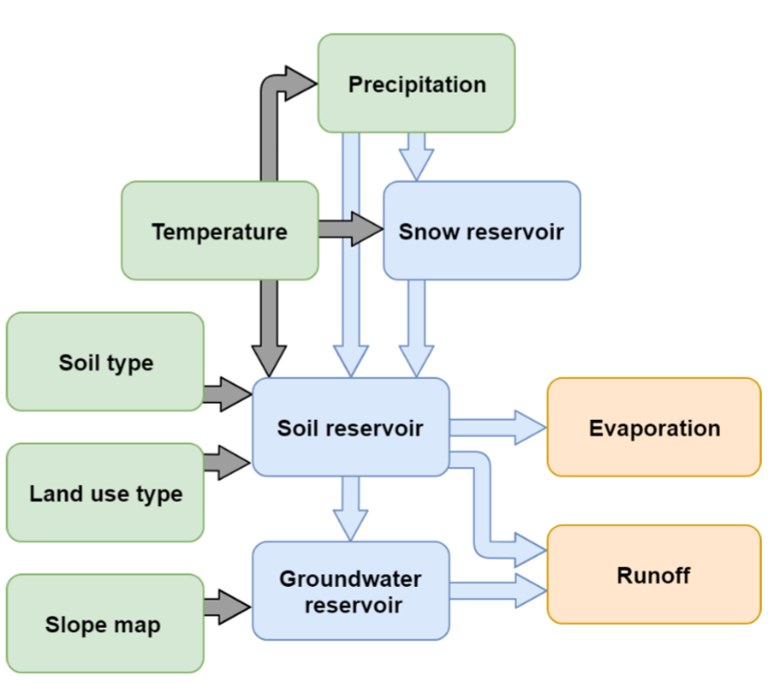

The wflow_stream Model
======================

Introduction
------------

STREAM (Spatial Tools for River Basins and Environment and Analysis of Management Options) has been added to the wflow framework as part of
the MSc. thesis work "Routing and calibration of distributed hydrological models" by Alkemade (2019). 

    Conceptual flow chart of STREAM.

STREAM is a hydrological model that was developed by Aerts et al. (1999). It is a distributed grid-based water-balance model, and as shown in
the flow chart of STREAM it consists of a snow, soil and groundwater reservoir, and has a fast and slow runoff component. The soil moisture storage
affects the fast component and ground water storage affects the slow component. Both behave as linear reservoirs. Potential evapotranspiration 
is derived from temperature, based on the Thornthwaite and Mather (1957) approach. Snow accumulation is equal to precipitation when 
temperature is below a threshold (e.g. zero degrees Celsius), and snow melts linearly depending on temperature. The fast and slow flows are routed to the 
catchment outlet by flow accumulation (based on a DEM) and assuming that all water moves through the system in one model time step (monthly).

Implementation in wflow
-----------------------

To add STREAM to the wflow framework, the model was re-written in the PCRaster Python framework. STREAM has 
until now mainly been used on monthly time step and calculates discharge by flow accumulation of upstream runoff. The following adjustment was made to 
run STREAM at a daily timestep:

- The original STREAM does not require any evaporation data and instead estimates it from temperature data on a monthly basis using the 
  Thornthwaite and Mather (1957) approach. For wflow the calculation of evapotranspiration via temperature was taken out and
  potential evapotranspiration data is used as forcing to STREAM. This means that the wflow version of STREAM now requires not two but three 
  forcings (precipitation, temperature and potential evapotranspiration). 

Wflow_stream requires the following static maps, for the following parameters:

+ whc [mm]
+ C [day]
+ cropf [-]
+ meltf [-]
+ togwf [-]

The parameter C is a recession coefficient and used in the draining of the groundwater reservoir. In the original STREAM model, this parameter is based on
a combination of a categorical variable C with values 1, 2, 3 and 4 from the average slope in a cell (from a DEM), with higher slopes getting lower values and 
therefore a faster draining of the groundwater reservoir, and a global parameter Ccal that steers how fast groundwater flows (C * Ccal). The parameter whc represents \
the maximum soil water holding capacity. The parameter cropf represents the crop factor, to determine the actual evapotranspiration from the potential evapotranspiration.
Parameter meltf is a melt factor that controls the rate of snow melt. Parameter togwf seperates the fraction of excess water going to groundwater and direct runoff.

Snow modelling
~~~~~~~~~~~~~~

Snow accumulates below a surface temperature of 3.0 :math:`^{o}C`. Snow melts linearly based on surface temperature and a melt factor self.MELTcal.

 ::

    # snow routine
    snowfall = self.precipitation
    snowfall = scalar(self.temperature < 3.0) * snowfall
    self.snow = self.snow + snowfall
    melt = (self.MELTcal * self.temperature)
    melt = scalar(self.temperature > 3.0) * melt
    melt = max(0.0, min(self.snow, melt))
    self.snow = self.snow - melt
    self.precipitation = self.precipitation - snowfall + melt

Soil water balance
~~~~~~~~~~~~~~~~~~

The Thornthwaite-Mather procedure (Thornthwaite and Mather, 1955) is used for modelling the soil water balance:

 1. When :math:`P-PET < 0` (the soil is drying), available water soil water and excess water is:

    .. math::
 
        AW_{t} = AW_{t-1} exp(\frac{(P-PET)}{WHC})\\
        Excess = 0
     
    where :math:`AW` is available soil water, :math:`P` is precipitation, :math:`PET` is potential evapotranspiration, :math:`WHC` is the
    soil water holding capacity and :math:`Excess` is all the water above :math:`WHC`. 
    
 | 2. When the soil is wetting, :math:`P-PET > 0`, but stays below :math:`WHC`: 

    .. math::
        
        AW_{t-1} + (P-PET) < WHC
     
    available water soil water and excess water is:

    .. math::
 
        AW_{t} = AW_{t-1} + (P-PET)\\
        Excess = 0

 3. When the soil is wetting, :math:`P-PET > 0`, above :math:`WHC`: 

    .. math::
        
        AW_{t-1} + (P-PET) > WHC

    available water soil water and excess water is:

    .. math::
 
        AW_{t} = WHC\\
        Excess = AW_{t-1} + (P-PET) - WHC

Groundwater and runoff
~~~~~~~~~~~~~~~~~~~~~~

Excess water (self.excess) is seperated by a fraction (self.TOGWcal) into seepage (self.togw) to groundwater (self.Ground_water) and direct 
runoff. Seepage is added to the groundwater reservoir, and flow from the groundwater reservoir (self.sloflo) is modelled as a linear reservoir.
Total runoff (self.runoff) consists of direct runoff and groundwater flow.

 ::

    # seepage to groundwater
    self.runoff = self.togwf * self.excess
    self.togw = self.excess - self.runoff

    # adding water to groundwater and taking water from groundwater
    self.Ground_water = self.Ground_water + self.togw
    self.sloflo = (self.Groundwater/ self.C )
    self.Ground_water = self.Ground_water - self.sloflo

    # adding water from groundwater to runoff
    self.runoff = self.runoff + self.sloflo

References
----------

- Aerts, J.C.J.H., Kriek, M., Schepel, M., 1999, STREAM (Spatial tools for river basins and environment and analysis of management 
  options): ‘set up and requirements’, Phys. Chem. Earth, Part B Hydrol. Ocean. Atmos., 24(6), 591–595. 
- Alkemade, G.I., 2019, Routing and calibration of distributed hydrological models, MSc. Thesis, VU Amsterdam, Faculty of Science, Hydrology.
- Thornthwaite, C.W., and Mather, J.R., 1955, The water balance, Publ. Climatol., 8(1), 1–104.
- Thornthwaite, C.W., and Mather, J.R., 1957, Instructions and tables for computing potential evapotranspiration and the water balance: Centerton,
  N.J., Laboratory of Climatology, Publ. Climatol., 10(3), 85–311.

wflow_stream module documentation
---------------------------------

.. automodule:: wflow_stream
    :members:
    :undoc-members:
    :show-inheritance:
    
    .. autoattribute:: usage
